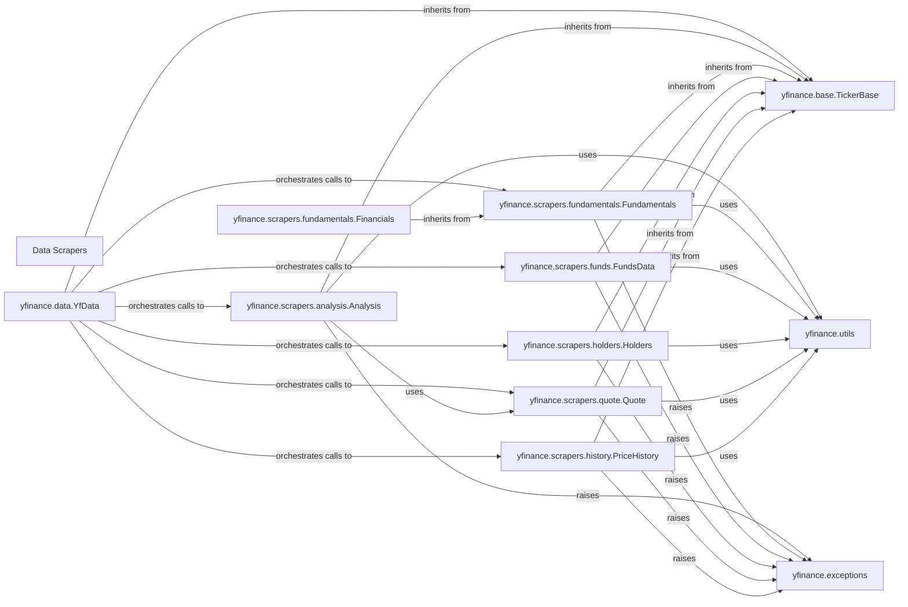

## Component Details

Component Overview: Data Scrapers subsystem of the yfinance project.

### Data Scrapers
This component comprises specialized modules dedicated to parsing and extracting specific types of financial data (e.g., analysis, fundamentals, price history, holders, quotes) from raw web responses. Each scraper focuses on a particular data domain, transforming raw web content into structured, usable financial information.

**Related Classes/Methods**:

- <a href="https://github.com/ranaroussi/yfinance/blob/master/yfinance/scrapers/analysis.py#L1-L1" target="_blank" rel="noopener noreferrer">`yfinance.scrapers.analysis` (1:1)</a>
- <a href="https://github.com/ranaroussi/yfinance/blob/master/yfinance/scrapers/fundamentals.py#L1-L1" target="_blank" rel="noopener noreferrer">`yfinance.scrapers.fundamentals` (1:1)</a>
- <a href="https://github.com/ranaroussi/yfinance/blob/master/yfinance/scrapers/funds.py#L1-L1" target="_blank" rel="noopener noreferrer">`yfinance.scrapers.funds` (1:1)</a>
- <a href="https://github.com/ranaroussi/yfinance/blob/master/yfinance/scrapers/history.py#L1-L1" target="_blank" rel="noopener noreferrer">`yfinance.scrapers.history` (1:1)</a>
- <a href="https://github.com/ranaroussi/yfinance/blob/master/yfinance/scrapers/holders.py#L1-L1" target="_blank" rel="noopener noreferrer">`yfinance.scrapers.holders` (1:1)</a>
- <a href="https://github.com/ranaroussi/yfinance/blob/master/yfinance/scrapers/quote.py#L1-L1" target="_blank" rel="noopener noreferrer">`yfinance.scrapers.quote` (1:1)</a>

### yfinance.data.YfData
Acts as the primary entry point and aggregator for accessing various financial data types. It instantiates and orchestrates calls to the specialized scraper classes, providing a unified interface to the user. It's fundamental because it's the user-facing interface that brings together all the individual scraping capabilities.

**Related Classes/Methods**:

- <a href="https://github.com/ranaroussi/yfinance/blob/master/yfinance/data.py#L61-L433" target="_blank" rel="noopener noreferrer">`yfinance.data.YfData` (61:433)</a>

### yfinance.base.TickerBase
An abstract base class that provides common attributes and methods for all ticker-related operations, including the various data scrapers. It ensures consistency and reusability across different data retrieval components. This is fundamental as it provides a common, standardized foundation for all scraper classes, promoting code reuse and maintainability.

**Related Classes/Methods**:

- <a href="https://github.com/ranaroussi/yfinance/blob/master/yfinance/base.py#L49-L805" target="_blank" rel="noopener noreferrer">`yfinance.base.TickerBase` (49:805)</a>

### yfinance.scrapers.analysis.Analysis
Specializes in fetching and parsing analyst estimates and trends, such as earnings estimates, revenue estimates, EPS trends, EPS revisions, analyst price targets, earnings history, and growth estimates. This is a core scraper component, directly responsible for a specific data domain.

**Related Classes/Methods**:

- <a href="https://github.com/ranaroussi/yfinance/blob/master/yfinance/scrapers/analysis.py#L10-L191" target="_blank" rel="noopener noreferrer">`yfinance.scrapers.analysis.Analysis` (10:191)</a>

### yfinance.scrapers.fundamentals.Fundamentals
Manages the retrieval of fundamental financial statements like income statements, balance sheets, and cash flow statements. This is a core scraper component, essential for fundamental financial analysis.

**Related Classes/Methods**:

- <a href="https://github.com/ranaroussi/yfinance/blob/master/yfinance/scrapers/fundamentals.py#L10-L42" target="_blank" rel="noopener noreferrer">`yfinance.scrapers.fundamentals.Fundamentals` (10:42)</a>

### yfinance.scrapers.fundamentals.Financials
A specialized class within `Fundamentals` for handling time-series financial data, inheriting and extending the capabilities of `Fundamentals`. This component refines the fundamental data retrieval, making it more granular and time-series oriented.

**Related Classes/Methods**:

- <a href="https://github.com/ranaroussi/yfinance/blob/master/yfinance/scrapers/fundamentals.py#L45-L169" target="_blank" rel="noopener noreferrer">`yfinance.scrapers.fundamentals.Financials` (45:169)</a>

### yfinance.scrapers.funds.FundsData
Handles the retrieval and parsing of data related to mutual funds and ETFs, including fund overview, operations, asset classes, top holdings, and bond ratings. This is a core scraper component, extending the data coverage to investment funds.

**Related Classes/Methods**:

- <a href="https://github.com/ranaroussi/yfinance/blob/master/yfinance/scrapers/funds.py#L11-L334" target="_blank" rel="noopener noreferrer">`yfinance.scrapers.funds.FundsData` (11:334)</a>

### yfinance.scrapers.holders.Holders
Focuses on ownership data, including major holders, institutional holders, mutual fund holders, insider transactions, insider purchases, and insider rosters. This is a core scraper component, providing crucial ownership insights.

**Related Classes/Methods**:

- <a href="https://github.com/ranaroussi/yfinance/blob/master/yfinance/scrapers/holders.py#L11-L239" target="_blank" rel="noopener noreferrer">`yfinance.scrapers.holders.Holders` (11:239)</a>

### yfinance.scrapers.quote.Quote
Retrieves general quote information, sustainability data, analyst recommendations, upgrades/downgrades, calendar events, and SEC filings. This is a core scraper component, providing a broad range of general market and company-specific information.

**Related Classes/Methods**:

- <a href="https://github.com/ranaroussi/yfinance/blob/master/yfinance/scrapers/quote.py#L487-L774" target="_blank" rel="noopener noreferrer">`yfinance.scrapers.quote.Quote` (487:774)</a>

### yfinance.scrapers.history.PriceHistory
Dedicated to fetching and processing historical price data, including dividends and stock splits. It also includes complex logic for fixing data anomalies. This is a core scraper component, vital for time-series analysis of stock prices.

**Related Classes/Methods**:

- <a href="https://github.com/ranaroussi/yfinance/blob/master/yfinance/scrapers/history.py#L15-L2937" target="_blank" rel="noopener noreferrer">`yfinance.scrapers.history.PriceHistory` (15:2937)</a>

### yfinance.utils
A utility module providing helper functions for data parsing, formatting, error handling, and time/date conversions, used across various scraper components. This module is fundamental as it provides essential, reusable functionalities that support all scraper operations, ensuring data consistency and robustness.

**Related Classes/Methods**:

- <a href="https://github.com/ranaroussi/yfinance/blob/master/yfinance/utils.py#L1-L1" target="_blank" rel="noopener noreferrer">`yfinance.utils` (1:1)</a>

### yfinance.exceptions
Module for handling exceptions within the yfinance project.

**Related Classes/Methods**:

- <a href="https://github.com/ranaroussi/yfinance/blob/master/yfinance/exceptions.py#L1-L1" target="_blank" rel="noopener noreferrer">`yfinance.exceptions` (1:1)</a>

### [FAQ](https://github.com/CodeBoarding/GeneratedOnBoardings/tree/main?tab=readme-ov-file#faq)