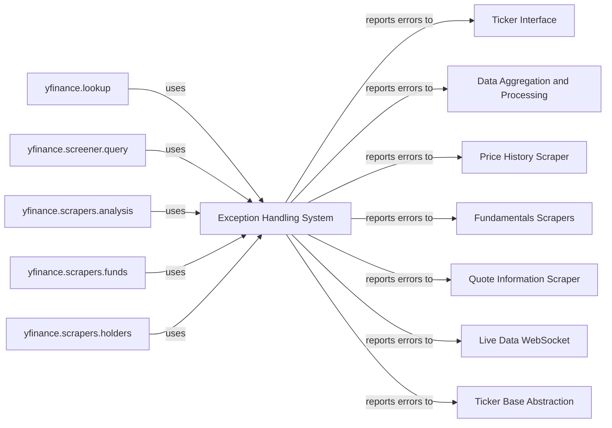

## Component Details

One paragraph explaining the functionality which is represented by this graph. What the main flow is and what is its purpose.

### Exception Handling System
This component defines a comprehensive hierarchy of custom exceptions, rooted in `YFException`, to provide structured and specific error management throughout the `yfinance` library. These exceptions are crucial for signaling various issues, such as missing data, invalid requests, or rate limits, enabling robust error handling and clear user feedback during financial data operations.

**Related Classes/Methods**:

- <a href="https://github.com/ranaroussi/yfinance/blob/master/yfinance/exceptions.py#L1-L1000" target="_blank" rel="noopener noreferrer">`yfinance.exceptions` (1:1000)</a>
- <a href="https://github.com/ranaroussi/yfinance/blob/master/yfinance/exceptions.py#L1-L1000" target="_blank" rel="noopener noreferrer">`yfinance.exceptions.YFException` (1:1000)</a>

### Ticker Interface

**Related Classes/Methods**: _None_

### Data Aggregation and Processing

**Related Classes/Methods**: _None_

### Price History Scraper

**Related Classes/Methods**: _None_

### Fundamentals Scrapers

**Related Classes/Methods**: _None_

### Quote Information Scraper

**Related Classes/Methods**: _None_

### Live Data WebSocket

**Related Classes/Methods**: _None_

### Ticker Base Abstraction

**Related Classes/Methods**: _None_

### yfinance.lookup

**Related Classes/Methods**: _None_

### yfinance.screener.query

**Related Classes/Methods**: _None_

### yfinance.scrapers.analysis

**Related Classes/Methods**: _None_

### yfinance.scrapers.funds

**Related Classes/Methods**: _None_

### yfinance.scrapers.holders

**Related Classes/Methods**: _None_

### [FAQ](https://github.com/CodeBoarding/GeneratedOnBoardings/tree/main?tab=readme-ov-file#faq)