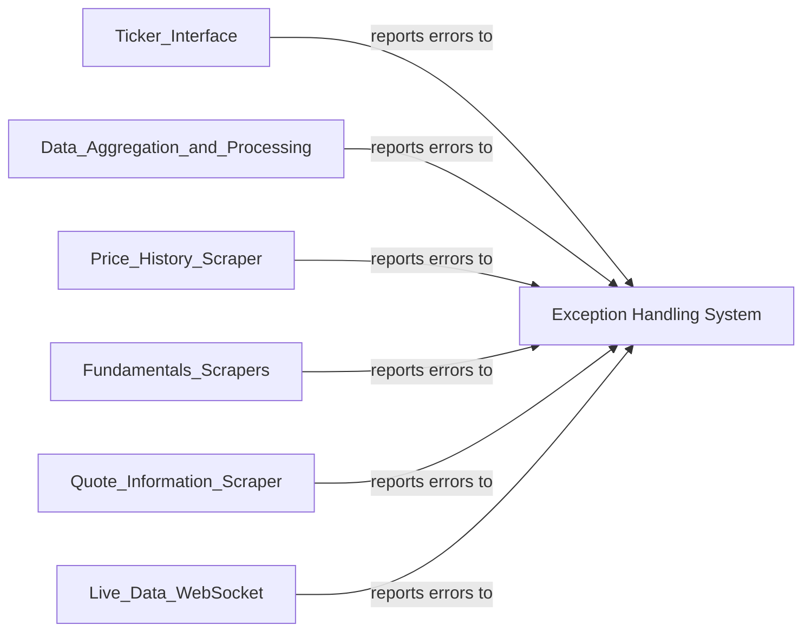

## Component Details

One paragraph explaining the functionality which is represented by this graph. What the main flow is and what is its purpose.

### Exception Handling System
This component defines a comprehensive hierarchy of custom exceptions, rooted in `yfinance.exceptions.YFException`. Key subclasses include `YFDataException`, `YFInvalidPeriodError`, `YFRateLimitError`, and `YFTickerMissingError`. `YFTickerMissingError` further specializes into `YFEarningsDateMissing`, `YFPricesMissingError`, and `YFTzMissingError`. These exceptions are critical for providing precise error management and clear communication of issues that arise during data retrieval and processing, such as rate limiting, invalid periods, or various types of missing data (e.g., ticker, prices, earnings dates, timezones). Its widespread use across various `yfinance` modules ensures robust and consistent error reporting throughout the library.

**Related Classes/Methods**:

- <a href="https://github.com/ranaroussi/yfinance/blob/master/yfinance/exceptions.py#L0-L0" target="_blank" rel="noopener noreferrer">`yfinance.exceptions.YFException` (0:0)</a>
- <a href="https://github.com/ranaroussi/yfinance/blob/master/yfinance/exceptions.py#L0-L0" target="_blank" rel="noopener noreferrer">`yfinance.exceptions.YFDataException` (0:0)</a>
- <a href="https://github.com/ranaroussi/yfinance/blob/master/yfinance/exceptions.py#L0-L0" target="_blank" rel="noopener noreferrer">`yfinance.exceptions.YFInvalidPeriodError` (0:0)</a>
- <a href="https://github.com/ranaroussi/yfinance/blob/master/yfinance/exceptions.py#L0-L0" target="_blank" rel="noopener noreferrer">`yfinance.exceptions.YFRateLimitError` (0:0)</a>
- <a href="https://github.com/ranaroussi/yfinance/blob/master/yfinance/exceptions.py#L0-L0" target="_blank" rel="noopener noreferrer">`yfinance.exceptions.YFTickerMissingError` (0:0)</a>
- <a href="https://github.com/ranaroussi/yfinance/blob/master/yfinance/exceptions.py#L0-L0" target="_blank" rel="noopener noreferrer">`yfinance.exceptions.YFEarningsDateMissing` (0:0)</a>
- <a href="https://github.com/ranaroussi/yfinance/blob/master/yfinance/exceptions.py#L0-L0" target="_blank" rel="noopener noreferrer">`yfinance.exceptions.YFPricesMissingError` (0:0)</a>
- <a href="https://github.com/ranaroussi/yfinance/blob/master/yfinance/exceptions.py#L0-L0" target="_blank" rel="noopener noreferrer">`yfinance.exceptions.YFTzMissingError` (0:0)</a>

### [FAQ](https://github.com/CodeBoarding/GeneratedOnBoardings/tree/main?tab=readme-ov-file#faq)