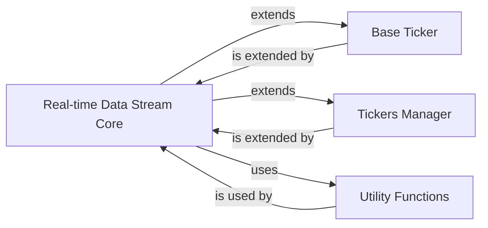

## Component Details

This subsystem is designed to establish and maintain real-time data connections to Yahoo Finance, providing live price updates and other streaming data. It offers both synchronous and asynchronous clients to accommodate diverse application requirements, with a strong emphasis on integrating live data handling directly with core ticker management functionalities.

### Real-time Data Stream Core
This is the heart of the real-time data stream. `BaseWebSocket` provides the fundamental structure for WebSocket communication. `AsyncWebSocket` offers an asynchronous client for non-blocking operations, while `WebSocket` provides a synchronous client. The `WebSocket` class is particularly powerful as it extends `TickerBase` and `Tickers`, allowing it to directly manage and process live data for multiple tickers, integrating real-time data with existing ticker functionalities.

**Related Classes/Methods**:

- <a href="https://github.com/ranaroussi/yfinance/blob/master/yfinance/live.py#L13-L35" target="_blank" rel="noopener noreferrer">`yfinance.live.BaseWebSocket` (13:35)</a>
- <a href="https://github.com/ranaroussi/yfinance/blob/master/yfinance/live.py#L38-L205" target="_blank" rel="noopener noreferrer">`yfinance.live.AsyncWebSocket` (38:205)</a>
- <a href="https://github.com/ranaroussi/yfinance/blob/master/yfinance/live.py#L208-L334" target="_blank" rel="noopener noreferrer">`yfinance.live.WebSocket` (208:334)</a>

### Base Ticker
A foundational abstract class that provides common functionalities and attributes shared across various core components, including the `WebSocket` client. Its inheritance by `WebSocket` signifies that real-time data streams can leverage a consistent base for ticker-related operations.

**Related Classes/Methods**:

- <a href="https://github.com/ranaroussi/yfinance/blob/master/yfinance/base.py#L49-L805" target="_blank" rel="noopener noreferrer">`yfinance.base.TickerBase` (49:805)</a>

### Tickers Manager
This component is designed to manage and interact with multiple stock tickers. The `WebSocket` client's inheritance from `Tickers` allows the real-time data stream to directly handle and process live data for a collection of tickers, streamlining the management of real-time updates for portfolios or lists of instruments.

**Related Classes/Methods**:

- <a href="https://github.com/ranaroussi/yfinance/blob/master/yfinance/tickers.py#L31-L114" target="_blank" rel="noopener noreferrer">`yfinance.tickers.Tickers` (31:114)</a>

### Utility Functions
This component provides utility functions, specifically `IndentLoggerAdapter`, which is used for logging within the `BaseWebSocket` and thus across the real-time data stream. It helps in debugging and monitoring the WebSocket connections and data flow.

**Related Classes/Methods**:

- <a href="https://github.com/ranaroussi/yfinance/blob/master/yfinance/utils.py#L55-L62" target="_blank" rel="noopener noreferrer">`yfinance.utils.IndentLoggerAdapter` (55:62)</a>

### [FAQ](https://github.com/CodeBoarding/GeneratedOnBoardings/tree/main?tab=readme-ov-file#faq)