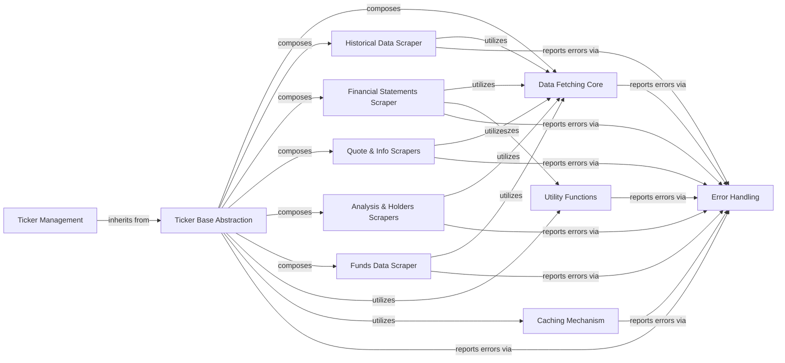

## Component Details

This component, centered around yfinance.base.TickerBase, serves as the foundational abstract layer for handling individual stock ticker data within the yfinance library. Its primary purpose is to establish a unified interface and common functionalities that concrete ticker implementations and various data scraping modules can build upon or utilize. It acts as an orchestrator, delegating specific data retrieval tasks to specialized internal components while maintaining a consistent public API for ticker-related operations.

### Ticker Base Abstraction
Defines the fundamental structure and common functionalities for handling individual ticker data. It provides an abstract base that orchestrates data retrieval by composing and delegating to various scraper components. It manages ticker-specific state like timezone and ISIN.

**Related Classes/Methods**:

- <a href="https://github.com/ranaroussi/yfinance/blob/master/yfinance/base.py#L49-L805" target="_blank" rel="noopener noreferrer">`yfinance.base.TickerBase` (49:805)</a>

### Ticker Management
The primary user-facing component. It inherits from TickerBase and provides a comprehensive, convenient API for accessing various financial data points (e.g., history, financials, news, recommendations) for a specific stock ticker. It acts as a facade, simplifying interactions with the underlying scraping logic.

**Related Classes/Methods**:

- <a href="https://github.com/ranaroussi/yfinance/blob/master/yfinance/ticker.py#L33-L327" target="_blank" rel="noopener noreferrer">`yfinance.ticker.Ticker` (33:327)</a>

### Data Fetching Core
Responsible for the fundamental process of fetching raw data from Yahoo Finance URLs. It handles low-level HTTP requests and response caching, serving as the direct interface to the external data source.

**Related Classes/Methods**:

- <a href="https://github.com/ranaroussi/yfinance/blob/master/yfinance/data.py#L61-L433" target="_blank" rel="noopener noreferrer">`yfinance.data.YfData` (61:433)</a>

### Historical Data Scraper
Specializes in retrieving and processing historical market data, including stock prices, dividends, stock splits, and capital gains. It handles the logic for parsing time-series data.

**Related Classes/Methods**:

- <a href="https://github.com/ranaroussi/yfinance/blob/master/yfinance/scrapers/history.py#L15-L2937" target="_blank" rel="noopener noreferrer">`yfinance.scrapers.history.PriceHistory` (15:2937)</a>

### Financial Statements Scraper
Dedicated to extracting and structuring detailed financial statements such as income statements, balance sheets, and cash flow statements, along with earnings data. It handles the complexities of parsing tabular financial data.

**Related Classes/Methods**:

- <a href="https://github.com/ranaroussi/yfinance/blob/master/yfinance/scrapers/fundamentals.py#L10-L42" target="_blank" rel="noopener noreferrer">`yfinance.scrapers.fundamentals.Fundamentals` (10:42)</a>
- <a href="https://github.com/ranaroussi/yfinance/blob/master/yfinance/scrapers/fundamentals.py#L45-L169" target="_blank" rel="noopener noreferrer">`yfinance.scrapers.fundamentals.Financials` (45:169)</a>

### Quote & Info Scrapers
These components are responsible for fetching current stock quotes, real-time trading information, general company details, and sustainability data.

**Related Classes/Methods**:

- <a href="https://github.com/ranaroussi/yfinance/blob/master/yfinance/scrapers/quote.py#L487-L774" target="_blank" rel="noopener noreferrer">`yfinance.scrapers.quote.Quote` (487:774)</a>
- <a href="https://github.com/ranaroussi/yfinance/blob/master/yfinance/scrapers/quote.py#L25-L484" target="_blank" rel="noopener noreferrer">`yfinance.scrapers.quote.FastInfo` (25:484)</a>

### Analysis & Holders Scrapers
Focuses on scraping specific analytical data, such as analyst recommendations and earnings estimates, as well as detailed information about major, institutional, mutual fund, and insider shareholders.

**Related Classes/Methods**:

- <a href="https://github.com/ranaroussi/yfinance/blob/master/yfinance/scrapers/analysis.py#L10-L191" target="_blank" rel="noopener noreferrer">`yfinance.scrapers.analysis.Analysis` (10:191)</a>
- <a href="https://github.com/ranaroussi/yfinance/blob/master/yfinance/scrapers/holders.py#L11-L239" target="_blank" rel="noopener noreferrer">`yfinance.scrapers.holders.Holders` (11:239)</a>

### Utility Functions
A collection of helper functions used across the entire library. This includes functionalities like data validation (e.g., timezone validation, ISIN checks), date parsing, logging, and string format conversions.

**Related Classes/Methods**:

- <a href="https://github.com/ranaroussi/yfinance/blob/master/yfinance/utils.py#L0-L0" target="_blank" rel="noopener noreferrer">`yfinance.utils` (0:0)</a>

### Caching Mechanism
Manages the caching of frequently accessed data, such as ISINs (International Securities Identification Numbers) and timezones, to reduce redundant network requests and improve performance.

**Related Classes/Methods**:

- <a href="https://github.com/ranaroussi/yfinance/blob/master/yfinance/cache.py#L0-L0" target="_blank" rel="noopener noreferrer">`yfinance.cache` (0:0)</a>

### Error Handling
Defines and manages custom exception types specific to yfinance operations. This ensures that errors are clearly categorized and communicated to the user, facilitating robust error handling in applications built on top of the library.

**Related Classes/Methods**:

- <a href="https://github.com/ranaroussi/yfinance/blob/master/yfinance/exceptions.py#L0-L0" target="_blank" rel="noopener noreferrer">`yfinance.exceptions` (0:0)</a>

### Funds Data Scraper
Handles the retrieval of funds-related data.

**Related Classes/Methods**:

- <a href="https://github.com/ranaroussi/yfinance/blob/master/yfinance/scrapers/funds.py#L11-L334" target="_blank" rel="noopener noreferrer">`yfinance.scrapers.funds.FundsData` (11:334)</a>

### [FAQ](https://github.com/CodeBoarding/GeneratedOnBoardings/tree/main?tab=readme-ov-file#faq)