```mermaid
graph LR
    Tickers_Collection_Manager["Tickers Collection Manager"]
    Single_Ticker_Entity["Single Ticker Entity"]
    Data_Aggregation_Layer["Data Aggregation Layer"]
    Live_Data_Streaming_Client["Live Data Streaming Client"]
    Base_Ticker_Abstraction["Base Ticker Abstraction"]
    Data_Scrapers["Data Scrapers"]
    Tickers_Collection_Manager -- "initiates" --> Live_Data_Streaming_Client
    Tickers_Collection_Manager -- "uses" --> Single_Ticker_Entity
    Single_Ticker_Entity -- "extends" --> Base_Ticker_Abstraction
    Single_Ticker_Entity -- "relies on" --> Data_Aggregation_Layer
    Data_Aggregation_Layer -- "extends" --> Base_Ticker_Abstraction
    Data_Aggregation_Layer -- "aggregates from" --> Data_Scrapers
    Live_Data_Streaming_Client -- "extends" --> Base_Ticker_Abstraction
    Live_Data_Streaming_Client -- "extends" --> Tickers_Collection_Manager
    Base_Ticker_Abstraction -- "is extended by" --> Single_Ticker_Entity
    Base_Ticker_Abstraction -- "is extended by" --> Data_Aggregation_Layer
    Data_Scrapers -- "are aggregated by" --> Data_Aggregation_Layer
    Data_Scrapers -- "extend" --> Base_Ticker_Abstraction
    click Data_Scrapers href "https://github.com/CodeBoarding/GeneratedOnBoardings/blob/main//yfinance/Data_Scrapers.md" "Details"
```

## Component Details

The Tickers Collection Management subsystem in yfinance is designed to efficiently handle operations across multiple financial instruments. Its core purpose is to provide a unified interface for managing, querying, and streaming data for a collection of tickers, abstracting away the complexities of individual data sources and real-time connections.

### Tickers Collection Manager
This component serves as the primary entry point for users to interact with and manage operations across a collection of financial instruments (tickers). It orchestrates calls for bulk data operations and initiates live data streams for multiple tickers.

**Related Classes/Methods**:

- <a href="https://github.com/ranaroussi/yfinance/blob/master/yfinance/tickers.py#L31-L114" target="_blank" rel="noopener noreferrer">`yfinance.tickers.Tickers` (31:114)</a>

### Single Ticker Entity
Represents a single financial instrument (e.g., a stock or ETF). It provides a comprehensive interface for accessing various types of data specific to that instrument, such as historical prices, news, and financial statements. It acts as a facade, simplifying interactions with the underlying data aggregation and scraping mechanisms.

**Related Classes/Methods**:

- <a href="https://github.com/ranaroussi/yfinance/blob/master/yfinance/ticker.py#L33-L327" target="_blank" rel="noopener noreferrer">`yfinance.ticker.Ticker` (33:327)</a>

### Data Aggregation Layer
This component is responsible for fetching, processing, and consolidating various types of financial data (e.g., analysis, fundamentals, quotes, historical prices) from Yahoo Finance. It acts as a central hub, integrating data from multiple specialized Data Scrapers and providing a unified interface for data access.

**Related Classes/Methods**:

- <a href="https://github.com/ranaroussi/yfinance/blob/master/yfinance/data.py#L61-L433" target="_blank" rel="noopener noreferrer">`yfinance.data.YfData` (61:433)</a>

### Live Data Streaming Client
Manages real-time data streaming through WebSocket connections, enabling users to subscribe to and receive live financial data updates. This component is unique as it extends both the Base Ticker Abstraction and the Tickers Collection Manager, allowing it to manage and stream live data for a collection of tickers.

**Related Classes/Methods**:

- <a href="https://github.com/ranaroussi/yfinance/blob/master/yfinance/live.py#L208-L334" target="_blank" rel="noopener noreferrer">`yfinance.live.WebSocket` (208:334)</a>

### Base Ticker Abstraction
This is a foundational abstract class that defines common functionalities, attributes, and a consistent interface shared by several key components, including Single Ticker Entity, Data Aggregation Layer, Live Data Streaming Client, and the individual Data Scrapers. It promotes significant code reuse, consistency, and extensibility across the ticker-related parts of the system.

**Related Classes/Methods**:

- <a href="https://github.com/ranaroussi/yfinance/blob/master/yfinance/base.py#L49-L805" target="_blank" rel="noopener noreferrer">`yfinance.base.TickerBase` (49:805)</a>

### Data Scrapers
A collection of specialized modules, each responsible for the direct extraction, parsing, and initial structuring of specific types of financial data from Yahoo Finance's web pages or APIs. These are the lowest-level data acquisition components.

**Related Classes/Methods**:

- <a href="https://github.com/ranaroussi/yfinance/blob/master/yfinance/scrapers/analysis.py#L1-L1" target="_blank" rel="noopener noreferrer">`yfinance.scrapers.analysis` (1:1)</a>
- <a href="https://github.com/ranaroussi/yfinance/blob/master/yfinance/scrapers/fundamentals.py#L1-L1" target="_blank" rel="noopener noreferrer">`yfinance.scrapers.fundamentals` (1:1)</a>
- <a href="https://github.com/ranaroussi/yfinance/blob/master/yfinance/scrapers/funds.py#L1-L1" target="_blank" rel="noopener noreferrer">`yfinance.scrapers.funds` (1:1)</a>
- <a href="https://github.com/ranaroussi/yfinance/blob/master/yfinance/scrapers/history.py#L1-L1" target="_blank" rel="noopener noreferrer">`yfinance.scrapers.history` (1:1)</a>
- <a href="https://github.com/ranaroussi/yfinance/blob/master/yfinance/scrapers/holders.py#L1-L1" target="_blank" rel="noopener noreferrer">`yfinance.scrapers.holders` (1:1)</a>
- <a href="https://github.com/ranaroussi/yfinance/blob/master/yfinance/scrapers/quote.py#L1-L1" target="_blank" rel="noopener noreferrer">`yfinance.scrapers.quote` (1:1)</a>

### [FAQ](https://github.com/CodeBoarding/GeneratedOnBoardings/tree/main?tab=readme-ov-file#faq)