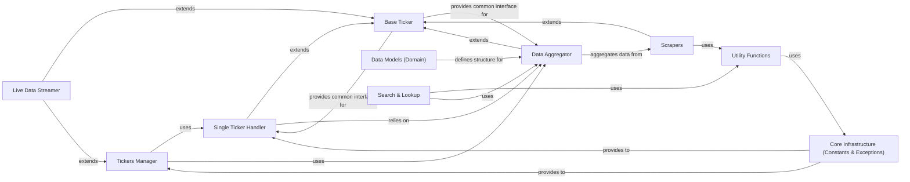

## Component Details

This analysis describes the 10 fundamental components of the `yfinance` library, along with their descriptions, source files, and key relationships. These components represent distinct functional areas, core abstractions, or critical infrastructure necessary for the library's operation.

### Tickers Manager
The primary entry point for users to interact with multiple stock tickers. It orchestrates calls to other components to retrieve historical data, news, and live data for a collection of tickers.

**Related Classes/Methods**: _None_

### Single Ticker Handler
Represents a single financial instrument (e.g., a stock or ETF) and provides methods to access its specific data, such as news, historical prices, and fundamental information.

**Related Classes/Methods**: _None_

### Data Aggregator
Responsible for fetching, processing, and consolidating various types of financial data (e.g., analysis, fundamentals, quotes) by leveraging underlying scraping mechanisms. Its extensive inheritance indicates it consolidates data from multiple sources.

**Related Classes/Methods**: _None_

### Live Data Streamer
Manages real-time data streaming through WebSocket connections, enabling users to subscribe to and receive live financial data updates.

**Related Classes/Methods**: _None_

### Base Ticker
A foundational abstract class that provides common functionalities or attributes shared by several key components like `Ticker`, `YfData`, and `WebSocket`. It promotes code reuse and consistency across related classes.

**Related Classes/Methods**: _None_

### Scrapers
A collection of specialized modules (e.g., `analysis.py`, `fundamentals.py`, `quote.py`) responsible for the actual extraction and parsing of specific types of financial data from Yahoo Finance.

**Related Classes/Methods**: _None_

### Utility Functions
A collection of general-purpose helper functions and classes, including a robust logging system and caching mechanisms, used across various parts of the `yfinance` library. It provides foundational utilities like logging, caching, and search-related helpers.

**Related Classes/Methods**:

- <a href="https://github.com/ranaroussi/yfinance/blob/master/yfinance/utils.py#L55-L62" target="_blank" rel="noopener noreferrer">`yfinance.utils.IndentLoggerAdapter` (55:62)</a>
- <a href="https://github.com/ranaroussi/yfinance/blob/master/yfinance/cache.py#L300-L311" target="_blank" rel="noopener noreferrer">`yfinance.cache.ISODateTimeField` (300:311)</a>

### Core Infrastructure (Constants & Exceptions)
Defines global constants, configurations, and custom exception classes used throughout the `yfinance` library. This component is fundamental for maintaining consistency and handling errors across all other components.

**Related Classes/Methods**: _None_

### Data Models (Domain)
Defines the structure and types of financial data, including industry, market, and sector information. These models ensure data consistency and provide a structured representation of financial concepts.

**Related Classes/Methods**: _None_

### Search & Lookup
Provides functionalities for searching and looking up financial instruments (e.g., by symbol or name) and retrieving basic information about them.

**Related Classes/Methods**: _None_

### [FAQ](https://github.com/CodeBoarding/GeneratedOnBoardings/tree/main?tab=readme-ov-file#faq)