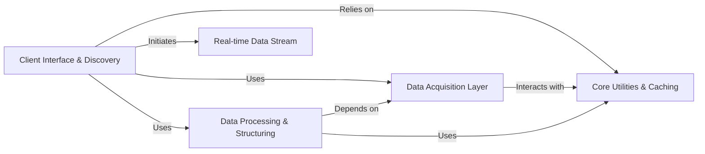

## Component Details

Abstract Components Overview

### Client Interface & Discovery
This component serves as the primary entry point for users to interact with the `yfinance` library. It encompasses the logic for fetching data for individual or multiple tickers, as well as functionalities for discovering financial instruments (lookup), filtering them based on criteria (screener), and accessing broader market/domain-specific data. It orchestrates high-level data requests and delegates to lower-level components for actual data retrieval and processing.

**Related Classes/Methods**:

- <a href="https://github.com/ranaroussi/yfinance/blob/master/yfinance/ticker.py#L33-L327" target="_blank" rel="noopener noreferrer">`yfinance.ticker.Ticker` (33:327)</a>
- <a href="https://github.com/ranaroussi/yfinance/blob/master/yfinance/base.py#L49-L805" target="_blank" rel="noopener noreferrer">`yfinance.base.TickerBase` (49:805)</a>
- <a href="https://github.com/ranaroussi/yfinance/blob/master/yfinance/tickers.py#L31-L114" target="_blank" rel="noopener noreferrer">`yfinance.tickers.Tickers` (31:114)</a>
- <a href="https://github.com/ranaroussi/yfinance/blob/master/yfinance/lookup.py#L33-L223" target="_blank" rel="noopener noreferrer">`yfinance.lookup.Lookup` (33:223)</a>
- <a href="https://github.com/ranaroussi/yfinance/blob/master/yfinance/screener/screener.py#L0-L0" target="_blank" rel="noopener noreferrer">`yfinance.screener.screener` (0:0)</a>
- <a href="https://github.com/ranaroussi/yfinance/blob/master/yfinance/screener/query.py#L11-L134" target="_blank" rel="noopener noreferrer">`yfinance.screener.query.QueryBase` (11:134)</a>
- <a href="https://github.com/ranaroussi/yfinance/blob/master/yfinance/domain/domain.py#L11-L198" target="_blank" rel="noopener noreferrer">`yfinance.domain.domain.Domain` (11:198)</a>
- <a href="https://github.com/ranaroussi/yfinance/blob/master/yfinance/domain/industry.py#L12-L154" target="_blank" rel="noopener noreferrer">`yfinance.domain.industry.Industry` (12:154)</a>
- <a href="https://github.com/ranaroussi/yfinance/blob/master/yfinance/domain/sector.py#L12-L155" target="_blank" rel="noopener noreferrer">`yfinance.domain.sector.Sector` (12:155)</a>
- <a href="https://github.com/ranaroussi/yfinance/blob/master/yfinance/search.py#L0-L0" target="_blank" rel="noopener noreferrer">`yfinance.search` (0:0)</a>
- <a href="https://github.com/ranaroussi/yfinance/blob/master/yfinance/multi.py#L0-L0" target="_blank" rel="noopener noreferrer">`yfinance.multi` (0:0)</a>

### Data Acquisition Layer
This is the foundational component responsible for all network communication with Yahoo Finance. It handles HTTP requests, manages sessions, cookies, and authentication mechanisms (like "crumbs") to ensure successful and rate-limited data retrieval. It acts as the sole gateway for external data.

**Related Classes/Methods**:

- <a href="https://github.com/ranaroussi/yfinance/blob/master/yfinance/data.py#L61-L433" target="_blank" rel="noopener noreferrer">`yfinance.data.YfData` (61:433)</a>

### Data Processing & Structuring
This component comprises a collection of specialized scrapers that take raw HTML or JSON responses obtained from the `Data Acquisition Layer` and transform them into structured, usable data formats, primarily Pandas DataFrames. Each scraper is tailored to parse a specific type of financial data (e.g., historical prices, fundamentals, analysis). It also includes components for handling protocol buffer definitions for pricing data.

**Related Classes/Methods**:

- <a href="https://github.com/ranaroussi/yfinance/blob/master/yfinance/scrapers/analysis.py#L0-L0" target="_blank" rel="noopener noreferrer">`yfinance.scrapers.analysis` (0:0)</a>
- <a href="https://github.com/ranaroussi/yfinance/blob/master/yfinance/scrapers/fundamentals.py#L0-L0" target="_blank" rel="noopener noreferrer">`yfinance.scrapers.fundamentals` (0:0)</a>
- <a href="https://github.com/ranaroussi/yfinance/blob/master/yfinance/scrapers/funds.py#L0-L0" target="_blank" rel="noopener noreferrer">`yfinance.scrapers.funds` (0:0)</a>
- <a href="https://github.com/ranaroussi/yfinance/blob/master/yfinance/scrapers/history.py#L0-L0" target="_blank" rel="noopener noreferrer">`yfinance.scrapers.history` (0:0)</a>
- <a href="https://github.com/ranaroussi/yfinance/blob/master/yfinance/scrapers/holders.py#L0-L0" target="_blank" rel="noopener noreferrer">`yfinance.scrapers.holders` (0:0)</a>
- <a href="https://github.com/ranaroussi/yfinance/blob/master/yfinance/scrapers/quote.py#L0-L0" target="_blank" rel="noopener noreferrer">`yfinance.scrapers.quote` (0:0)</a>
- <a href="https://github.com/ranaroussi/yfinance/blob/master/yfinance/scrapers/history.py#L15-L2937" target="_blank" rel="noopener noreferrer">`yfinance.scrapers.history.PriceHistory` (15:2937)</a>
- <a href="https://github.com/ranaroussi/yfinance/blob/master/yfinance/pricing_pb2.py#L0-L0" target="_blank" rel="noopener noreferrer">`yfinance.pricing_pb2` (0:0)</a>

### Real-time Data Stream
This component provides functionality to establish and maintain a WebSocket connection to Yahoo Finance for real-time price updates and other live data streams. It operates independently of the HTTP-based data acquisition for historical and static data, focusing solely on dynamic, live information.

**Related Classes/Methods**:

- <a href="https://github.com/ranaroussi/yfinance/blob/master/yfinance/live.py#L208-L334" target="_blank" rel="noopener noreferrer">`yfinance.live.WebSocket` (208:334)</a>
- <a href="https://github.com/ranaroussi/yfinance/blob/master/yfinance/live.py#L13-L35" target="_blank" rel="noopener noreferrer">`yfinance.live.BaseWebSocket` (13:35)</a>

### Core Utilities & Caching
This essential support component provides a suite of common helper functions and a caching mechanism. It handles tasks suchs as logging, data manipulation (e.g., time zone conversions, DataFrame operations), and caching frequently accessed data (like timezone information or ISIN lookups) to optimize performance and reduce redundant requests. It also defines constants, handles exceptions, and manages shared resources and versioning information.

**Related Classes/Methods**:

- <a href="https://github.com/ranaroussi/yfinance/blob/master/yfinance/utils.py#L0-L0" target="_blank" rel="noopener noreferrer">`yfinance.utils` (0:0)</a>
- <a href="https://github.com/ranaroussi/yfinance/blob/master/yfinance/cache.py#L0-L0" target="_blank" rel="noopener noreferrer">`yfinance.cache` (0:0)</a>
- <a href="https://github.com/ranaroussi/yfinance/blob/master/yfinance/const.py#L0-L0" target="_blank" rel="noopener noreferrer">`yfinance.const` (0:0)</a>
- <a href="https://github.com/ranaroussi/yfinance/blob/master/yfinance/exceptions.py#L0-L0" target="_blank" rel="noopener noreferrer">`yfinance.exceptions` (0:0)</a>
- <a href="https://github.com/ranaroussi/yfinance/blob/master/yfinance/shared.py#L0-L0" target="_blank" rel="noopener noreferrer">`yfinance.shared` (0:0)</a>
- <a href="https://github.com/ranaroussi/yfinance/blob/master/yfinance/version.py#L0-L0" target="_blank" rel="noopener noreferrer">`yfinance.version` (0:0)</a>

### [FAQ](https://github.com/CodeBoarding/GeneratedOnBoardings/tree/main?tab=readme-ov-file#faq)