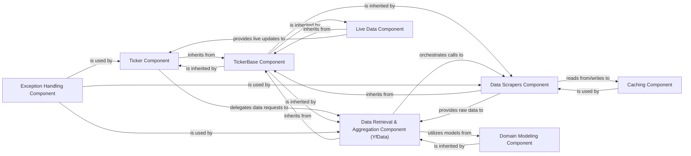

## Component Details

The yfinance.base.TickerBase class serves as a foundational and orchestrating component within the yfinance library, specifically for ticker-specific operations. It is crucial because it initializes and holds an instance of yfinance.data.YfData, making it the primary internal consumer that triggers data acquisition. Acting as a facade, TickerBase coordinates the fetching of various data types by delegating to YfData and other specialized components that inherit from it. Its widespread inheritance across the library underscores its role as a central point for shared context and functionality.

### Ticker Component
The primary public entry point for users to interact with individual stock data. It acts as a high-level orchestrator, providing methods to access various financial data points (e.g., historical prices, company info, financials) by delegating requests.

**Related Classes/Methods**:

- <a href="https://github.com/ranaroussi/yfinance/blob/master/yfinance/ticker.py#L0-L0" target="_blank" rel="noopener noreferrer">`yfinance.ticker` (0:0)</a>

### TickerBase Component
A fundamental base class that provides common attributes, methods, and a shared context for all ticker-specific operations. It serves as the core foundation upon which other ticker-related components are built, ensuring consistency and reusability.

**Related Classes/Methods**:

- <a href="https://github.com/ranaroussi/yfinance/blob/master/yfinance/base.py#L49-L805" target="_blank" rel="noopener noreferrer">`yfinance.base.TickerBase` (49:805)</a>

### Data Retrieval & Aggregation Component (YfData)
This central component is responsible for coordinating the retrieval and aggregation of diverse financial data. It leverages various specialized "scraper" modules to fetch specific types of information and consolidates this data before returning it.

**Related Classes/Methods**:

- <a href="https://github.com/ranaroussi/yfinance/blob/master/yfinance/data.py#L61-L433" target="_blank" rel="noopener noreferrer">`yfinance.data.YfData` (61:433)</a>

### Data Scrapers Component
A collection of specialized modules (e.g., analysis, fundamentals, history, quote, funds, holders) that directly handle the web scraping logic to extract specific types of financial data from Yahoo Finance. Each scraper focuses on a particular data category.

**Related Classes/Methods**:

- <a href="https://github.com/ranaroussi/yfinance/blob/master/yfinance/scrapers/analysis.py#L0-L0" target="_blank" rel="noopener noreferrer">`yfinance.scrapers.analysis` (0:0)</a>
- <a href="https://github.com/ranaroussi/yfinance/blob/master/yfinance/scrapers/fundamentals.py#L0-L0" target="_blank" rel="noopener noreferrer">`yfinance.scrapers.fundamentals` (0:0)</a>
- <a href="https://github.com/ranaroussi/yfinance/blob/master/yfinance/scrapers/funds.py#L0-L0" target="_blank" rel="noopener noreferrer">`yfinance.scrapers.funds` (0:0)</a>
- <a href="https://github.com/ranaroussi/yfinance/blob/master/yfinance/scrapers/history.py#L0-L0" target="_blank" rel="noopener noreferrer">`yfinance.scrapers.history` (0:0)</a>
- <a href="https://github.com/ranaroussi/yfinance/blob/master/yfinance/scrapers/holders.py#L0-L0" target="_blank" rel="noopener noreferrer">`yfinance.scrapers.holders` (0:0)</a>
- <a href="https://github.com/ranaroussi/yfinance/blob/master/yfinance/scrapers/quote.py#L0-L0" target="_blank" rel="noopener noreferrer">`yfinance.scrapers.quote` (0:0)</a>

### Live Data Component
Provides functionality for real-time data streaming using WebSockets, leveraging the common ticker-specific foundation for live updates.

**Related Classes/Methods**:

- <a href="https://github.com/ranaroussi/yfinance/blob/master/yfinance/live.py#L0-L0" target="_blank" rel="noopener noreferrer">`yfinance.live` (0:0)</a>

### Caching Component
Manages the caching of retrieved data to improve performance by storing frequently accessed data locally, reducing redundant network requests and adhering to rate limits.

**Related Classes/Methods**:

- <a href="https://github.com/ranaroussi/yfinance/blob/master/yfinance/cache.py#L0-L0" target="_blank" rel="noopener noreferrer">`yfinance.cache` (0:0)</a>

### Exception Handling Component
Defines a hierarchy of custom exception classes that are raised when specific errors occur during data retrieval, parsing, or processing, providing clear and actionable error messages.

**Related Classes/Methods**:

- <a href="https://github.com/ranaroussi/yfinance/blob/master/yfinance/exceptions.py#L0-L0" target="_blank" rel="noopener noreferrer">`yfinance.exceptions` (0:0)</a>

### Domain Modeling Component
Provides classes for modeling financial concepts such as Industry, Market, and Sector, helping in structuring and categorizing financial data.

**Related Classes/Methods**:

- <a href="https://github.com/ranaroussi/yfinance/blob/master/yfinance/domain/domain.py#L0-L0" target="_blank" rel="noopener noreferrer">`yfinance.domain.domain` (0:0)</a>
- <a href="https://github.com/ranaroussi/yfinance/blob/master/yfinance/domain/industry.py#L0-L0" target="_blank" rel="noopener noreferrer">`yfinance.domain.industry` (0:0)</a>
- <a href="https://github.com/ranaroussi/yfinance/blob/master/yfinance/domain/market.py#L0-L0" target="_blank" rel="noopener noreferrer">`yfinance.domain.market` (0:0)</a>
- <a href="https://github.com/ranaroussi/yfinance/blob/master/yfinance/domain/sector.py#L0-L0" target="_blank" rel="noopener noreferrer">`yfinance.domain.sector` (0:0)</a>

### [FAQ](https://github.com/CodeBoarding/GeneratedOnBoardings/tree/main?tab=readme-ov-file#faq)