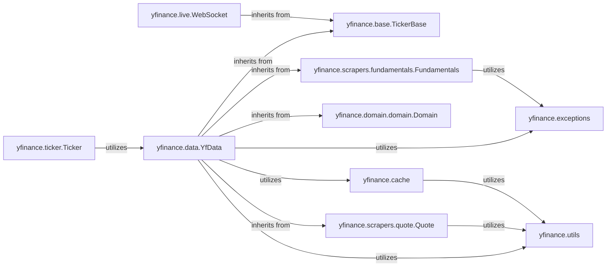

## Component Details

An overview of the fundamental components within the yfinance library, focusing on their structure, flow, and purpose, with yfinance.data.YfData as the central point of analysis.

### yfinance.data.YfData
Acts as the central data retrieval and aggregation component within yfinance. It provides a unified, high-level interface for users to access various types of structured financial data. YfData achieves this by inheriting functionalities from multiple specialized scraper modules, effectively acting as a facade that consolidates data access. Its responsibilities include managing the entire lifecycle of data requests, from initializing sessions and handling proxies to managing authentication (cookies and crumbs) and executing HTTP GET/POST requests. It also seamlessly integrates with caching and error handling mechanisms to ensure efficient and robust data retrieval.

**Related Classes/Methods**:

- <a href="https://github.com/ranaroussi/yfinance/blob/master/yfinance/data.py#L61-L433" target="_blank" rel="noopener noreferrer">`yfinance.data.YfData` (61:433)</a>

### yfinance.base.TickerBase
This is a foundational abstract base class that provides common attributes and methods shared across various components that deal with ticker symbols. It establishes a consistent interface and common functionalities for handling ticker-related information, promoting code reuse and architectural consistency throughout the library.

**Related Classes/Methods**:

- <a href="https://github.com/ranaroussi/yfinance/blob/master/yfinance/base.py#L49-L805" target="_blank" rel="noopener noreferrer">`yfinance.base.TickerBase` (49:805)</a>

### yfinance.exceptions
This component defines a structured hierarchy of custom exceptions used throughout the yfinance library. It provides specific error types for various scenarios encountered during data retrieval and processing, such as rate limiting, missing data, or invalid parameters. This structured approach allows for precise error management, clearer debugging, and more robust application behavior.

**Related Classes/Methods**:

- <a href="https://github.com/ranaroussi/yfinance/blob/master/yfinance/exceptions.py#L1-L1" target="_blank" rel="noopener noreferrer">`yfinance.exceptions` (1:1)</a>

### yfinance.utils
This component provides a collection of common utility functions that are widely used across the yfinance library. Its most notable contribution is the logging functionality, which is extensively utilized by YfData and other modules for debugging, operational insights, and tracking the flow of data requests. It also includes other general-purpose helpers that support various operations within the library.

**Related Classes/Methods**:

- <a href="https://github.com/ranaroussi/yfinance/blob/master/yfinance/utils.py#L1-L1" target="_blank" rel="noopener noreferrer">`yfinance.utils` (1:1)</a>

### yfinance.cache
This component is responsible for managing caching mechanisms within the yfinance library, primarily focusing on the caching of cookies. By storing and retrieving cookies, YfCache helps avoid repetitive authentication steps and reduces the number of redundant HTTP requests to Yahoo Finance. This significantly improves the efficiency and performance of data retrieval operations, especially for repeated requests or long-running sessions.

**Related Classes/Methods**:

- <a href="https://github.com/ranaroussi/yfinance/blob/master/yfinance/cache.py#L1-L1" target="_blank" rel="noopener noreferrer">`yfinance.cache` (1:1)</a>

### yfinance.domain.domain.Domain
This component represents a base class within the domain package, likely defining common structures or behaviors for domain-specific data entities. Its inheritance by YfData suggests that YfData integrates and processes data that adheres to these specific domain models, ensuring data consistency and proper categorization within the broader financial context.

**Related Classes/Methods**:

- <a href="https://github.com/ranaroussi/yfinance/blob/master/yfinance/domain/domain.py#L11-L198" target="_blank" rel="noopener noreferrer">`yfinance.domain.domain.Domain` (11:198)</a>

### yfinance.scrapers.quote.Quote
A specialized scraper module responsible for retrieving quote data, which typically includes real-time or near real-time price information, volume, and other summary statistics for a given ticker. YfData inherits from this class to expose its functionalities.

**Related Classes/Methods**:

- <a href="https://github.com/ranaroussi/yfinance/blob/master/yfinance/scrapers/quote.py#L487-L774" target="_blank" rel="noopener noreferrer">`yfinance.scrapers.quote.Quote` (487:774)</a>

### yfinance.scrapers.fundamentals.Fundamentals
A specialized scraper module focused on extracting fundamental financial data, such as income statements, balance sheets, and cash flow statements. YfData inherits from this class to provide comprehensive access to a company's financial health.

**Related Classes/Methods**:

- <a href="https://github.com/ranaroussi/yfinance/blob/master/yfinance/scrapers/fundamentals.py#L10-L42" target="_blank" rel="noopener noreferrer">`yfinance.scrapers.fundamentals.Fundamentals` (10:42)</a>

### yfinance.ticker.Ticker
This is the primary user-facing class that provides a convenient interface for interacting with a single stock ticker. It encapsulates the logic for fetching various types of data (prices, fundamentals, analysis, etc.) for a specific symbol, likely by orchestrating calls to YfData and other internal components.

**Related Classes/Methods**:

- <a href="https://github.com/ranaroussi/yfinance/blob/master/yfinance/ticker.py#L33-L327" target="_blank" rel="noopener noreferrer">`yfinance.ticker.Ticker` (33:327)</a>

### yfinance.live.WebSocket
This component handles real-time data streaming capabilities, allowing users to receive live updates for financial instruments. It extends TickerBase to integrate real-time data features with the core ticker abstraction.

**Related Classes/Methods**:

- <a href="https://github.com/ranaroussi/yfinance/blob/master/yfinance/live.py#L208-L334" target="_blank" rel="noopener noreferrer">`yfinance.live.WebSocket` (208:334)</a>

### [FAQ](https://github.com/CodeBoarding/GeneratedOnBoardings/tree/main?tab=readme-ov-file#faq)