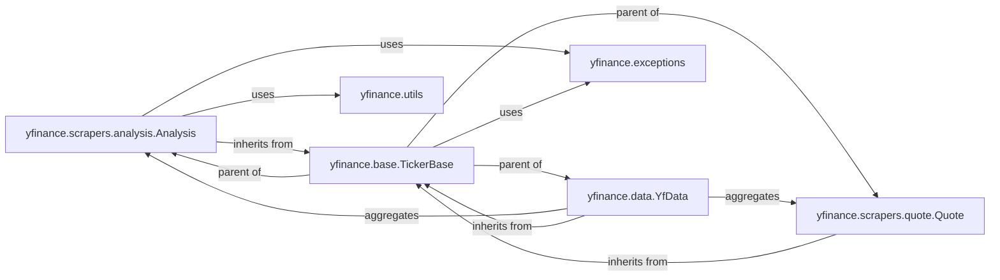

## Component Details

This analysis focuses on the `Analysis` component within the `yfinance` library, detailing its structure, purpose, and interactions with other core components. The selected components are fundamental to understanding how analyst data is fetched, processed, and exposed to users.

### yfinance.scrapers.analysis.Analysis
This is the core component dedicated to parsing and structuring analyst recommendation data from raw web responses. It extracts insights related to analyst ratings, target prices, consensus recommendations, earnings estimates, and other related financial metrics.

**Related Classes/Methods**: _None_

### yfinance.base.TickerBase
A foundational abstract base class that provides common attributes and methods for handling ticker symbols, managing HTTP sessions, and implementing basic data fetching mechanisms. It serves as the parent class for various data scraping components, including `Analysis`, ensuring consistency and reusability.

**Related Classes/Methods**: _None_

### yfinance.data.YfData
This component acts as a higher-level data interface that aggregates data from various scrapers, including the `Analysis` scraper. It provides a unified and simplified way for users to access different types of financial data, abstracting away the underlying scraping logic.

**Related Classes/Methods**: _None_

### yfinance.exceptions
This module defines custom exception classes used throughout the `yfinance` library. It is crucial for robust error handling, allowing the system to gracefully manage issues such as missing data, rate limits, or invalid requests during the scraping process.

**Related Classes/Methods**: _None_

### yfinance.utils
This module provides various utility functions used across the `yfinance` library. Specifically, functions like `get_yf_logger` are utilized by components like `Analysis` for logging operational information, warnings, or errors during data fetching and processing.

**Related Classes/Methods**: _None_

### yfinance.scrapers.quote.Quote
This component is responsible for scraping basic quote information for a ticker. Its data might be supplementary to the analyst data, and it shares a common base with the `Analysis` scraper.

**Related Classes/Methods**: _None_

### [FAQ](https://github.com/CodeBoarding/GeneratedOnBoardings/tree/main?tab=readme-ov-file#faq)