```mermaid
graph LR
    yfinance_ticker_Ticker["yfinance.ticker.Ticker"]
    yfinance_data_YfData["yfinance.data.YfData"]
    yfinance_scrapers_fundamentals_Financials["yfinance.scrapers.fundamentals.Financials"]
    yfinance_scrapers_fundamentals_Fundamentals["yfinance.scrapers.fundamentals.Fundamentals"]
    yfinance_base_TickerBase["yfinance.base.TickerBase"]
    yfinance_utils["yfinance.utils"]
    yfinance_ticker_Ticker -- "uses" --> yfinance_data_YfData
    yfinance_ticker_Ticker -- "inherits from" --> yfinance_base_TickerBase
    yfinance_data_YfData -- "composes/aggregates" --> yfinance_scrapers_fundamentals_Financials
    yfinance_data_YfData -- "inherits from" --> yfinance_base_TickerBase
    yfinance_scrapers_fundamentals_Financials -- "inherits from" --> yfinance_scrapers_fundamentals_Fundamentals
    yfinance_scrapers_fundamentals_Financials -- "uses" --> yfinance_utils
    yfinance_scrapers_fundamentals_Fundamentals -- "inherits from" --> yfinance_base_TickerBase
    yfinance_scrapers_fundamentals_Fundamentals -- "is parent of" --> yfinance_scrapers_fundamentals_Financials
    yfinance_base_TickerBase -- "is parent of" --> yfinance_scrapers_fundamentals_Fundamentals
    yfinance_base_TickerBase -- "is parent of" --> yfinance_data_YfData
    yfinance_utils -- "is used by" --> yfinance_scrapers_fundamentals_Financials
    click yfinance_data_YfData href "https://github.com/CodeBoarding/GeneratedOnBoardings/blob/main//yfinance/yfinance_data_YfData.md" "Details"
    click yfinance_scrapers_fundamentals_Financials href "https://github.com/CodeBoarding/GeneratedOnBoardings/blob/main//yfinance/yfinance_scrapers_fundamentals_Financials.md" "Details"
    click yfinance_scrapers_fundamentals_Fundamentals href "https://github.com/CodeBoarding/GeneratedOnBoardings/blob/main//yfinance/yfinance_scrapers_fundamentals_Fundamentals.md" "Details"
    click yfinance_base_TickerBase href "https://github.com/CodeBoarding/GeneratedOnBoardings/blob/main//yfinance/yfinance_base_TickerBase.md" "Details"
    click yfinance_utils href "https://github.com/CodeBoarding/GeneratedOnBoardings/blob/main//yfinance/yfinance_utils.md" "Details"
```

## Component Details

This analysis focuses on the `yfinance.scrapers.fundamentals.Financials` component and its integral role within the `yfinance` library's architecture for retrieving financial statement data. The selected components are fundamental because they form a clear chain of responsibility, from the user-facing interface down to the specific data scraping logic, with `Financials` being a key specialized scraper.

### yfinance.ticker.Ticker
This is the primary user-facing component of the `yfinance` library. Users instantiate this class to interact with the library and retrieve various types of financial data for a specific stock ticker. It acts as the main entry point for all data retrieval operations.

**Related Classes/Methods**:

- <a href="https://github.com/ranaroussi/yfinance/blob/master/yfinance/ticker.py#L33-L327" target="_blank" rel="noopener noreferrer">`yfinance.ticker.Ticker` (33:327)</a>

### yfinance.data.YfData
This component serves as a central data aggregator and facade. It orchestrates and composes various specialized scraper components, including `Financials`, to provide a unified and comprehensive interface for accessing different types of financial data for a given ticker. It abstracts the complexities of individual scrapers.

**Related Classes/Methods**:

- <a href="https://github.com/ranaroussi/yfinance/blob/master/yfinance/data.py#L61-L433" target="_blank" rel="noopener noreferrer">`yfinance.data.YfData` (61:433)</a>

### yfinance.scrapers.fundamentals.Financials
This is the core component under analysis. It is specifically responsible for fetching, parsing, and structuring detailed financial statements (Income Statement, Balance Sheet, and Cash Flow Statement) from Yahoo Finance. It provides methods like `get_income_time_series` for direct data retrieval.

**Related Classes/Methods**:

- <a href="https://github.com/ranaroussi/yfinance/blob/master/yfinance/scrapers/fundamentals.py#L45-L169" target="_blank" rel="noopener noreferrer">`yfinance.scrapers.fundamentals.Financials` (45:169)</a>

### yfinance.scrapers.fundamentals.Fundamentals
This abstract base class provides a foundational structure and standardized interface for various fundamental data scrapers within the `yfinance` library. It promotes code reusability and consistency across different types of fundamental data.

**Related Classes/Methods**:

- <a href="https://github.com/ranaroussi/yfinance/blob/master/yfinance/scrapers/fundamentals.py#L10-L42" target="_blank" rel="noopener noreferrer">`yfinance.scrapers.fundamentals.Fundamentals` (10:42)</a>

### yfinance.base.TickerBase
This foundational class is at the root of the inheritance hierarchy for many components in `yfinance` that operate on a specific stock ticker. It provides essential common attributes and methods related to ticker identification and basic data handling, ensuring a consistent interface across ticker-centric operations.

**Related Classes/Methods**:

- <a href="https://github.com/ranaroussi/yfinance/blob/master/yfinance/base.py#L49-L805" target="_blank" rel="noopener noreferrer">`yfinance.base.TickerBase` (49:805)</a>

### yfinance.utils
This module contains a collection of general-purpose utility functions used across the `yfinance` project. These functions provide common services such as logging, data manipulation, and error handling, supporting various components including the `Financials` scraper.

**Related Classes/Methods**:

- <a href="https://github.com/ranaroussi/yfinance/blob/master/yfinance/utils.py#L1-L1" target="_blank" rel="noopener noreferrer">`yfinance.utils` (1:1)</a>

### [FAQ](https://github.com/CodeBoarding/GeneratedOnBoardings/tree/main?tab=readme-ov-file#faq)