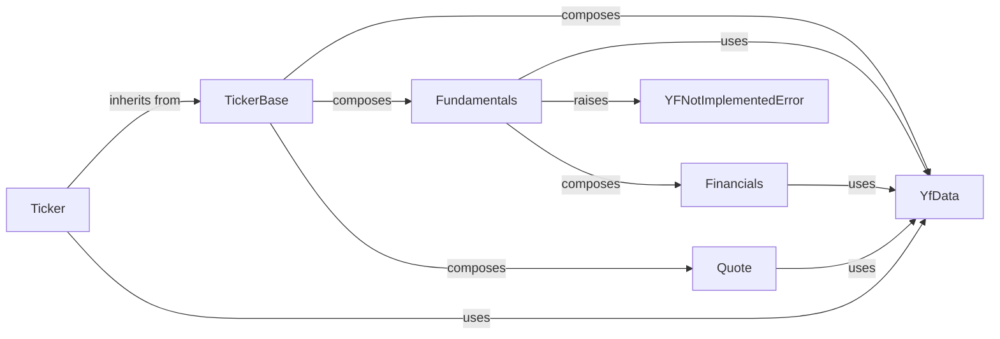

## Component Details

One paragraph explaining the functionality which is represented by this graph. What the main flow is and what is its purpose.

### TickerBase
Provides the foundational structure and common methods for all ticker-related operations across the yfinance library. It acts as an orchestrator, composing various data scraping and processing modules to ensure consistency and reusability.

**Related Classes/Methods**:

- <a href="https://github.com/ranaroussi/yfinance/blob/master/yfinance/base.py#L49-L805" target="_blank" rel="noopener noreferrer">`yfinance.base.TickerBase` (49:805)</a>

### Fundamentals
Manages the extraction and organization of a company's core financial statements, including income statements, balance sheets, and cash flow statements. It defines the structure and methods for accessing fundamental data and composes the Financials component for detailed data retrieval.

**Related Classes/Methods**:

- <a href="https://github.com/ranaroussi/yfinance/blob/master/yfinance/scrapers/fundamentals.py#L10-L42" target="_blank" rel="noopener noreferrer">`yfinance.scrapers.fundamentals.Fundamentals` (10:42)</a>

### Financials
Handles the detailed retrieval and processing of specific financial statements and data points by fetching time series data from Yahoo Finance. It is a specialized component composed by Fundamentals to provide granular financial information.

**Related Classes/Methods**:

- <a href="https://github.com/ranaroussi/yfinance/blob/master/yfinance/scrapers/fundamentals.py#L45-L169" target="_blank" rel="noopener noreferrer">`yfinance.scrapers.fundamentals.Financials` (45:169)</a>

### Quote
Responsible for scraping and providing real-time or summary quote information for a given ticker, including current price, volume, and other market-related data. It complements fundamental data by offering immediate market insights.

**Related Classes/Methods**:

- <a href="https://github.com/ranaroussi/yfinance/blob/master/yfinance/scrapers/quote.py#L487-L774" target="_blank" rel="noopener noreferrer">`yfinance.scrapers.quote.Quote` (487:774)</a>

### YfData
Serves as a central data fetching and caching mechanism, handling HTTP requests to Yahoo Finance APIs. It provides a unified interface for various scraper components to retrieve raw data, managing cookies and crumbs for successful API interactions.

**Related Classes/Methods**:

- <a href="https://github.com/ranaroussi/yfinance/blob/master/yfinance/data.py#L61-L433" target="_blank" rel="noopener noreferrer">`yfinance.data.YfData` (61:433)</a>

### Ticker
The primary user-facing interface for interacting with yfinance. It inherits from TickerBase and provides convenient access to all aggregated ticker information (e.g., financials, history, news) by leveraging the composed data components.

**Related Classes/Methods**:

- <a href="https://github.com/ranaroussi/yfinance/blob/master/yfinance/ticker.py#L33-L327" target="_blank" rel="noopener noreferrer">`yfinance.ticker.Ticker` (33:327)</a>

### YFNotImplementedError
A custom exception used to indicate that a requested feature or data point is not yet implemented within the yfinance library. It helps in graceful error handling and informs users about missing functionalities.

**Related Classes/Methods**:

- <a href="https://github.com/ranaroussi/yfinance/blob/master/yfinance/exceptions.py#L10-L12" target="_blank" rel="noopener noreferrer">`yfinance.exceptions.YFNotImplementedError` (10:12)</a>

### [FAQ](https://github.com/CodeBoarding/GeneratedOnBoardings/tree/main?tab=readme-ov-file#faq)