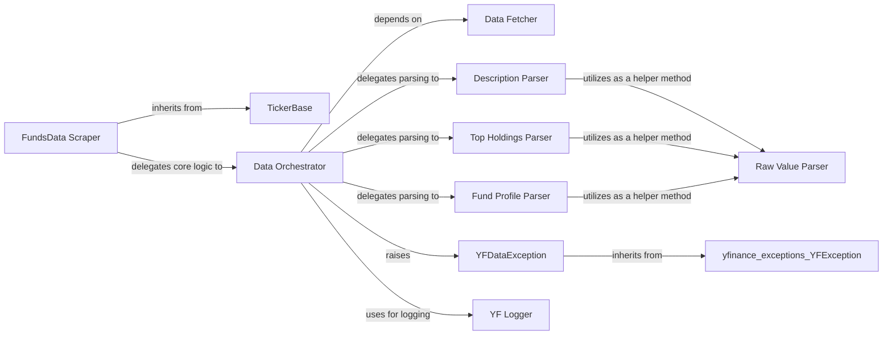

## Component Details

This document provides a refined overview of the fundamental components within the yfinance.scrapers.funds.FundsData subsystem, along with their responsibilities and interactions. These components represent the core functionalities, data flow, and error handling mechanisms essential for the FundsData scraper to operate effectively.

### FundsData Scraper
This is the primary class (yfinance.scrapers.funds.FundsData) that serves as the public interface for accessing various fund-related data points, such as quote type, description, and holdings. It orchestrates the entire data scraping and parsing process for funds.

**Related Classes/Methods**:

- <a href="https://github.com/ranaroussi/yfinance/blob/master/yfinance/scrapers/funds.py#L11-L334" target="_blank" rel="noopener noreferrer">`yfinance.scrapers.funds.FundsData` (11:334)</a>

### TickerBase
The foundational base class (yfinance.base.TickerBase) from which FundsData inherits. It provides fundamental functionalities and attributes common to all ticker-related operations within the yfinance library, ensuring consistency and reusability across different data types (e.g., stocks, funds).

**Related Classes/Methods**:

- <a href="https://github.com/ranaroussi/yfinance/blob/master/yfinance/base.py#L49-L805" target="_blank" rel="noopener noreferrer">`yfinance.base.TickerBase` (49:805)</a>

### Data Orchestrator
A crucial internal method (yfinance.scrapers.funds.FundsData._fetch_and_parse) that coordinates the fetching of raw data and then dispatches it to specific parsing sub-components based on the data type requested. It acts as an intermediary between the public interface methods of FundsData and the low-level fetch/parse operations.

**Related Classes/Methods**:

- <a href="https://github.com/ranaroussi/yfinance/blob/master/yfinance/scrapers/funds.py#L180-L202" target="_blank" rel="noopener noreferrer">`yfinance.scrapers.funds.FundsData._fetch_and_parse` (180:202)</a>

### Data Fetcher
An internal method (yfinance.scrapers.funds.FundsData._fetch) responsible for making the actual HTTP requests to retrieve raw data from the external financial data source (Yahoo Finance). It is the low-level component for data acquisition.

**Related Classes/Methods**:

- <a href="https://github.com/ranaroussi/yfinance/blob/master/yfinance/scrapers/funds.py#L168-L178" target="_blank" rel="noopener noreferrer">`yfinance.scrapers.funds.FundsData._fetch` (168:178)</a>

### Description Parser
A specialized internal method (yfinance.scrapers.funds.FundsData._parse_description) responsible for parsing the fund's description from the raw fetched content, transforming it into a structured format.

**Related Classes/Methods**:

- <a href="https://github.com/ranaroussi/yfinance/blob/master/yfinance/scrapers/funds.py#L221-L228" target="_blank" rel="noopener noreferrer">`yfinance.scrapers.funds.FundsData._parse_description` (221:228)</a>

### Top Holdings Parser
A specialized internal method (yfinance.scrapers.funds.FundsData._parse_top_holdings) dedicated to parsing the top holdings data of a fund from the raw fetched content, extracting and structuring information about the fund's investments.

**Related Classes/Methods**:

- <a href="https://github.com/ranaroussi/yfinance/blob/master/yfinance/scrapers/funds.py#L230-L304" target="_blank" rel="noopener noreferrer">`yfinance.scrapers.funds.FundsData._parse_top_holdings` (230:304)</a>

### Fund Profile Parser
A specialized internal method (yfinance.scrapers.funds.FundsData._parse_fund_profile) for parsing general fund profile information, such as fund overview and operations, from the raw data.

**Related Classes/Methods**:

- <a href="https://github.com/ranaroussi/yfinance/blob/master/yfinance/scrapers/funds.py#L306-L334" target="_blank" rel="noopener noreferrer">`yfinance.scrapers.funds.FundsData._parse_fund_profile` (306:334)</a>

### Raw Value Parser
A utility internal method (yfinance.scrapers.funds.FundsData._parse_raw_values) used by other specific data parsers to extract and clean individual raw values from the parsed data. It provides a common parsing utility, promoting consistency.

**Related Classes/Methods**:

- <a href="https://github.com/ranaroussi/yfinance/blob/master/yfinance/scrapers/funds.py#L205-L219" target="_blank" rel="noopener noreferrer">`yfinance.scrapers.funds.FundsData._parse_raw_values` (205:219)</a>

### YFDataException
A custom exception class (yfinance.exceptions.YFDataException) used to signal errors specifically related to data retrieval or parsing failures within the yfinance library, allowing for specific error handling.

**Related Classes/Methods**:

- <a href="https://github.com/ranaroussi/yfinance/blob/master/yfinance/exceptions.py#L1-L1" target="_blank" rel="noopener noreferrer">`yfinance.exceptions.YFDataException` (1:1)</a>

### YF Logger
A utility function (yfinance.utils.get_yf_logger) that provides logging capabilities, allowing the FundsData scraper to record events, errors, and debugging information during its operation, which is crucial for monitoring and troubleshooting.

**Related Classes/Methods**:

- <a href="https://github.com/ranaroussi/yfinance/blob/master/yfinance/utils.py#L145-L153" target="_blank" rel="noopener noreferrer">`yfinance.utils.get_yf_logger` (145:153)</a>

### [FAQ](https://github.com/CodeBoarding/GeneratedOnBoardings/tree/main?tab=readme-ov-file#faq)