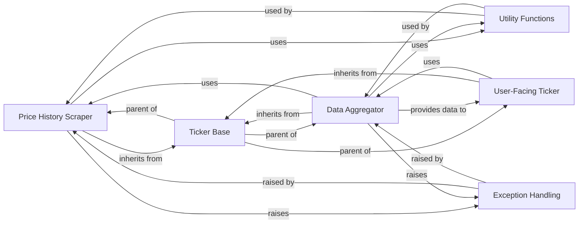

## Component Details

This analysis focuses on the `PriceHistory` component within the `yfinance` library, detailing its structure, purpose, and interactions with other fundamental parts of the system.

### Price History Scraper
This component is the core engine for retrieving and refining historical financial data. It specializes in parsing and structuring historical price and volume data for securities, including open, high, low, close prices, and trading volumes over various periods. It applies sophisticated cleaning, standardization, and adjustment algorithms to ensure data quality.

**Related Classes/Methods**:

- <a href="https://github.com/ranaroussi/yfinance/blob/master/yfinance/scrapers/history.py#L15-L2937" target="_blank" rel="noopener noreferrer">`yfinance.scrapers.history.PriceHistory` (15:2937)</a>

### Ticker Base
A foundational component providing common functionalities and a base structure for various ticker-related operations across the yfinance library. It serves as a parent class for components like PriceHistory, enabling code reuse and a consistent interface for interacting with different types of financial data.

**Related Classes/Methods**:

- <a href="https://github.com/ranaroussi/yfinance/blob/master/yfinance/base.py#L1-L100" target="_blank" rel="noopener noreferrer">`yfinance.base` (1:100)</a>

### Utility Functions
This component provides a comprehensive suite of helper functions that support various operations across the yfinance library. These utilities include functionalities for date and time parsing, robust DataFrame manipulation (e.g., timezone handling, merging data), and specific financial data adjustments (e.g., auto-adjustment for splits/dividends, back-adjustment).

**Related Classes/Methods**:

- <a href="https://github.com/ranaroussi/yfinance/blob/master/yfinance/utils.py#L1-L100" target="_blank" rel="noopener noreferrer">`yfinance.utils` (1:100)</a>

### Exception Handling
This component defines a set of custom exception classes tailored to specific error conditions encountered within the yfinance library. These exceptions provide clear and specific error messages, enabling robust error management and graceful failure handling throughout the system.

**Related Classes/Methods**:

- <a href="https://github.com/ranaroussi/yfinance/blob/master/yfinance/exceptions.py#L1-L100" target="_blank" rel="noopener noreferrer">`yfinance.exceptions` (1:100)</a>

### Data Aggregator
This component acts as a central orchestrator, aggregating data from various scraper components (including historical data, analysis, fundamentals, etc.) to provide a unified and comprehensive data interface. It inherits from TickerBase and integrates multiple data sources for a holistic view.

**Related Classes/Methods**:

- <a href="https://github.com/ranaroussi/yfinance/blob/master/yfinance/data.py#L1-L100" target="_blank" rel="noopener noreferrer">`yfinance.data` (1:100)</a>

### User-Facing Ticker
This is the primary public interface for users to interact with the yfinance library. It provides a high-level abstraction to access various financial data points for a given ticker, including historical prices, financial statements, and more, by leveraging the underlying scraper and data aggregation components.

**Related Classes/Methods**:

- <a href="https://github.com/ranaroussi/yfinance/blob/master/yfinance/ticker.py#L1-L100" target="_blank" rel="noopener noreferrer">`yfinance.ticker` (1:100)</a>

### [FAQ](https://github.com/CodeBoarding/GeneratedOnBoardings/tree/main?tab=readme-ov-file#faq)