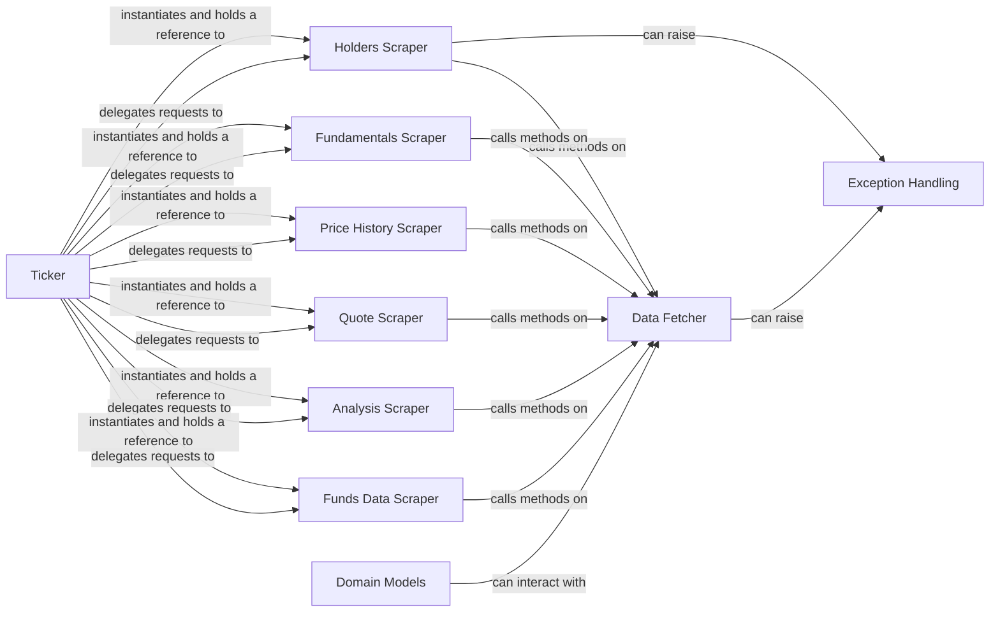

## Component Details

This analysis describes the core components and their relationships within the `yfinance` library. The `Ticker` component acts as the primary user entry point and orchestrator, delegating data retrieval to various specialized scraper components (e.g., `Holders Scraper`, `Fundamentals Scraper`, `Price History Scraper`, `Quote Scraper`, `Analysis Scraper`, `Funds Data Scraper`). All scrapers rely on the `Data Fetcher` for low-level HTTP requests and data acquisition. The `Exception Handling` component provides a structured way to manage errors across the library. Finally, `Domain Models` provide structured representations for financial concepts, some of which may interact with the `Data Fetcher`.

### Ticker
This is the primary entry point for users to interact with `yfinance` for a specific stock ticker. It inherits from `TickerBase` and acts as an orchestrator, aggregating various data scrapers (including `Holders`) and providing convenient, high-level methods to access different types of financial data. It instantiates and manages the lifecycle of scraper components.

**Related Classes/Methods**:

- <a href="https://github.com/ranaroussi/yfinance/blob/master/yfinance/ticker.py#L33-L327" target="_blank" rel="noopener noreferrer">`yfinance.ticker.Ticker` (33:327)</a>
- <a href="https://github.com/ranaroussi/yfinance/blob/master/yfinance/base.py#L49-L805" target="_blank" rel="noopener noreferrer">`yfinance.base.TickerBase` (49:805)</a>

### Holders Scraper
This component is solely responsible for fetching, parsing, and structuring all data related to a company's ownership. It encapsulates the complex logic of interacting with Yahoo Finance endpoints for holder data and transforming the raw responses into usable, structured formats (e.g., pandas DataFrames). It inherits from `TickerBase` to access common ticker-related functionalities.

**Related Classes/Methods**:

- <a href="https://github.com/ranaroussi/yfinance/blob/master/yfinance/scrapers/holders.py#L11-L239" target="_blank" rel="noopener noreferrer">`yfinance.scrapers.holders.Holders` (11:239)</a>

### Data Fetcher
This component manages the underlying HTTP session, handles cookie and crumb acquisition (essential for authentication with Yahoo Finance), and provides generic methods for making GET and POST requests. It acts as the foundational, low-level data access layer for all scrapers within `yfinance`. It is a dependency for various scrapers, including `Holders`.

**Related Classes/Methods**:

- <a href="https://github.com/ranaroussi/yfinance/blob/master/yfinance/data.py#L61-L433" target="_blank" rel="noopener noreferrer">`yfinance.data.YfData` (61:433)</a>
- <a href="https://github.com/ranaroussi/yfinance/blob/master/yfinance/data.py#L429-L433" target="_blank" rel="noopener noreferrer">`yfinance.data.YfData.get_raw_json` (429:433)</a>
- <a href="https://github.com/ranaroussi/yfinance/blob/master/yfinance/data.py#L368-L369" target="_blank" rel="noopener noreferrer">`yfinance.data.YfData.get` (368:369)</a>
- <a href="https://github.com/ranaroussi/yfinance/blob/master/yfinance/data.py#L372-L373" target="_blank" rel="noopener noreferrer">`yfinance.data.YfData.post` (372:373)</a>

### Exception Handling
This component defines custom exception classes used throughout the `yfinance` library to signal specific errors, particularly those related to data fetching or parsing failures. It provides a structured and informative way to manage and communicate issues to the user or calling code. `YFDataException` is a specialized exception for data-related issues, inheriting from the base `YFException`.

**Related Classes/Methods**:

- <a href="https://github.com/ranaroussi/yfinance/blob/master/yfinance/exceptions.py#L1-L1" target="_blank" rel="noopener noreferrer">`yfinance.exceptions.YFException` (1:1)</a>
- <a href="https://github.com/ranaroussi/yfinance/blob/master/yfinance/exceptions.py#L1-L1" target="_blank" rel="noopener noreferrer">`yfinance.exceptions.YFDataException` (1:1)</a>

### Fundamentals Scraper
This component is responsible for fetching and parsing fundamental financial data of a company, such as income statements, balance sheets, and cash flow statements. It inherits from `TickerBase` and provides structured access to this financial information.

**Related Classes/Methods**:

- <a href="https://github.com/ranaroussi/yfinance/blob/master/yfinance/scrapers/fundamentals.py#L10-L42" target="_blank" rel="noopener noreferrer">`yfinance.scrapers.fundamentals.Fundamentals` (10:42)</a>
- <a href="https://github.com/ranaroussi/yfinance/blob/master/yfinance/scrapers/fundamentals.py#L45-L169" target="_blank" rel="noopener noreferrer">`yfinance.scrapers.fundamentals.Financials` (45:169)</a>

### Price History Scraper
This component focuses on retrieving historical price data for a given ticker. It handles the complexities of fetching time-series data and presenting it in a usable format, typically a pandas DataFrame. It also inherits from `TickerBase`.

**Related Classes/Methods**:

- <a href="https://github.com/ranaroussi/yfinance/blob/master/yfinance/scrapers/history.py#L15-L2937" target="_blank" rel="noopener noreferrer">`yfinance.scrapers.history.PriceHistory` (15:2937)</a>

### Quote Scraper
This component is dedicated to fetching real-time or near real-time quote information for a stock, including current price, volume, and other key metrics. It inherits from `TickerBase` and provides quick access to current market data.

**Related Classes/Methods**:

- <a href="https://github.com/ranaroussi/yfinance/blob/master/yfinance/scrapers/quote.py#L487-L774" target="_blank" rel="noopener noreferrer">`yfinance.scrapers.quote.Quote` (487:774)</a>
- <a href="https://github.com/ranaroussi/yfinance/blob/master/yfinance/scrapers/quote.py#L25-L484" target="_blank" rel="noopener noreferrer">`yfinance.scrapers.quote.FastInfo` (25:484)</a>

### Analysis Scraper
This component is responsible for extracting and organizing analyst recommendations and earnings estimates for a company. It provides insights into market sentiment and future performance projections. It also inherits from `TickerBase`.

**Related Classes/Methods**:

- <a href="https://github.com/ranaroussi/yfinance/blob/master/yfinance/scrapers/analysis.py#L10-L191" target="_blank" rel="noopener noreferrer">`yfinance.scrapers.analysis.Analysis` (10:191)</a>

### Funds Data Scraper
This component specializes in retrieving data related to mutual funds and ETFs, including holdings, performance, and other fund-specific metrics. It inherits from `TickerBase` to integrate with the overall ticker-centric data access.

**Related Classes/Methods**:

- <a href="https://github.com/ranaroussi/yfinance/blob/master/yfinance/scrapers/funds.py#L11-L334" target="_blank" rel="noopener noreferrer">`yfinance.scrapers.funds.FundsData` (11:334)</a>

### Domain Models
This component encompasses various domain-specific models that represent financial concepts like industry, sector, and market. These models likely provide structured ways to interact with and categorize financial data, and some may interact with `YfData` for data retrieval.

**Related Classes/Methods**:

- <a href="https://github.com/ranaroussi/yfinance/blob/master/yfinance/domain/domain.py#L11-L198" target="_blank" rel="noopener noreferrer">`yfinance.domain.domain.Domain` (11:198)</a>
- <a href="https://github.com/ranaroussi/yfinance/blob/master/yfinance/domain/industry.py#L12-L154" target="_blank" rel="noopener noreferrer">`yfinance.domain.industry.Industry` (12:154)</a>
- <a href="https://github.com/ranaroussi/yfinance/blob/master/yfinance/domain/sector.py#L12-L155" target="_blank" rel="noopener noreferrer">`yfinance.domain.sector.Sector` (12:155)</a>
- <a href="https://github.com/ranaroussi/yfinance/blob/master/yfinance/domain/market.py#L7-L102" target="_blank" rel="noopener noreferrer">`yfinance.domain.market.Market` (7:102)</a>

### [FAQ](https://github.com/CodeBoarding/GeneratedOnBoardings/tree/main?tab=readme-ov-file#faq)