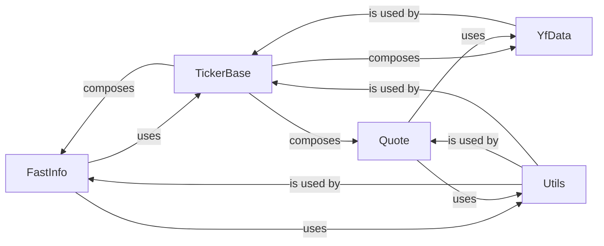

## Component Details

Overview of components and their relationships in a financial data scraping library.

### FastInfo
This class is a specialized scraper designed for rapidly fetching essential, frequently accessed financial metrics such as last price, daily high/low, and trading volume. Its purpose is to provide optimized, quick access to core quote information by utilizing a `TickerBase` object.

**Related Classes/Methods**:

- <a href="https://github.com/ranaroussi/yfinance/blob/master/yfinance/scrapers/quote.py#L25-L484" target="_blank" rel="noopener noreferrer">`yfinance.scrapers.quote.FastInfo` (25:484)</a>

### TickerBase
This serves as the foundational abstract base class for all ticker-related operations across the `yfinance` library. It provides common attributes and methods, and importantly, it composes instances of other key components like `YfData`, `Quote`, and `FastInfo` to manage various data scraping and processing functionalities.

**Related Classes/Methods**:

- <a href="https://github.com/ranaroussi/yfinance/blob/master/yfinance/base.py#L49-L805" target="_blank" rel="noopener noreferrer">`yfinance.base.TickerBase` (49:805)</a>

### Quote
This class is a scraper focused on retrieving comprehensive quote-related information. It relies on `YfData` to perform its data fetching operations, providing a broader interface for market quote information.

**Related Classes/Methods**:

- <a href="https://github.com/ranaroussi/yfinance/blob/master/yfinance/scrapers/quote.py#L487-L774" target="_blank" rel="noopener noreferrer">`yfinance.scrapers.quote.Quote` (487:774)</a>

### YfData
This class acts as a unified data fetching and caching layer for various types of financial data. It is responsible for making HTTP requests and caching responses, serving as a backend for other scraper components like `Quote` and `TickerBase`.

**Related Classes/Methods**:

- <a href="https://github.com/ranaroussi/yfinance/blob/master/yfinance/data.py#L61-L433" target="_blank" rel="noopener noreferrer">`yfinance.data.YfData` (61:433)</a>

### Utils
This module encapsulates a collection of general-purpose utility functions. These functions are crucial for common tasks such as data conversion, validation, and other manipulations used across the library, promoting code reusability and maintainability.

**Related Classes/Methods**:

- <a href="https://github.com/ranaroussi/yfinance/blob/master/yfinance/utils.py#L0-L0" target="_blank" rel="noopener noreferrer">`yfinance.utils` (0:0)</a>

### [FAQ](https://github.com/CodeBoarding/GeneratedOnBoardings/tree/main?tab=readme-ov-file#faq)