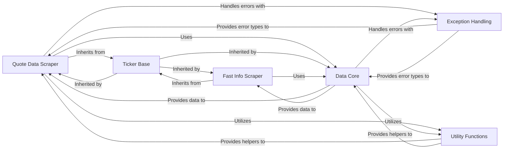

## Component Details

This analysis focuses on the `yfinance.scrapers.quote.Quote` component and its surrounding ecosystem, detailing its structure, data flow, and purpose within the `yfinance` library. The identified components are fundamental to the operation of retrieving and processing financial quote data.

### Quote Data Scraper
This is the core component responsible for parsing and structuring comprehensive real-time and summary quote data for financial tickers. It processes raw data to extract current prices, bid/ask information, daily trading statistics, and other related financial details.

**Related Classes/Methods**:

- <a href="https://github.com/ranaroussi/yfinance/blob/master/yfinance/scrapers/quote.py#L487-L774" target="_blank" rel="noopener noreferrer">`yfinance.scrapers.quote.Quote` (487:774)</a>

### Ticker Base
An abstract base class that provides foundational properties and methods common to all ticker-related operations. It ensures consistency in ticker identification, session management, and basic data access patterns across various data scrapers.

**Related Classes/Methods**:

- <a href="https://github.com/ranaroussi/yfinance/blob/master/yfinance/base.py#L49-L805" target="_blank" rel="noopener noreferrer">`yfinance.base.TickerBase` (49:805)</a>

### Data Core
This component acts as the central data access layer, responsible for executing HTTP requests to retrieve raw financial data from Yahoo Finance. It handles low-level fetching logic, caching mechanisms, and initial response processing before data is passed to specific scrapers.

**Related Classes/Methods**:

- <a href="https://github.com/ranaroussi/yfinance/blob/master/yfinance/data.py#L61-L433" target="_blank" rel="noopener noreferrer">`yfinance.data.YfData` (61:433)</a>

### Fast Info Scraper
A specialized scraper within the `quote` module designed for quickly retrieving a subset of essential, frequently accessed information about a ticker. It offers a lightweight alternative to the comprehensive `Quote Data Scraper` for specific use cases.

**Related Classes/Methods**:

- <a href="https://github.com/ranaroussi/yfinance/blob/master/yfinance/scrapers/quote.py#L25-L484" target="_blank" rel="noopener noreferrer">`yfinance.scrapers.quote.FastInfo` (25:484)</a>

### Exception Handling
This component defines and manages custom exception classes specific to the `yfinance` library. It provides a structured way to handle errors related to data retrieval, missing information, rate limits, and other operational issues.

**Related Classes/Methods**:

- <a href="https://github.com/ranaroussi/yfinance/blob/master/yfinance/exceptions.py#L1-L1000" target="_blank" rel="noopener noreferrer">`yfinance.exceptions` (1:1000)</a>

### Utility Functions
This component provides a collection of general-purpose utility functions used across the `yfinance` library. This includes logging utilities, data formatting helpers, and other common functionalities that support the core data retrieval and processing logic.

**Related Classes/Methods**:

- <a href="https://github.com/ranaroussi/yfinance/blob/master/yfinance/utils.py#L1-L1000" target="_blank" rel="noopener noreferrer">`yfinance.utils` (1:1000)</a>

### [FAQ](https://github.com/CodeBoarding/GeneratedOnBoardings/tree/main?tab=readme-ov-file#faq)