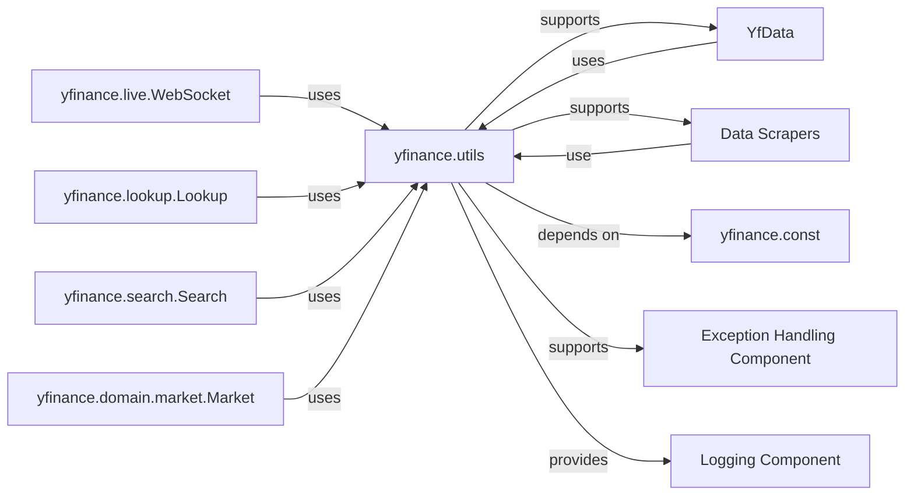

## Component Details

The yfinance.utils module serves as a foundational utility hub for the entire yfinance library. It provides a collection of general-purpose functions and classes that are crucial for various operations, including robust network communication, data handling, and logging. Its core purpose is to offer reusable, low-level functionalities that support higher-level components in data acquisition, processing, and error management, ensuring the library's stability and efficiency.

### yfinance.utils
The yfinance.utils module serves as a foundational utility hub for the entire yfinance library. It provides a collection of general-purpose functions and classes that are crucial for various operations, including robust network communication, data handling, and logging. Its core purpose is to offer reusable, low-level functionalities that support higher-level components in data acquisition, processing, and error management, ensuring the library's stability and efficiency.

**Related Classes/Methods**:

- <a href="https://github.com/ranaroussi/yfinance/blob/master/yfinance/utils.py#L1-L1" target="_blank" rel="noopener noreferrer">`yfinance.utils` (1:1)</a>

### YfData
This component is responsible for orchestrating the retrieval and aggregation of financial data from various sources. It acts as a central data access layer.

**Related Classes/Methods**:

- `YfData` (1:1)

### Data Scrapers
A collection of specialized components (modules/classes) dedicated to scraping specific types of financial data (e.g., historical prices, quotes, fundamentals).

**Related Classes/Methods**:

- `yfinance.scrapers` (1:1)

### yfinance.live.WebSocket
This component handles real-time data streaming via WebSocket connections, providing live updates for financial instruments.

**Related Classes/Methods**:

- <a href="https://github.com/ranaroussi/yfinance/blob/master/yfinance/live.py#L208-L334" target="_blank" rel="noopener noreferrer">`yfinance.live.WebSocket` (208:334)</a>

### yfinance.lookup.Lookup
This component provides functionalities for looking up financial instruments or symbols based on various criteria.

**Related Classes/Methods**:

- <a href="https://github.com/ranaroussi/yfinance/blob/master/yfinance/lookup.py#L33-L223" target="_blank" rel="noopener noreferrer">`yfinance.lookup.Lookup` (33:223)</a>

### yfinance.search.Search
Similar to Lookup, this component focuses on broader search capabilities within the yfinance ecosystem.

**Related Classes/Methods**:

- <a href="https://github.com/ranaroussi/yfinance/blob/master/yfinance/search.py#L29-L161" target="_blank" rel="noopener noreferrer">`yfinance.search.Search` (29:161)</a>

### yfinance.const
This module stores various constants, such as URLs, API endpoints, and other fixed values used throughout the yfinance library.

**Related Classes/Methods**:

- <a href="https://github.com/ranaroussi/yfinance/blob/master/yfinance/const.py#L1-L1" target="_blank" rel="noopener noreferrer">`yfinance.const` (1:1)</a>

### yfinance.domain.market.Market
Represents domain-specific logic and data structures related to market information.

**Related Classes/Methods**:

- <a href="https://github.com/ranaroussi/yfinance/blob/master/yfinance/domain/market.py#L7-L102" target="_blank" rel="noopener noreferrer">`yfinance.domain.market.Market` (7:102)</a>

### Exception Handling Component
This conceptual component encompasses the mechanisms for identifying, raising, and handling errors throughout the yfinance library, ensuring graceful degradation and informative feedback.

**Related Classes/Methods**:

- <a href="https://github.com/ranaroussi/yfinance/blob/master/yfinance/exceptions.py#L1-L1" target="_blank" rel="noopener noreferrer">`yfinance.exceptions` (1:1)</a>

### Logging Component
This conceptual component manages the logging of events, warnings, and errors within the yfinance library, aiding in debugging and operational monitoring.

**Related Classes/Methods**:

- <a href="https://github.com/ranaroussi/yfinance/blob/master/yfinance/utils.py#L55-L62" target="_blank" rel="noopener noreferrer">`yfinance.utils.IndentLoggerAdapter` (55:62)</a>

### [FAQ](https://github.com/CodeBoarding/GeneratedOnBoardings/tree/main?tab=readme-ov-file#faq)