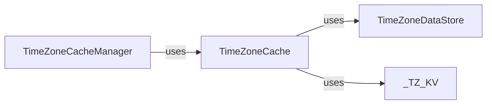

## Component Details

Overview of timezone caching components and their relationships.

### TimeZoneCacheManager
Manages the singleton instance of the timezone cache. It provides a central point of access for retrieving the TimeZoneCache instance, ensuring that only one instance of the timezone cache is active throughout the application.

**Related Classes/Methods**:

- <a href="https://github.com/ranaroussi/yfinance/blob/master/yfinance/cache.py#L36-L48" target="_blank" rel="noopener noreferrer">`yfinance.cache._TzCacheManager` (36:48)</a>

### TimeZoneDataStore
Handles the persistent storage and retrieval of timezone data. This component is responsible for managing the SQLite database (tkr-tz.db), including its initialization, connection, and closing. It also manages the cache directory on the file system.

**Related Classes/Methods**:

- <a href="https://github.com/ranaroussi/yfinance/blob/master/yfinance/cache.py#L51-L102" target="_blank" rel="noopener noreferrer">`yfinance.cache._TzDBManager` (51:102)</a>

### TimeZoneCache
Implements the core caching logic for timezone data. It interacts with the TimeZoneDataStore to obtain a database connection and performs lookup and store operations for timezone information using a key-value store.

**Related Classes/Methods**:

- <a href="https://github.com/ranaroussi/yfinance/blob/master/yfinance/cache.py#L118-L201" target="_blank" rel="noopener noreferrer">`yfinance.cache._TzCache` (118:201)</a>
- <a href="https://github.com/ranaroussi/yfinance/blob/master/yfinance/cache.py#L109-L115" target="_blank" rel="noopener noreferrer">`yfinance.cache._TZ_KV` (109:115)</a>

### _TZ_KV
Represents the key-value model used by TimeZoneCache for database operations.

**Related Classes/Methods**:

- <a href="https://github.com/ranaroussi/yfinance/blob/master/yfinance/cache.py#L109-L115" target="_blank" rel="noopener noreferrer">`yfinance.cache._TZ_KV` (109:115)</a>

### [FAQ](https://github.com/CodeBoarding/GeneratedOnBoardings/tree/main?tab=readme-ov-file#faq)