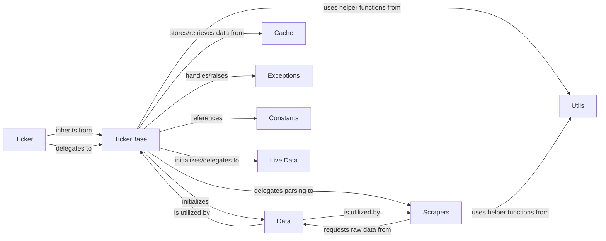

## Component Details

Component overview for the Core Ticker Interface in the yfinance library.

### Ticker
The primary user-facing class (yfinance.ticker.Ticker) that serves as the entry point for accessing all financial data related to a single stock ticker. It provides a high-level, convenient API through properties and methods, abstracting the complexities of data retrieval and parsing.

**Related Classes/Methods**:

- <a href="https://github.com/ranaroussi/yfinance/blob/master/yfinance/ticker.py#L33-L327" target="_blank" rel="noopener noreferrer">`yfinance.ticker.Ticker` (33:327)</a>

### TickerBase
An abstract base class (yfinance.base.TickerBase) that acts as the foundational orchestrator for Ticker operations. It manages the underlying data fetching mechanism (Data) and delegates specific data parsing tasks to various Scrapers. It centralizes common logic and state for ticker-related data.

**Related Classes/Methods**:

- <a href="https://github.com/ranaroussi/yfinance/blob/master/yfinance/base.py#L49-L805" target="_blank" rel="noopener noreferrer">`yfinance.base.TickerBase` (49:805)</a>

### Data
Responsible for low-level HTTP requests to Yahoo Finance APIs. This component (yfinance.data.YfData) handles session management, proxy settings, and retrieves raw JSON or HTML responses, acting as the direct communication layer with external data sources.

**Related Classes/Methods**:

- <a href="https://github.com/ranaroussi/yfinance/blob/master/yfinance/data.py#L61-L433" target="_blank" rel="noopener noreferrer">`yfinance.data.YfData` (61:433)</a>

### Scrapers
A collection of specialized modules (e.g., yfinance.scrapers.analysis, yfinance.scrapers.holders, yfinance.scrapers.quote, yfinance.scrapers.fundamentals, yfinance.scrapers.history, yfinance.scrapers.funds) each dedicated to parsing specific types of financial data from the raw responses provided by the Data component. They transform unstructured web content into structured Python objects (e.g., Pandas DataFrames or dictionaries).

**Related Classes/Methods**:

- <a href="https://github.com/ranaroussi/yfinance/blob/master/yfinance/scrapers/analysis.py#L1-L1" target="_blank" rel="noopener noreferrer">`yfinance.scrapers.analysis` (1:1)</a>
- <a href="https://github.com/ranaroussi/yfinance/blob/master/yfinance/scrapers/holders.py#L1-L1" target="_blank" rel="noopener noreferrer">`yfinance.scrapers.holders` (1:1)</a>
- <a href="https://github.com/ranaroussi/yfinance/blob/master/yfinance/scrapers/quote.py#L1-L1" target="_blank" rel="noopener noreferrer">`yfinance.scrapers.quote` (1:1)</a>
- <a href="https://github.com/ranaroussi/yfinance/blob/master/yfinance/scrapers/fundamentals.py#L1-L1" target="_blank" rel="noopener noreferrer">`yfinance.scrapers.fundamentals` (1:1)</a>
- <a href="https://github.com/ranaroussi/yfinance/blob/master/yfinance/scrapers/history.py#L1-L1" target="_blank" rel="noopener noreferrer">`yfinance.scrapers.history` (1:1)</a>
- <a href="https://github.com/ranaroussi/yfinance/blob/master/yfinance/scrapers/funds.py#L1-L1" target="_blank" rel="noopener noreferrer">`yfinance.scrapers.funds` (1:1)</a>

### Utils
A module (yfinance.utils) containing various helper functions used across the library for common tasks such as logging, string manipulation (e.g., camelCase to Title Case), date parsing, and timezone handling.

**Related Classes/Methods**:

- <a href="https://github.com/ranaroussi/yfinance/blob/master/yfinance/utils.py#L1-L1" target="_blank" rel="noopener noreferrer">`yfinance.utils` (1:1)</a>

### Cache
Manages caching mechanisms (yfinance.cache) to store frequently accessed data, such as timezone information and ISIN lookups. This reduces the number of redundant API calls and improves performance.

**Related Classes/Methods**:

- <a href="https://github.com/ranaroussi/yfinance/blob/master/yfinance/cache.py#L1-L1" target="_blank" rel="noopener noreferrer">`yfinance.cache` (1:1)</a>

### Exceptions
Defines custom exception classes (yfinance.exceptions) specific to the yfinance library. These exceptions provide structured error handling and communicate specific issues (e.g., rate limits, missing data) to the user.

**Related Classes/Methods**:

- <a href="https://github.com/ranaroussi/yfinance/blob/master/yfinance/exceptions.py#L1-L1" target="_blank" rel="noopener noreferrer">`yfinance.exceptions` (1:1)</a>

### Constants
A module (yfinance.const) that centralizes various constant values, including base URLs for Yahoo Finance APIs and other fixed parameters used throughout the library.

**Related Classes/Methods**:

- <a href="https://github.com/ranaroussi/yfinance/blob/master/yfinance/const.py#L1-L1" target="_blank" rel="noopener noreferrer">`yfinance.const` (1:1)</a>

### Live Data
Handles real-time data streaming functionality (yfinance.websocket.WebSocket), allowing users to subscribe to live updates for a given ticker.

**Related Classes/Methods**:

- `yfinance.websocket.WebSocket` (1:1)

### [FAQ](https://github.com/CodeBoarding/GeneratedOnBoardings/tree/main?tab=readme-ov-file#faq)