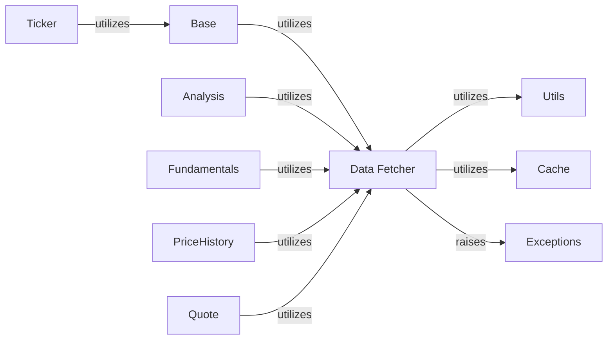

## Component Details

The `Data Fetcher` component, primarily embodied by the `yfinance.data.YfData` class, serves as the foundational network layer for the entire `yfinance` library. Its core purpose is to manage all HTTP communication with Yahoo Finance, ensuring reliable and compliant data retrieval.

### Data Fetcher
The central network layer responsible for all HTTP communication with Yahoo Finance. It manages HTTP sessions, handles proxy configurations, and critically, acquires and persists cookies and crumbs to bypass anti-bot measures. It provides the low-level `get` and `post` methods used by all data-retrieval components.

**Related Classes/Methods**:

- <a href="https://github.com/ranaroussi/yfinance/blob/master/yfinance/data.py#L61-L433" target="_blank" rel="noopener noreferrer">`yfinance.data.YfData` (61:433)</a>
- <a href="https://github.com/ranaroussi/yfinance/blob/master/yfinance/data.py#L107-L114" target="_blank" rel="noopener noreferrer">`yfinance.data.YfData:_set_proxy` (107:114)</a>
- <a href="https://github.com/ranaroussi/yfinance/blob/master/yfinance/data.py#L184-L203" target="_blank" rel="noopener noreferrer">`yfinance.data.YfData:_get_cookie_basic` (184:203)</a>
- <a href="https://github.com/ranaroussi/yfinance/blob/master/yfinance/data.py#L140-L158" target="_blank" rel="noopener noreferrer">`yfinance.data.YfData:_save_cookie_curlCffi` (140:158)</a>
- <a href="https://github.com/ranaroussi/yfinance/blob/master/yfinance/data.py#L161-L181" target="_blank" rel="noopener noreferrer">`yfinance.data.YfData:_load_cookie_curlCffi` (161:181)</a>
- <a href="https://github.com/ranaroussi/yfinance/blob/master/yfinance/data.py#L116-L137" target="_blank" rel="noopener noreferrer">`yfinance.data.YfData:_set_cookie_strategy` (116:137)</a>
- <a href="https://github.com/ranaroussi/yfinance/blob/master/yfinance/data.py#L368-L369" target="_blank" rel="noopener noreferrer">`yfinance.data.YfData:get` (368:369)</a>
- <a href="https://github.com/ranaroussi/yfinance/blob/master/yfinance/data.py#L372-L373" target="_blank" rel="noopener noreferrer">`yfinance.data.YfData:post` (372:373)</a>
- `curl_cffi.requests.Session` (-1:-1)

### Utils
Contains a collection of utility functions used across different scraper components, including logging, date/time parsing, data frame manipulation, and data validation.

**Related Classes/Methods**: _None_

### Cache
This component handles caching mechanisms to store and retrieve frequently accessed data, improving performance and reducing redundant requests.

**Related Classes/Methods**: _None_

### Exceptions
This module defines custom exception classes used throughout the `yfinance` library. These exceptions provide specific error handling for various data retrieval and processing issues.

**Related Classes/Methods**: _None_

### Base
This component appears to provide foundational or common functionalities used by other parts of the library, possibly related to the core `Ticker` object and its interaction with data fetching. It acts as an intermediary for various data scrapers.

**Related Classes/Methods**: _None_

### Ticker
This component represents a single financial ticker and provides a high-level interface to access various data points related to that ticker (e.g., historical prices, financial statements, analysis).

**Related Classes/Methods**: _None_

### Analysis
This component is responsible for fetching and parsing financial analysis data, such as earnings estimates, revenue estimates, and analyst price targets.

**Related Classes/Methods**: _None_

### Fundamentals
This component serves as an entry point for fundamental financial data, primarily delegating to the `Financials` component for detailed financial statements (income statement, balance sheet, cash flow).

**Related Classes/Methods**: _None_

### PriceHistory
This component is responsible for retrieving and processing historical price data, including dividends, capital gains, and stock splits. It includes complex logic for handling data inconsistencies and adjustments.

**Related Classes/Methods**: _None_

### Quote
This component handles a broad range of quote-related information, including general company info, sustainability metrics, analyst recommendations, and earnings calendar.

**Related Classes/Methods**: _None_

### [FAQ](https://github.com/CodeBoarding/GeneratedOnBoardings/tree/main?tab=readme-ov-file#faq)