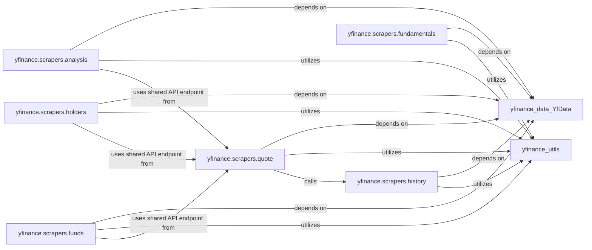

## Component Details

The `Data Scrapers` subsystem in `yfinance` is a specialized collection of modules designed to extract, parse, and structure various types of financial data from raw Yahoo Finance responses (HTML/JSON). Each module focuses on a specific data domain, transforming the raw web data into usable Python data structures, primarily pandas DataFrames. This subsystem is critical for providing the rich financial information that `yfinance` users rely on.

### yfinance.scrapers.history
Responsible for scraping and parsing historical market data (e.g., open, high, low, close prices, volume) for a given ticker. It handles the transformation of raw historical data into a structured pandas DataFrame, managing various periods, intervals, and data adjustments.

**Related Classes/Methods**:

- <a href="https://github.com/ranaroussi/yfinance/blob/master/yfinance/scrapers/history.py#L0-L0" target="_blank" rel="noopener noreferrer">`yfinance.scrapers.history` (0:0)</a>

### yfinance.scrapers.quote
Focuses on retrieving and processing real-time or near real-time quote data, including current prices, bid/ask information, market capitalization, and other immediate trading metrics. It provides a lazy-loading dictionary-like interface for quick access to this information.

**Related Classes/Methods**:

- <a href="https://github.com/ranaroussi/yfinance/blob/master/yfinance/scrapers/quote.py#L0-L0" target="_blank" rel="noopener noreferrer">`yfinance.scrapers.quote` (0:0)</a>

### yfinance.scrapers.fundamentals
Dedicated to extracting and structuring fundamental financial data, such as income statements, balance sheets, and cash flow statements. It parses complex financial tables from Yahoo Finance responses into structured DataFrames.

**Related Classes/Methods**:

- <a href="https://github.com/ranaroussi/yfinance/blob/master/yfinance/scrapers/fundamentals.py#L0-L0" target="_blank" rel="noopener noreferrer">`yfinance.scrapers.fundamentals` (0:0)</a>

### yfinance.scrapers.analysis
Handles the scraping and organization of analyst recommendations, earnings estimates, EPS trends, EPS revisions, earnings history, and growth estimates provided by Yahoo Finance.

**Related Classes/Methods**:

- <a href="https://github.com/ranaroussi/yfinance/blob/master/yfinance/scrapers/analysis.py#L0-L0" target="_blank" rel="noopener noreferrer">`yfinance.scrapers.analysis` (0:0)</a>

### yfinance.scrapers.holders
Specializes in retrieving and structuring information about major shareholders, institutional holders, mutual fund holders, and insider transactions/purchases/roster for a company's stock.

**Related Classes/Methods**:

- <a href="https://github.com/ranaroussi/yfinance/blob/master/yfinance/scrapers/holders.py#L0-L0" target="_blank" rel="noopener noreferrer">`yfinance.scrapers.holders` (0:0)</a>

### yfinance.scrapers.funds
Responsible for scraping data specifically related to mutual funds and ETFs, including their quote type, description, overview, operations, asset classes, top holdings, equity/bond holdings, bond ratings, and sector weightings.

**Related Classes/Methods**:

- <a href="https://github.com/ranaroussi/yfinance/blob/master/yfinance/scrapers/funds.py#L0-L0" target="_blank" rel="noopener noreferrer">`yfinance.scrapers.funds` (0:0)</a>

### [FAQ](https://github.com/CodeBoarding/GeneratedOnBoardings/tree/main?tab=readme-ov-file#faq)