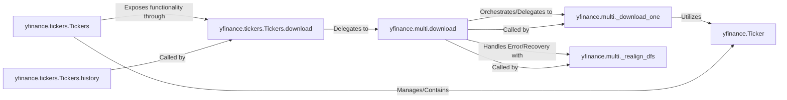

## Component Details

This subsystem provides robust functionalities for handling operations across multiple financial instruments, optimizing performance for large-scale data collection. It achieves this through a central batch download function and a container class for managing a portfolio of ticker objects.

### yfinance.multi.download
This is the core function responsible for orchestrating the batch download of historical data for a list of tickers. It manages the overall process, including preparing the ticker list, handling multi-threading (or synchronous execution), collecting results, and consolidating data from individual ticker downloads. It also incorporates error handling and recovery mechanisms.

**Related Classes/Methods**:

- <a href="https://github.com/ranaroussi/yfinance/blob/master/yfinance/multi.py#L39-L233" target="_blank" rel="noopener noreferrer">`yfinance.multi.download` (39:233)</a>

### yfinance.multi._download_one
An internal helper function that performs the actual data download for a *single* financial ticker. It wraps the `Ticker().history()` method to fetch data from Yahoo Finance and handles any exceptions that occur during the individual download, reporting them to the shared error structures.

**Related Classes/Methods**:

- <a href="https://github.com/ranaroussi/yfinance/blob/master/yfinance/multi.py#L272-L295" target="_blank" rel="noopener noreferrer">`yfinance.multi._download_one` (272:295)</a>

### yfinance.multi._realign_dfs
A private utility function designed to address issues that arise when concatenating DataFrames from multiple tickers, particularly when `pandas.concat` fails due to inconsistent indices or columns. It realigns and cleans up the individual DataFrames to ensure successful consolidation.

**Related Classes/Methods**:

- <a href="https://github.com/ranaroussi/yfinance/blob/master/yfinance/multi.py#L236-L256" target="_blank" rel="noopener noreferrer">`yfinance.multi._realign_dfs` (236:256)</a>

### yfinance.tickers.Tickers
This class serves as a high-level container for managing a collection of `Ticker` objects. It provides an abstraction layer, allowing users to interact with a portfolio of financial instruments as a single entity, simplifying operations across multiple assets.

**Related Classes/Methods**:

- <a href="https://github.com/ranaroussi/yfinance/blob/master/yfinance/tickers.py#L31-L114" target="_blank" rel="noopener noreferrer">`yfinance.tickers.Tickers` (31:114)</a>

### yfinance.tickers.Tickers.download
This method, part of the `Tickers` class, acts as an intermediary for initiating the download of historical data for all tickers associated with the `Tickers` object. It prepares the necessary parameters and then delegates the actual data fetching to the `yfinance.multi.download` function, subsequently updating the internal `Ticker` objects with the downloaded data.

**Related Classes/Methods**:

- <a href="https://github.com/ranaroussi/yfinance/blob/master/yfinance/tickers.py#L71-L104" target="_blank" rel="noopener noreferrer">`yfinance.tickers.Tickers:download` (71:104)</a>

### yfinance.Ticker
Represents a single financial ticker object.

**Related Classes/Methods**:

- <a href="https://github.com/ranaroussi/yfinance/blob/master/yfinance/ticker.py#L33-L327" target="_blank" rel="noopener noreferrer">`yfinance.Ticker` (33:327)</a>

### yfinance.tickers.Tickers.history
A method of the `Tickers` class that provides historical data.

**Related Classes/Methods**:

- <a href="https://github.com/ranaroussi/yfinance/blob/master/yfinance/tickers.py#L51-L69" target="_blank" rel="noopener noreferrer">`yfinance.tickers.Tickers:history` (51:69)</a>

### [FAQ](https://github.com/CodeBoarding/GeneratedOnBoardings/tree/main?tab=readme-ov-file#faq)