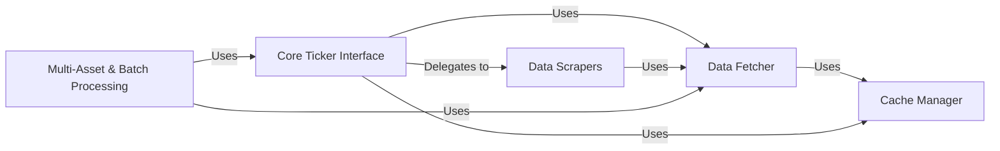

## Component Details

The `yfinance` library's architecture is primarily driven by its goal of providing easy access to Yahoo Finance data. The analysis of its Control Flow Graph (CFG) and source code reveals a clear separation of concerns, with distinct components handling user interaction, network communication, data parsing, caching, and multi-asset processing.

### Core Ticker Interface
This is the primary user-facing component, acting as an orchestrator for all data requests related to a single financial instrument. It provides a high-level API for accessing historical data, financial statements, news, options, and more, delegating the actual data retrieval and parsing to specialized internal components. It encapsulates the `Ticker` object and its foundational `TickerBase` methods.

**Related Classes/Methods**:

- <a href="https://github.com/ranaroussi/yfinance/blob/master/yfinance/ticker.py#L33-L327" target="_blank" rel="noopener noreferrer">`yfinance.ticker.Ticker` (33:327)</a>
- <a href="https://github.com/ranaroussi/yfinance/blob/master/yfinance/base.py#L49-L805" target="_blank" rel="noopener noreferrer">`yfinance.base.TickerBase` (49:805)</a>

### Data Fetcher
The central network layer responsible for all HTTP communication with Yahoo Finance. It manages HTTP sessions, handles proxy configurations, and critically, acquires and persists cookies and crumbs to bypass anti-bot measures. It provides the low-level `get` and `post` methods used by all data-retrieval components.

**Related Classes/Methods**:

- <a href="https://github.com/ranaroussi/yfinance/blob/master/yfinance/data.py#L1-L1" target="_blank" rel="noopener noreferrer">`yfinance.data.get` (1:1)</a>
- <a href="https://github.com/ranaroussi/yfinance/blob/master/yfinance/data.py#L1-L1" target="_blank" rel="noopener noreferrer">`yfinance.data.post` (1:1)</a>

### Data Scrapers
A collection of specialized modules, each dedicated to scraping, parsing, and structuring specific types of financial data from raw Yahoo Finance responses (HTML/JSON). This includes historical prices, financial statements, quotes, analysis, and holder information. They transform raw web data into usable Python data structures (e.g., pandas DataFrames).

**Related Classes/Methods**:

- <a href="https://github.com/ranaroussi/yfinance/blob/master/yfinance/scrapers/history.py#L1-L1" target="_blank" rel="noopener noreferrer">`yfinance.scrapers.history` (1:1)</a>
- <a href="https://github.com/ranaroussi/yfinance/blob/master/yfinance/scrapers/quote.py#L1-L1" target="_blank" rel="noopener noreferrer">`yfinance.scrapers.quote` (1:1)</a>
- <a href="https://github.com/ranaroussi/yfinance/blob/master/yfinance/scrapers/fundamentals.py#L1-L1" target="_blank" rel="noopener noreferrer">`yfinance.scrapers.fundamentals` (1:1)</a>
- <a href="https://github.com/ranaroussi/yfinance/blob/master/yfinance/scrapers/analysis.py#L1-L1" target="_blank" rel="noopener noreferrer">`yfinance.scrapers.analysis` (1:1)</a>
- <a href="https://github.com/ranaroussi/yfinance/blob/master/yfinance/scrapers/holders.py#L1-L1" target="_blank" rel="noopener noreferrer">`yfinance.scrapers.holders` (1:1)</a>
- <a href="https://github.com/ranaroussi/yfinance/blob/master/yfinance/scrapers/funds.py#L1-L1" target="_blank" rel="noopener noreferrer">`yfinance.scrapers.funds` (1:1)</a>

### Cache Manager
Implements caching mechanisms for frequently accessed data, such as timezones, cookies, and ISINs. This component significantly improves performance by reducing redundant network requests and ensuring efficient retrieval of relatively static information.

**Related Classes/Methods**:

- <a href="https://github.com/ranaroussi/yfinance/blob/master/yfinance/cache.py#L1-L1" target="_blank" rel="noopener noreferrer">`yfinance.cache` (1:1)</a>

### Multi-Asset & Batch Processing
Provides functionalities for handling operations across multiple financial instruments. This includes efficient batch downloading of historical data for a list of tickers (`yfinance.multi.download`) and a container class (`yfinance.tickers.Tickers`) to manage and interact with a portfolio of `Ticker` objects. It optimizes performance for large-scale data collection.

**Related Classes/Methods**:

- <a href="https://github.com/ranaroussi/yfinance/blob/master/yfinance/multi.py#L39-L233" target="_blank" rel="noopener noreferrer">`yfinance.multi.download` (39:233)</a>
- <a href="https://github.com/ranaroussi/yfinance/blob/master/yfinance/tickers.py#L31-L114" target="_blank" rel="noopener noreferrer">`yfinance.tickers.Tickers` (31:114)</a>

### [FAQ](https://github.com/CodeBoarding/GeneratedOnBoardings/tree/main?tab=readme-ov-file#faq)