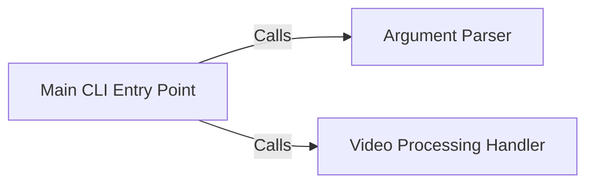

## Details

The `CLI Orchestrator` subsystem is primarily encapsulated within the `cykdl.__main__` module, specifically involving the `main`, `parse_args`, and `handle_video` functions. These components collectively manage the command-line interface's lifecycle, from input parsing to initiating the core video processing logic.

### Main CLI Entry Point
This is the primary entry point for the `cykdl` command-line application. It orchestrates the overall workflow, initiating argument parsing and subsequently delegating control to the video processing handler based on the parsed arguments. It acts as the central coordinator for the CLI.

**Related Classes/Methods**:

- <a href="https://github.com/LifeActor/ykdl/blob/master/cykdl/__main__.py#L247-L364" target="_blank" rel="noopener noreferrer">`cykdl.__main__.main`:247-364</a>

### Argument Parser
Responsible for defining and parsing command-line arguments provided by the user. It interprets user input, validates options, and prepares the arguments for consumption by other components, ensuring the application understands the user's intent.

**Related Classes/Methods**:

- <a href="https://github.com/LifeActor/ykdl/blob/master/cykdl/__main__.py#L37-L63" target="_blank" rel="noopener noreferrer">`cykdl.__main__.parse_args`:37-63</a>

### Video Processing Handler
This component takes the parsed arguments and initiates the core logic for video handling, which includes identifying the appropriate site extractor, initiating the download process, and potentially post-processing. It acts as the bridge between the CLI input and the core downloading pipeline.

**Related Classes/Methods**:

- <a href="https://github.com/LifeActor/ykdl/blob/master/cykdl/__main__.py#L223-L245" target="_blank" rel="noopener noreferrer">`cykdl.__main__.handle_video`:223-245</a>

### [FAQ](https://github.com/CodeBoarding/GeneratedOnBoardings/tree/main?tab=readme-ov-file#faq)