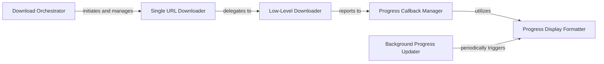

## Details

The `Download Manager` subsystem is primarily responsible for the actual downloading of media streams, including multi-part downloads, progress tracking, and error management. It is encapsulated within the `ykdl.util.download` module.

### Download Orchestrator
Manages the overall download process for multiple URLs, acting as the high-level entry point for batch downloads. It initiates individual download tasks and handles connection caching across multiple operations.

**Related Classes/Methods**:

- <a href="https://github.com/LifeActor/ykdl/blob/master/ykdl/util/download.py#L338-L430" target="_blank" rel="noopener noreferrer">`ykdl.util.download.save_urls`:338-430</a>

### Single URL Downloader
Prepares and initiates the saving of content from a single URL. It acts as an intermediary, setting up the download request before delegating the actual fetching to the low-level mechanism.

**Related Classes/Methods**:

- <a href="https://github.com/LifeActor/ykdl/blob/master/ykdl/util/download.py#L317-L336" target="_blank" rel="noopener noreferrer">`ykdl.util.download.save_url`:317-336</a>

### Low-Level Downloader
Handles the core logic of fetching data from a URL. This component is responsible for network buffer configuration, obtaining HTTP responses, and the actual byte-stream retrieval.

**Related Classes/Methods**:

- <a href="https://github.com/LifeActor/ykdl/blob/master/ykdl/util/download.py#L217-L315" target="_blank" rel="noopener noreferrer">`ykdl.util.download._save_url`:217-315</a>

### Progress Callback Manager
Provides a callback mechanism to update and manage download progress information. It aggregates progress data from individual download streams and makes it available for display.

**Related Classes/Methods**:

- <a href="https://github.com/LifeActor/ykdl/blob/master/ykdl/util/download.py#L73-L215" target="_blank" rel="noopener noreferrer">`ykdl.util.download.multi_hook`:73-215</a>

### Progress Display Formatter
Formats and outputs the current status of all active download processes to the console. This component is responsible for rendering user-facing progress updates in a readable format.

**Related Classes/Methods**:

- <a href="https://github.com/LifeActor/ykdl/blob/master/ykdl/util/download.py#L77-L101" target="_blank" rel="noopener noreferrer">`ykdl.util.download.print_processes`:77-101</a>

### Background Progress Updater
Operates as a background daemon to periodically refresh and display download progress. It ensures the user interface remains updated without blocking the main download threads, providing a smooth user experience.

**Related Classes/Methods**:

- <a href="https://github.com/LifeActor/ykdl/blob/master/ykdl/util/download.py#L103-L108" target="_blank" rel="noopener noreferrer">`ykdl.util.download.processes_deamon`:103-108</a>

### [FAQ](https://github.com/CodeBoarding/GeneratedOnBoardings/tree/main?tab=readme-ov-file#faq)