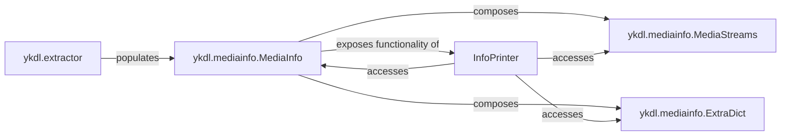

## Details

The `ykdl` subsystem is primarily designed around the extraction, storage, and presentation of media information. At its core, the `ykdl.mediainfo.MediaInfo` component acts as the central data model, aggregating all extracted details. This model is composed of specialized structures like `ykdl.mediainfo.MediaStreams` for managing individual media streams and `ykdl.mediainfo.ExtraDict` for flexible metadata storage. The `ykdl.extractor` component, representing a family of site-specific extractors, is responsible for populating the `MediaInfo` model by parsing web pages and extracting raw media data. Finally, the `InfoPrinter` component provides various methods within `MediaInfo` to format and present the stored information, catering to different output needs such as CLI display, JSON output, and file naming. This architecture ensures a clear separation of concerns between data extraction, data modeling, and data presentation.

### ykdl.mediainfo.MediaInfo
The foundational data model for the entire subsystem. It acts as a comprehensive container for all extracted media details, including title, artist, duration, streams, subtitles, and comments. It orchestrates the storage, access, and high-level presentation of this aggregated data.

**Related Classes/Methods**:

- <a href="https://github.com/LifeActor/ykdl/blob/master/ykdl/mediainfo.py#L19-L172" target="_blank" rel="noopener noreferrer">`ykdl.mediainfo.MediaInfo`:19-172</a>

### ykdl.mediainfo.MediaStreams
A specialized component within MediaInfo responsible for managing a collection of individual media streams (e.g., different video qualities, audio tracks). It provides structured access to stream-specific properties and likely handles internal indexing or sorting of streams.

**Related Classes/Methods**:

- <a href="https://github.com/LifeActor/ykdl/blob/master/ykdl/mediainfo.py#L200-L330" target="_blank" rel="noopener noreferrer">`ykdl.mediainfo.MediaStreams`:200-330</a>

### ykdl.mediainfo.ExtraDict
A flexible dictionary-like structure embedded within MediaInfo designed to store arbitrary, non-standard, or additional metadata that doesn't fit into the core, predefined MediaInfo attributes.

**Related Classes/Methods**:

- <a href="https://github.com/LifeActor/ykdl/blob/master/ykdl/mediainfo.py#L175-L197" target="_blank" rel="noopener noreferrer">`ykdl.mediainfo.ExtraDict`:175-197</a>

### InfoPrinter
Represents a set of methods within the MediaInfo class (`print_stream_info`, `print_subtitle_info`, `print_info`, `jsonlize`, `build_file_name`, `lprint`) dedicated to formatting and presenting the stored media information for various output needs. This includes CLI display, JSON output, and generating file names.

**Related Classes/Methods**:

- <a href="https://github.com/LifeActor/ykdl/blob/master/ykdl/mediainfo.py" target="_blank" rel="noopener noreferrer">`ykdl.mediainfo.MediaInfo:print_stream_info`</a>
- <a href="https://github.com/LifeActor/ykdl/blob/master/ykdl/mediainfo.py" target="_blank" rel="noopener noreferrer">`ykdl.mediainfo.MediaInfo:print_subtitle_info`</a>
- <a href="https://github.com/LifeActor/ykdl/blob/master/ykdl/mediainfo.py" target="_blank" rel="noopener noreferrer">`ykdl.mediainfo.MediaInfo:print_info`</a>
- <a href="https://github.com/LifeActor/ykdl/blob/master/ykdl/mediainfo.py" target="_blank" rel="noopener noreferrer">`ykdl.mediainfo.MediaInfo:jsonlize`</a>
- <a href="https://github.com/LifeActor/ykdl/blob/master/ykdl/mediainfo.py" target="_blank" rel="noopener noreferrer">`ykdl.mediainfo.MediaInfo:build_file_name`</a>
- <a href="https://github.com/LifeActor/ykdl/blob/master/ykdl/mediainfo.py" target="_blank" rel="noopener noreferrer">`ykdl.mediainfo.MediaInfo:lprint`</a>

### ykdl.extractor
This conceptual component represents the collection of site-specific extractors responsible for parsing web pages and extracting raw media data and metadata from online video platforms. These extractors are the primary source of data that populates the `MediaInfo` model.

**Related Classes/Methods**:

- <a href="https://github.com/LifeActor/ykdl/blob/master/ykdl/extractors" target="_blank" rel="noopener noreferrer">`ykdl.extractors`</a>

### [FAQ](https://github.com/CodeBoarding/GeneratedOnBoardings/tree/main?tab=readme-ov-file#faq)