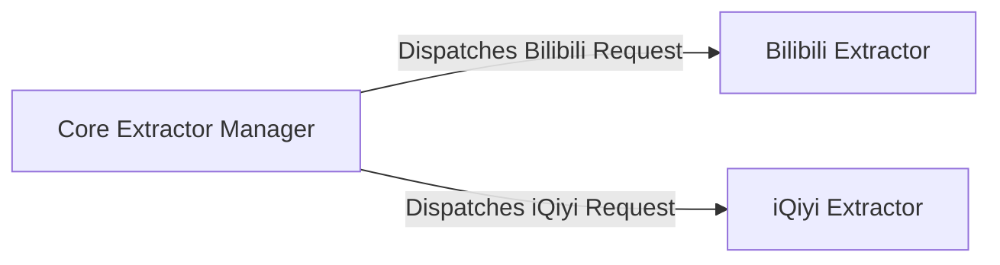

## Details

The `ykdl` system's content extraction subsystem is designed around a flexible, platform-agnostic core that leverages specialized extractors for diverse video platforms. At its heart, the **Core Extractor Manager** serves as the central dispatcher, intelligently routing incoming requests to the appropriate platform-specific component, such as the **Bilibili Extractor** or the **iQiyi Extractor**. Each extractor is self-contained, handling the unique complexities of its designated platform to retrieve video metadata and stream URLs. This architectural pattern ensures modularity, allowing for easy expansion to support new platforms while maintaining clear separation of concerns and efficient content retrieval.

### Core Extractor Manager
This central component is responsible for identifying the target video platform from a given URL or input and dynamically selecting and invoking the appropriate platform-specific extractor. It acts as the primary interface for initiating content extraction.

**Related Classes/Methods**: _None_

### Bilibili Extractor
Dedicated to preparing and retrieving detailed video information specifically from the Bilibili platform, including managing recursive fetching and processing of Bilibili's unique content structure to extract video metadata and stream URLs.

**Related Classes/Methods**:

- <a href="https://github.com/LifeActor/ykdl/blob/master/ykdl/extractors/bilibili/bilibase.py" target="_blank" rel="noopener noreferrer">`ykdl.extractors.bilibili.bilibase`</a>

### iQiyi Extractor
Specializes in parsing HTML content, fetching various media stream types (e.g., TMTS, VPS, DASH), and preparing comprehensive video lists or episodes specifically for the iQiyi platform. It orchestrates multiple internal methods to acquire all necessary media data, including handling different stream qualities and episode listings.

**Related Classes/Methods**:

- <a href="https://github.com/LifeActor/ykdl/blob/master/ykdl/extractors/iqiyi/video.py" target="_blank" rel="noopener noreferrer">`ykdl.extractors.iqiyi.video`</a>

### [FAQ](https://github.com/CodeBoarding/GeneratedOnBoardings/tree/main?tab=readme-ov-file#faq)