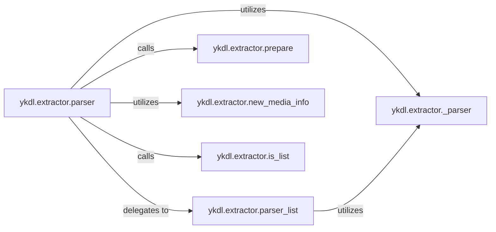

## Details

The `ykdl.extractor` subsystem is responsible for the core logic of extracting media information from various online sources. It acts as the central hub for processing URLs, identifying media types (single video vs. playlist), and delegating to specialized parsing routines to gather comprehensive media details. The architecture emphasizes a clear separation of concerns, with components dedicated to orchestration, list handling, data preparation, and generic parsing. The `ykdl.extractor` subsystem in `ykdl` is designed to efficiently extract media information from diverse online sources. Its core functionality revolves around the `parser` component, which acts as the primary entry point, intelligently determining whether a given URL represents a single media item or a playlist by consulting `is_list`. Depending on this determination, it either delegates to `parser_list` for iterative processing or proceeds with single-item extraction. Both pathways converge on `_parser`, a versatile component responsible for handling the actual parsing logic, often by dynamically loading site-specific extractors. The `prepare` component is crucial for gathering initial media attributes, while `new_media_info` ensures that all extracted data is consistently structured within `MediaInfo` objects. This modular design allows for robust and extensible media information retrieval.

### ykdl.extractor.parser
The primary entry point for initiating media extraction from a given URL. It orchestrates the overall flow, determining the media type (single or list) and delegating to the appropriate parsing mechanism.

**Related Classes/Methods**:

- <a href="https://github.com/LifeActor/ykdl/blob/master/ykdl/extractor.py#L331-L346" target="_blank" rel="noopener noreferrer">`ykdl.extractor.parser`:331-346</a>

### ykdl.extractor.parser_list
Manages the extraction process specifically for URLs identified as lists or playlists. It iterates through individual media items within the list, ensuring each is processed.

**Related Classes/Methods**:

- <a href="https://github.com/LifeActor/ykdl/blob/master/ykdl/extractor.py#L348-L380" target="_blank" rel="noopener noreferrer">`ykdl.extractor.parser_list`:348-380</a>

### ykdl.extractor.prepare
Focuses on gathering specific, detailed media attributes such as the title, artist, and stream URLs, enriching the extracted media information. This method is typically overridden by site-specific extractors to implement their unique data retrieval logic.

**Related Classes/Methods**:

- <a href="https://github.com/LifeActor/ykdl/blob/master/ykdl/extractor.py#L248-L262" target="_blank" rel="noopener noreferrer">`ykdl.extractor.prepare`:248-262</a>

### ykdl.extractor._parser
Encapsulates common and reusable parsing logic that can be applied across different extraction scenarios. It handles the dynamic loading of site-specific extractors based on the provided media information (URL, site, or MID).

**Related Classes/Methods**:

- <a href="https://github.com/LifeActor/ykdl/blob/master/ykdl/extractor.py#L305-L329" target="_blank" rel="noopener noreferrer">`ykdl.extractor._parser`:305-329</a>

### ykdl.extractor.new_media_info
Serves as a factory function to instantiate and initialize `MediaInfoDict` objects, which are the structured containers for all extracted media data.

**Related Classes/Methods**:

- <a href="https://github.com/LifeActor/ykdl/blob/master/ykdl/extractor.py#L301-L303" target="_blank" rel="noopener noreferrer">`ykdl.extractor.new_media_info`:301-303</a>

### ykdl.extractor.is_list
Determines whether a given URL points to a single media item or a collection/playlist of media items, guiding the subsequent extraction flow.

**Related Classes/Methods**:

- <a href="https://github.com/LifeActor/ykdl/blob/master/ykdl/extractor.py#L172-L178" target="_blank" rel="noopener noreferrer">`ykdl.extractor.is_list`:172-178</a>

### [FAQ](https://github.com/CodeBoarding/GeneratedOnBoardings/tree/main?tab=readme-ov-file#faq)