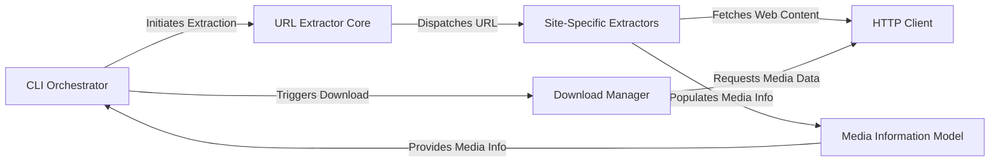

## Details

The `ykdl` project operates as a modular media downloading tool, centered around a `CLI Orchestrator` that drives the entire process. User requests are first handled by the `CLI Orchestrator`, which then delegates the task of identifying and extracting media information to the `URL Extractor Core`. The `URL Extractor Core` acts as a dispatcher, routing requests to the appropriate `Site-Specific Extractors` based on the provided URL. These specialized extractors, in turn, leverage the `HTTP Client` to interact with various online platforms and retrieve raw web content. The extracted media details are then structured and stored within the `Media Information Model`. Finally, the `CLI Orchestrator` utilizes this structured media information to trigger the `Download Manager`, which, with the assistance of the `HTTP Client`, handles the actual downloading of media streams. This architecture ensures a clear separation of concerns, allowing for easy extension with new site-specific extractors and robust handling of media extraction and download processes.

### CLI Orchestrator [[Expand]](./CLI_Orchestrator.md)
The primary command-line interface component responsible for parsing user input, managing the overall workflow, and coordinating between other components.

**Related Classes/Methods**:

- <a href="https://github.com/LifeActor/ykdl/blob/master/cykdl/__main__.py" target="_blank" rel="noopener noreferrer">`cykdl.__main__`</a>

### URL Extractor Core [[Expand]](./URL_Extractor_Core.md)
The central module for identifying the correct site-specific extractor and initiating the media information extraction process from a given URL.

**Related Classes/Methods**:

- <a href="https://github.com/LifeActor/ykdl/blob/master/ykdl/extractor.py" target="_blank" rel="noopener noreferrer">`ykdl.extractor`</a>

### Site-Specific Extractors [[Expand]](./Site_Specific_Extractors.md)
A collection of specialized, pluggable modules, each designed to extract detailed media information from a particular online video platform.

**Related Classes/Methods**:

- <a href="https://github.com/LifeActor/ykdl/blob/master/ykdl/extractors/bilibili/bilibase.py" target="_blank" rel="noopener noreferrer">`ykdl.extractors.bilibili.bilibase`</a>
- <a href="https://github.com/LifeActor/ykdl/blob/master/ykdl/extractors/iqiyi/video.py" target="_blank" rel="noopener noreferrer">`ykdl.extractors.iqiyi.video`</a>

### Media Information Model [[Expand]](./Media_Information_Model.md)
Defines the data structures and associated utilities for holding, organizing, and presenting all extracted details about a media item.

**Related Classes/Methods**:

- <a href="https://github.com/LifeActor/ykdl/blob/master/ykdl/mediainfo.py" target="_blank" rel="noopener noreferrer">`ykdl.mediainfo`</a>

### Download Manager [[Expand]](./Download_Manager.md)
Responsible for the actual downloading of media streams, including multi-part downloads, progress tracking, and error management.

**Related Classes/Methods**:

- <a href="https://github.com/LifeActor/ykdl/blob/master/ykdl/util/download.py" target="_blank" rel="noopener noreferrer">`ykdl.util.download`</a>

### HTTP Client
Provides a robust and reusable interface for making HTTP/HTTPS requests, managing sessions, cookies, and response handling.

**Related Classes/Methods**:

- <a href="https://github.com/LifeActor/ykdl/blob/master/ykdl/util/http.py" target="_blank" rel="noopener noreferrer">`ykdl.util.http`</a>

### [FAQ](https://github.com/CodeBoarding/GeneratedOnBoardings/tree/main?tab=readme-ov-file#faq)