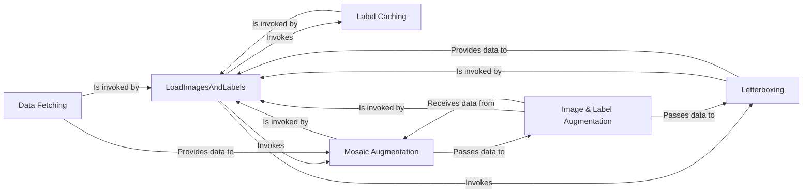

## Details

Data Loading Subsystem Analysis

### LoadImagesAndLabels
The central orchestrator of the data pipeline. Implemented as a PyTorch `Dataset`, this class initializes the data loading process from specified paths, manages data indices for distributed training, and sequences the entire data fetching, caching, and augmentation workflow. It is the primary entry point for the model's training loop to get data.

**Related Classes/Methods**:

- <a href="https://github.com/ultralytics/yolov5/blob/master/utils/dataloaders.py#L536-L1053" target="_blank" rel="noopener noreferrer">`utils.dataloaders.LoadImagesAndLabels` (536:1053)</a>

### Label Caching
An internal performance-optimization component used by `LoadImagesAndLabels`. It caches dataset labels to a binary format (`.npy`) for rapid loading. On initialization, it checks for a cached file and either loads it or generates a new one by parsing the label files, significantly speeding up subsequent runs.

**Related Classes/Methods**:

- <a href="https://github.com/ultralytics/yolov5/blob/master/utils/dataloaders.py#L721-L759" target="_blank" rel="noopener noreferrer">`utils.dataloaders.LoadImagesAndLabels.cache_labels` (721:759)</a>

### Mosaic Augmentation
A complex data augmentation technique that combines four different images and their corresponding labels into a single "mosaic." It is responsible for loading the four samples, arranging them on a new canvas, and transforming their bounding box coordinates accordingly. This is one of the first and most complex augmentations applied.

**Related Classes/Methods**:

- `utils.dataloaders.load_mosaic`
- `utils.dataloaders.load_mosaic9`

### Image & Label Augmentation
A collection of functions that apply a wide range of transformations after the initial mosaic augmentation. This includes geometric changes (scaling, rotation, perspective), color space adjustments (hue, saturation, value), and techniques like MixUp. These functions directly manipulate the image and its corresponding bounding box labels.

**Related Classes/Methods**:

- <a href="https://github.com/ultralytics/yolov5/blob/master/utils/augmentations.py#L154-L233" target="_blank" rel="noopener noreferrer">`utils.augmentations.random_perspective` (154:233)</a>
- <a href="https://github.com/ultralytics/yolov5/blob/master/utils/augmentations.py#L73-L86" target="_blank" rel="noopener noreferrer">`utils.augmentations.augment_hsv` (73:86)</a>
- <a href="https://github.com/ultralytics/yolov5/blob/master/utils/augmentations.py#L293-L302" target="_blank" rel="noopener noreferrer">`utils.augmentations.mixup` (293:302)</a>

### Letterboxing
A final, non-destructive resizing utility. It scales an image to fit the model's required input dimensions (e.g., 640x640) while preserving the original aspect ratio by adding padding ("letterboxes") to the shorter dimension(s). This ensures that all output images are of a uniform size without distorting their content.

**Related Classes/Methods**:

- `utils.dataloaders.letterbox`

### Data Fetching
The fundamental component responsible for reading raw data from the filesystem. It handles opening image files (e.g., `.jpg`) and is invoked by the higher-level augmentation components like `load_mosaic` or directly within the `__getitem__` method of the dataset.

**Related Classes/Methods**:

- <a href="https://github.com/ultralytics/yolov5/blob/master/utils/dataloaders.py#L771-L845" target="_blank" rel="noopener noreferrer">`utils.dataloaders.LoadImagesAndLabels.__getitem__` (771:845)</a>
- `utils.dataloaders.load_image`

### [FAQ](https://github.com/CodeBoarding/GeneratedOnBoardings/tree/main?tab=readme-ov-file#faq)