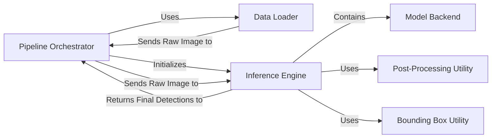

## Details

One paragraph explaining the functionality which is represented by this graph. What the main flow is and what is its purpose.

### Pipeline Orchestrator
Parses command-line arguments, loads configurations, and orchestrates the high-level sequence of operations: iterating through the data source, executing the inference engine for each image, and saving the results.

**Related Classes/Methods**:

- <a href="https://github.com/ultralytics/yolov5/blob/master/detect.py#L1-L1" target="_blank" rel="noopener noreferrer">`detect` (1:1)</a>

### Data Loader
Reads images from various sources (files, directories, URLs, streams) and provides them sequentially to the orchestrator.

**Related Classes/Methods**:

- <a href="https://github.com/ultralytics/yolov5/blob/master/utils/dataloaders.py#L321-L429" target="_blank" rel="noopener noreferrer">`utils.dataloaders.LoadImages` (321:429)</a>

### Inference Engine [[Expand]](./Inference_Engine.md)
Acts as the central orchestrator for the core inference pipeline. It accepts raw image data, executes the full sequence of preprocessing (resizing, padding), inference, post-processing (NMS), and bounding box scaling.

**Related Classes/Methods**:

- <a href="https://github.com/ultralytics/yolov5/blob/master/models/common.py#L815-L924" target="_blank" rel="noopener noreferrer">`models.common.AutoShape` (815:924)</a>

### Model Backend
A backend-agnostic loader for the serialized model weights. It is initialized and contained entirely within the Inference Engine, which uses it to execute the forward pass.

**Related Classes/Methods**:

- <a href="https://github.com/ultralytics/yolov5/blob/master/models/common.py#L458-L812" target="_blank" rel="noopener noreferrer">`models.common.DetectMultiBackend` (458:812)</a>

### Post-Processing Utility
A utility function that applies Non-Maximum Suppression (NMS) to raw model outputs. It is invoked by the Inference Engine to filter redundant and low-confidence detections.

**Related Classes/Methods**:

- <a href="https://github.com/ultralytics/yolov5/blob/master/utils/general.py#L1010-L1120" target="_blank" rel="noopener noreferrer">`utils.general.non_max_suppression` (1010:1120)</a>

### Bounding Box Utility
A utility function that scales bounding box coordinates from the model's resolution to the original image's resolution. It is invoked by the Inference Engine after NMS.

**Related Classes/Methods**:

- <a href="https://github.com/ultralytics/yolov5/blob/master/utils/general.py#L953-L966" target="_blank" rel="noopener noreferrer">`utils.general.scale_boxes` (953:966)</a>

### [FAQ](https://github.com/CodeBoarding/GeneratedOnBoardings/tree/main?tab=readme-ov-file#faq)