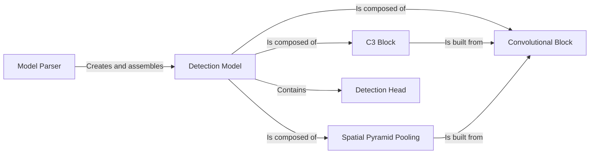

## Details

One paragraph explaining the functionality which is represented by this graph. What the main flow is and what is its purpose.

### Model Parser
Acts as a factory that constructs the entire neural network. It reads a model's YAML configuration file, interprets each line to identify the module type and its arguments, and instantiates the corresponding PyTorch modules from models.common. It then assembles these modules into a nn.Sequential list that forms the core of the DetectionModel.

**Related Classes/Methods**:

- `parse_model`

### Detection Model
The primary class representing the complete YOLOv5 model. It holds the list of layers created by the parse_model function and manages the model's forward pass, routing input tensors through the network layers. It also handles logic for different model states like training and inference.

**Related Classes/Methods**:

- `DetectionModel`

### Convolutional Block
The most fundamental building block of the network. It encapsulates a 2D convolutional layer, a Batch Normalization layer, and a SiLU (Sigmoid-weighted Linear Unit) activation function. This standardized block is reused extensively throughout the backbone and neck.

**Related Classes/Methods**:

- `Conv`

### C3 Block
A core composite block used heavily in the backbone and neck. It is a key element of the CSP (Cross Stage Partial) network design, processing features through two parallel paths to promote gradient flow and reduce computational cost. It is composed of several Conv blocks and smaller Bottleneck modules.

**Related Classes/Methods**:

- `C3`

### Spatial Pyramid Pooling
A memory-efficient version of the Spatial Pyramid Pooling (SPP) layer. It processes features at multiple receptive field sizes by using several MaxPool2d layers in sequence, rather than in parallel. This allows the model to detect objects of various scales effectively without a large computational overhead.

**Related Classes/Methods**:

- `SPPF`

### Detection Head
The final layer of the model, responsible for generating predictions. It takes the feature maps from the neck at three different scales and applies a final set of 1x1 convolutional layers to predict bounding boxes, objectness scores, and class probabilities for a predefined set of anchors.

**Related Classes/Methods**:

- `Detect`

### [FAQ](https://github.com/CodeBoarding/GeneratedOnBoardings/tree/main?tab=readme-ov-file#faq)