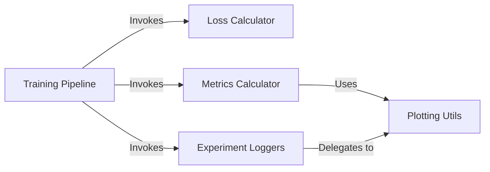

## Details

An expert analysis of the `yolov5` training and evaluation subsystem, based on the provided project context and analysis summary. The analysis identifies the primary components of the training and evaluation subsystem, their roles, and their interactions, highlighting the system's adherence to the architectural principle of separation of concerns.

### Training Pipeline
Central Orchestrator: This component is the primary entry point for model training. It parses configurations, initializes the environment, model, and data loaders, and executes the main training loop. It coordinates all other components to perform loss calculation, validation, and results logging.

**Related Classes/Methods**:

- `train.py`

### Loss Calculator
Specialized Calculator: Encapsulates the complex logic for calculating training loss. It compares model predictions against ground-truth labels, computing a weighted sum of objectness loss, class probability loss, and bounding box regression loss. This separation isolates complex mathematical logic from the main training flow.

**Related Classes/Methods**:

- `utils/loss.py`

### Metrics Calculator
Performance Quantifier: A collection of utilities responsible for evaluating model performance during validation. It computes key metrics such as mean Average Precision (mAP), precision, recall, and generates confusion matrices to provide a detailed assessment of the model's accuracy.

**Related Classes/Methods**:

- `utils/metrics.py`

### Experiment Loggers
Unified Logging Interface: Acts as a facade to abstract various experiment tracking backends like Comet, TensorBoard, or W&B. It provides a consistent API for the `Training Pipeline` to log hyperparameters, metrics, and visual artifacts, decoupling the core logic from specific logging implementations.

**Related Classes/Methods**:

- `utils/loggers/__init__.py`

### Plotting Utils
Visualization Generator: A utility component that generates visual artifacts such as charts and image overlays. It is invoked by the `Metrics Calculator` to create confusion matrices and by `Experiment Loggers` to plot training results, providing visual feedback on model performance.

**Related Classes/Methods**:

- `utils/plots.py`

### [FAQ](https://github.com/CodeBoarding/GeneratedOnBoardings/tree/main?tab=readme-ov-file#faq)