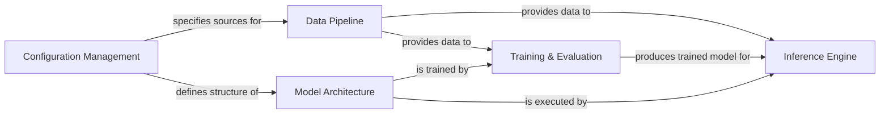

## Details

One paragraph explaining the functionality which is represented by this graph. What the main flow is and what is its purpose.

### Configuration Management
Manages model, data, and hyperparameter settings using YAML files. It decouples the core logic from experimental parameters, allowing for flexible configuration of the model architecture and data sources.

**Related Classes/Methods**:

- <a href="https://github.com/ultralytics/yolov5/blob/master/models/yolo.py#L376-L459" target="_blank" rel="noopener noreferrer">`models.yolo.parse_model` (376:459)</a>
- <a href="https://github.com/ultralytics/yolov5/blob/master/train.py#L104-L542" target="_blank" rel="noopener noreferrer">`train` (104:542)</a>
- `utils.dataloaders`

### Data Pipeline [[Expand]](./Data_Pipeline.md)
Responsible for loading datasets, parsing labels, applying augmentations (e.g., random perspective, mixup), and batching data for the model. It includes features like caching and distributed sampling for efficiency.

**Related Classes/Methods**:

- <a href="https://github.com/ultralytics/yolov5/blob/master/utils/dataloaders.py#L536-L1053" target="_blank" rel="noopener noreferrer">`utils.dataloaders.LoadImagesAndLabels` (536:1053)</a>

### Model Architecture [[Expand]](./Model_Architecture.md)
Defines the complete object detection model by assembling reusable neural network layers (e.g., Conv, C3, SPP) based on a YAML configuration. It represents the core deep learning structure of YOLOv5.

**Related Classes/Methods**:

- <a href="https://github.com/ultralytics/yolov5/blob/master/models/yolo.py#L217-L330" target="_blank" rel="noopener noreferrer">`models.yolo.DetectionModel` (217:330)</a>
- <a href="https://github.com/ultralytics/yolov5/blob/master/models/common.py#L72-L90" target="_blank" rel="noopener noreferrer">`models.common.Conv` (72:90)</a>
- <a href="https://github.com/ultralytics/yolov5/blob/master/models/common.py#L230-L246" target="_blank" rel="noopener noreferrer">`models.common.C3` (230:246)</a>

### Training & Evaluation [[Expand]](./Training_Evaluation.md)
Orchestrates the model training and validation processes. It calculates training loss (objectness, class, box regression), computes evaluation metrics like mAP, and manages the overall training loop.

**Related Classes/Methods**:

- <a href="https://github.com/ultralytics/yolov5/blob/master/train.py#L104-L542" target="_blank" rel="noopener noreferrer">`train` (104:542)</a>
- <a href="https://github.com/ultralytics/yolov5/blob/master/utils/loss.py#L105-L253" target="_blank" rel="noopener noreferrer">`utils.loss.ComputeLoss` (105:253)</a>
- `utils.metrics`

### Inference Engine [[Expand]](./Inference_Engine.md)
Executes a trained model to make predictions on new data. It handles model loading (PyTorch, ONNX) and post-processes raw outputs by applying non-max suppression (NMS) to generate final bounding boxes.

**Related Classes/Methods**:

- `detect`
- `hubconf`
- `utils.general`

### [FAQ](https://github.com/CodeBoarding/GeneratedOnBoardings/tree/main?tab=readme-ov-file#faq)