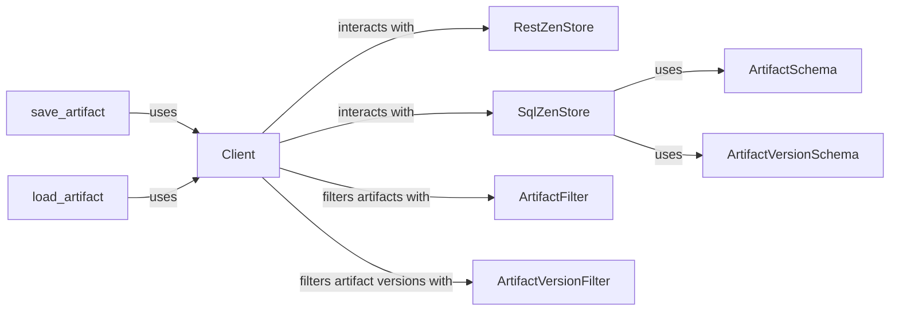

## Component Details

### Client
The `Client` class provides an interface for interacting with the ZenML server. It handles operations such as creating, reading, updating, and deleting artifacts and artifact versions. It centralizes the interaction with the ZenStore, abstracting away the underlying storage implementation (SQL or REST).
- **Related Classes/Methods**: `repos.zenml.src.zenml.client.Client`

### RestZenStore
The `RestZenStore` class is responsible for interacting with a RESTful ZenStore. It implements methods for creating, retrieving, updating, and deleting artifacts and artifact versions via REST API calls. It serves as a concrete implementation of the ZenStore interface for REST-based storage.
- **Related Classes/Methods**: `repos.zenml.src.zenml.zen_stores.rest_zen_store.RestZenStore`

### SqlZenStore
The `SqlZenStore` class manages the storage of ZenML metadata in a SQL database. It provides methods for creating, retrieving, updating, and deleting artifacts and artifact versions, as well as related metadata. It serves as a concrete implementation of the ZenStore interface for SQL-based storage.
- **Related Classes/Methods**: `repos.zenml.src.zenml.zen_stores.sql_zen_store.SqlZenStore`

### save_artifact
The `save_artifact` function is responsible for saving an artifact and its metadata. It interacts with the `Client` to register the artifact and its versions, and it handles the storage of artifact data. This function orchestrates the process of persisting artifact data and metadata.
- **Related Classes/Methods**: `repos.zenml.src.zenml.artifacts.utils:save_artifact`

### load_artifact
The `load_artifact` function is responsible for loading an artifact and its metadata. It interacts with the `Client` to retrieve the artifact and its versions, and it handles the loading of artifact data. This function orchestrates the process of retrieving artifact data and metadata.
- **Related Classes/Methods**: `repos.zenml.src.zenml.artifacts.utils:load_artifact`

### ArtifactSchema
The `ArtifactSchema` class defines the schema for storing artifact data in the ZenStore. It specifies the data types and constraints for artifact metadata stored in the SQL database.
- **Related Classes/Methods**: `repos.zenml.src.zenml.zen_stores.schemas.artifact_schemas.ArtifactSchema`

### ArtifactVersionSchema
The `ArtifactVersionSchema` class defines the schema for storing artifact version data in the ZenStore. It specifies the data types and constraints for artifact version metadata stored in the SQL database.
- **Related Classes/Methods**: `repos.zenml.src.zenml.zen_stores.schemas.artifact_schemas.ArtifactVersionSchema`

### ArtifactFilter
The `ArtifactFilter` class defines the filter criteria for listing artifacts. It allows users to specify conditions for retrieving specific artifacts based on their properties.
- **Related Classes/Methods**: `zenml.models.v2.core.artifact.ArtifactFilter`

### ArtifactVersionFilter
The `ArtifactVersionFilter` class defines the filter criteria for listing artifact versions. It allows users to specify conditions for retrieving specific artifact versions based on their properties.
- **Related Classes/Methods**: `zenml.models.v2.core.artifact_version.ArtifactVersionFilter`
