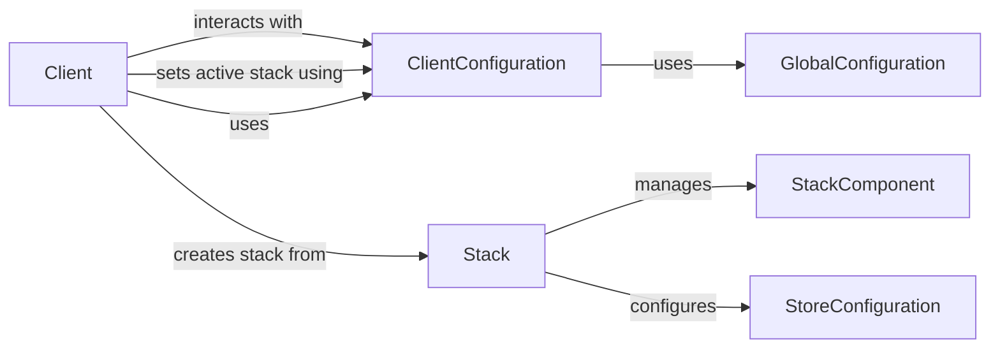

## Component Details

### GlobalConfiguration
The GlobalConfiguration component provides access to global ZenML configuration settings. It manages settings related to the ZenML environment, such as the analytics opt-in status and the user's profile. It ensures that global settings are consistently applied across the ZenML platform.
- **Related Classes/Methods**: `zenml.config.global_config.GlobalConfiguration`

### StoreConfiguration
The StoreConfiguration component handles the configuration of the ZenStore, including the database URL and other store-specific settings. It is responsible for persisting and retrieving configuration data related to the ZenStore, ensuring that the ZenStore is properly configured and accessible.
- **Related Classes/Methods**: `zenml.config.store_config.StoreConfiguration`

### Stack
The Stack component represents a stack, which is a collection of components used in a ZenML pipeline. It defines the infrastructure and tools used for running pipelines, such as the orchestrator, artifact store, and container registry. It provides a consistent and reproducible environment for running ZenML pipelines.
- **Related Classes/Methods**: `zenml.stack.stack.Stack`

### StackComponent
The StackComponent component represents a single component within a stack, such as an orchestrator or artifact store. Each stack component has its own configuration, which is managed by the `StackComponentConfig`. It allows for modular and configurable stacks, where each component can be customized to meet the specific needs of a pipeline.
- **Related Classes/Methods**: `zenml.stack.stack_component.StackComponent`, `zenml.stack.stack_component.StackComponentConfig`

### Client
The Client component is the central point of interaction with the ZenML platform. It provides methods for managing users, projects, stacks, pipelines, and other entities. It uses the `ClientConfiguration` to manage the client-side configuration, providing a unified interface for interacting with the ZenML platform.
- **Related Classes/Methods**: `zenml.client.Client`

### ClientConfiguration
The ClientConfiguration component manages the client-side configuration, including the active stack and project. It stores information about the current user, project, and stack, and provides methods for accessing and modifying this information. It ensures that the client is properly configured and connected to the ZenML platform.
- **Related Classes/Methods**: `zenml.client.ClientConfiguration`
