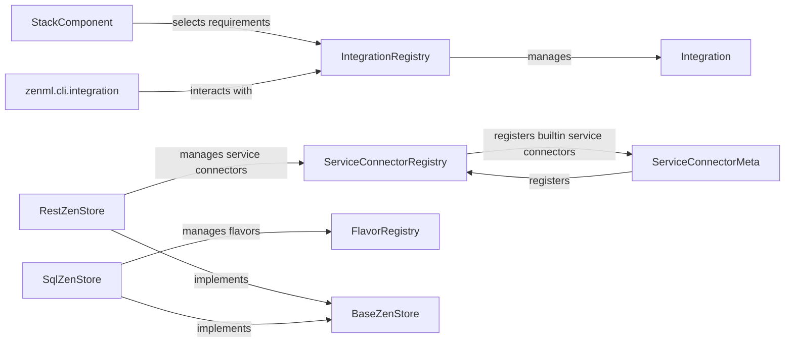

## Component Details

### IntegrationRegistry
The IntegrationRegistry class manages the available integrations in ZenML. It handles activating integrations, checking their installation status, and selecting requirements for installation or uninstallation. It initializes by discovering integration submodules and registering them, providing a central point for managing and accessing integrations within ZenML.
- **Related Classes/Methods**: `zenml.integrations.registry.IntegrationRegistry`

### Integration
The Integration class is an abstract base class for ZenML integrations. Each integration represents a connection to an external tool or framework. Integrations define requirements, installation checks, and activation logic, serving as a blueprint for creating specific integrations with various tools and services.
- **Related Classes/Methods**: `zenml.integrations.integration.Integration`

### ServiceConnectorRegistry
The ServiceConnectorRegistry class manages the available service connectors in ZenML. It handles registering service connector types, checking if a connector type is registered, and instantiating connectors. This registry ensures that service connectors, which facilitate connections to external services, are properly managed and accessible within ZenML.
- **Related Classes/Methods**: `zenml.service_connectors.service_connector_registry.ServiceConnectorRegistry`

### ServiceConnectorMeta
The ServiceConnectorMeta metaclass is responsible for registering service connector types with the ServiceConnectorRegistry when new ServiceConnector classes are defined. It automates the registration process, ensuring that new service connectors are automatically added to the registry and made available for use within ZenML.
- **Related Classes/Methods**: `zenml.service_connectors.service_connector.ServiceConnectorMeta`

### FlavorRegistry
The FlavorRegistry class manages the available component flavors in ZenML. It handles registering flavors, which are specific configurations for stack components. This registry allows ZenML to manage and provide different flavors for each component, enabling users to easily configure their stacks with pre-defined settings.
- **Related Classes/Methods**: `zenml.stack.flavor_registry.FlavorRegistry`

### StackComponent
The StackComponent class represents a component of a ZenML stack. It interacts with the IntegrationRegistry to select integration requirements based on the component's configuration. Stack components are the building blocks of ZenML stacks, and this class ensures that they can leverage integrations to extend their functionality.
- **Related Classes/Methods**: `zenml.stack.stack_component.StackComponent`

### BaseZenStore
The BaseZenStore class serves as the base class for ZenStore implementations, providing core functionalities for interacting with ZenML metadata. It is responsible for creating and retrieving various ZenML entities, managing stacks and components, and handling user authentication. It provides the foundation for different ZenStore implementations to manage ZenML's metadata.
- **Related Classes/Methods**: `zenml.zen_stores.base_zen_store.BaseZenStore`

### SqlZenStore
The SqlZenStore class is a ZenStore implementation that uses a SQL database to store ZenML metadata. It interacts with the FlavorRegistry to manage component flavors. This class provides a SQL-based storage solution for ZenML metadata, allowing users to persist and manage their ZenML configurations and entities.
- **Related Classes/Methods**: `zenml.zen_stores.sql_zen_store.SqlZenStore`

### RestZenStore
The RestZenStore class is a ZenStore implementation that uses a REST API to interact with a remote ZenML repository. It interacts with the ServiceConnectorRegistry to manage service connector types. This class enables ZenML to interact with remote ZenML repositories through a RESTful interface, facilitating distributed and collaborative ZenML deployments.
- **Related Classes/Methods**: `zenml.zen_stores.rest_zen_store.RestZenStore`

### zenml.cli.integration
This module contains the CLI commands for managing ZenML integrations. It interacts with the IntegrationRegistry to install, uninstall, list, and upgrade integrations. It provides a command-line interface for users to manage ZenML integrations, simplifying the process of installing, uninstalling, and managing integrations.
- **Related Classes/Methods**: `zenml.cli.integration`
