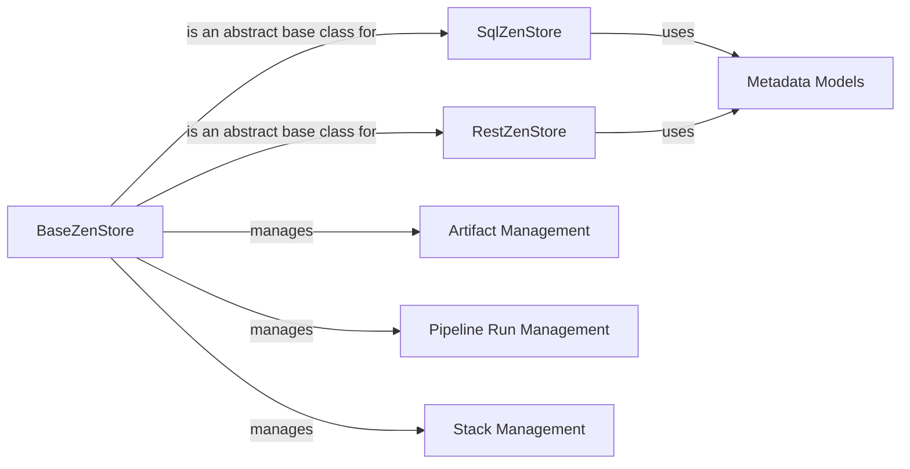

## Component Details

### BaseZenStore
The BaseZenStore class serves as an abstract base class for all ZenStore implementations. It defines the core interface for interacting with the metadata store, providing methods for creating, reading, updating, and deleting metadata entities such as pipelines, runs, artifacts, and stacks. It ensures that all ZenStore implementations adhere to a consistent API, facilitating interoperability and extensibility.
- **Related Classes/Methods**: `repos.zenml.src.zenml.zen_stores.base_zen_store.BaseZenStore`

### SqlZenStore
The SqlZenStore class is a concrete implementation of the BaseZenStore that uses a SQL database as the underlying metadata store. It provides methods for interacting with the database, including creating tables, executing queries, and managing transactions. It leverages SQLAlchemy for database interactions, supporting various SQL dialects such as SQLite, MySQL, and PostgreSQL.
- **Related Classes/Methods**: `repos.zenml.src.zenml.zen_stores.sql_zen_store.SqlZenStore`

### RestZenStore
The RestZenStore class is another concrete implementation of the BaseZenStore that interacts with a remote ZenML server via REST API calls. It encapsulates the logic for making HTTP requests to the server and handling the responses. This allows ZenML clients to access and manage metadata stored on a remote server.
- **Related Classes/Methods**: `repos.zenml.src.zenml.zen_stores.rest_zen_store.RestZenStore`

### Metadata Models
The `zenml.models.v2.base` module defines the base classes for all metadata models used in ZenML. These models represent the different entities that ZenML tracks, such as pipelines, runs, artifacts, and stacks. They provide a consistent interface for accessing and manipulating metadata, and they are used by the ZenStore implementations to persist and retrieve metadata from the underlying store.
- **Related Classes/Methods**: `repos.zenml.src.zenml.models.v2.base.filter`

### Artifact Management
The Artifact Management component provides functionalities for managing artifacts, including creating, retrieving, updating, and deleting them. It also handles artifact versions and their associated metadata.
- **Related Classes/Methods**: `zenml.models.v2.core.artifact.ArtifactFilter`, `zenml.models.v2.core.artifact.ArtifactRequest`, `zenml.models.v2.core.artifact.ArtifactResponse`, `zenml.models.v2.core.artifact.ArtifactResponseBody`, `zenml.models.v2.core.artifact.ArtifactResponseMetadata`, `zenml.models.v2.core.artifact.ArtifactResponseResources`, `zenml.enums.ArtifactSaveType`, `zenml.zen_stores.schemas.artifact_schemas.ArtifactSchema`, `zenml.exceptions.ArtifactStoreInterfaceError`, `zenml.enums.ArtifactType`, `zenml.models.v2.core.artifact.ArtifactUpdate`

### Pipeline Run Management
Handles the execution of ZenML pipelines, including creating, retrieving, updating, and deleting pipeline runs. It also manages the state and metadata associated with each run.
- **Related Classes/Methods**: `zenml.models.v2.core.pipeline_run.PipelineRunFilter`, `zenml.models.v2.core.pipeline_run.PipelineRunRequest`, `zenml.models.v2.core.pipeline_run.PipelineRunResponse`, `zenml.models.v2.core.pipeline_run.PipelineRunResponseBody`, `zenml.models.v2.core.pipeline_run.PipelineRunResponseMetadata`, `zenml.models.v2.core.pipeline_run.PipelineRunResponseResources`, `zenml.zen_stores.schemas.pipeline_run_schemas.PipelineRunSchema`, `zenml.models.v2.core.pipeline_run.PipelineRunUpdate`

### Stack Management
Provides functionalities for managing ZenML stacks, including creating, retrieving, updating, and deleting them. It also handles stack components and their configurations.
- **Related Classes/Methods**: `zenml.stack.stack.Stack`, `zenml.models.v2.core.stack.StackFilter`, `zenml.models.v2.core.stack.StackRequest`, `zenml.models.v2.core.stack.StackResponse`, `zenml.models.v2.core.stack.StackResponseBody`, `zenml.models.v2.core.stack.StackResponseMetadata`, `zenml.models.v2.core.stack.StackResponseResources`, `zenml.zen_stores.schemas.stack_schemas.StackSchema`, `zenml.models.v2.core.stack.StackUpdate`
