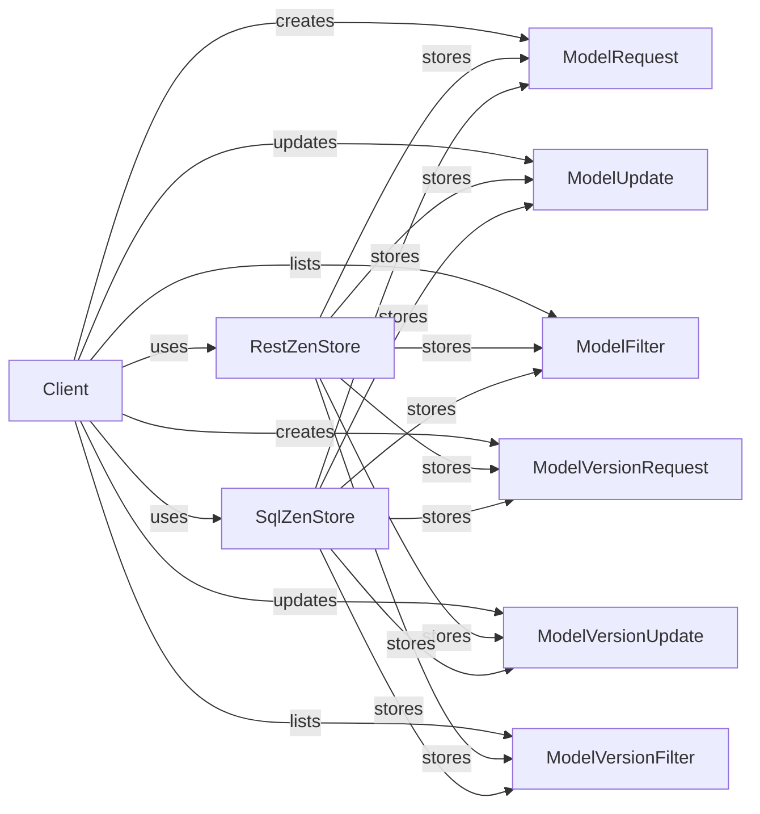

## Component Details

### Client
The `Client` class serves as the primary interface for interacting with the ZenML platform. It provides methods for creating, retrieving, updating, and deleting ZenML entities, including models, model versions, and their associated metadata. It abstracts the underlying storage mechanism, allowing users to interact with ZenML resources in a consistent manner.
- **Related Classes/Methods**: `repos.zenml.src.zenml.client.Client`

### RestZenStore
The `RestZenStore` class implements the storage backend for ZenML entities using a REST API. It handles the serialization and deserialization of data, as well as the communication with the ZenML server. It provides methods for creating, retrieving, updating, and deleting models, model versions, and their associated links via RESTful endpoints.
- **Related Classes/Methods**: `repos.zenml.src.zenml.zen_stores.rest_zen_store.RestZenStore`

### SqlZenStore
The `SqlZenStore` class implements the storage backend for ZenML entities using an SQL database. It manages the database connection, schema, and data access logic. It provides methods for creating, retrieving, updating, and deleting models, model versions, and their associated metadata, ensuring data consistency and integrity.
- **Related Classes/Methods**: `repos.zenml.src.zenml.zen_stores.sql_zen_store.SqlZenStore`

### ModelRequest
The `ModelRequest` class defines the structure for creating a new model. It encapsulates the data required to create a model entity, such as name and description. This class is used to serialize the model creation request and send it to the ZenML server.
- **Related Classes/Methods**: `zenml.models.v2.core.model.ModelRequest`

### ModelUpdate
The `ModelUpdate` class defines the structure for updating an existing model. It encapsulates the data required to update a model entity, such as name and description. This class is used to serialize the model update request and send it to the ZenML server.
- **Related Classes/Methods**: `zenml.models.v2.core.model.ModelUpdate`

### ModelFilter
The `ModelFilter` class defines the structure for filtering models when listing them. It encapsulates the data required to filter models, such as name and ID. This class is used to serialize the model filter criteria and send it to the ZenML server.
- **Related Classes/Methods**: `zenml.models.v2.core.model.ModelFilter`

### ModelVersionRequest
The `ModelVersionRequest` class defines the structure for creating a new model version. It encapsulates the data required to create a model version entity, such as name and description. This class is used to serialize the model version creation request and send it to the ZenML server.
- **Related Classes/Methods**: `zenml.models.v2.core.model_version.ModelVersionRequest`

### ModelVersionUpdate
The `ModelVersionUpdate` class defines the structure for updating an existing model version. It encapsulates the data required to update a model version entity, such as name and description. This class is used to serialize the model version update request and send it to the ZenML server.
- **Related Classes/Methods**: `zenml.models.v2.core.model_version.ModelVersionUpdate`

### ModelVersionFilter
The `ModelVersionFilter` class defines the structure for filtering model versions when listing them. It encapsulates the data required to filter model versions, such as name and ID. This class is used to serialize the model version filter criteria and send it to the ZenML server.
- **Related Classes/Methods**: `zenml.models.v2.core.model_version.ModelVersionFilter`
