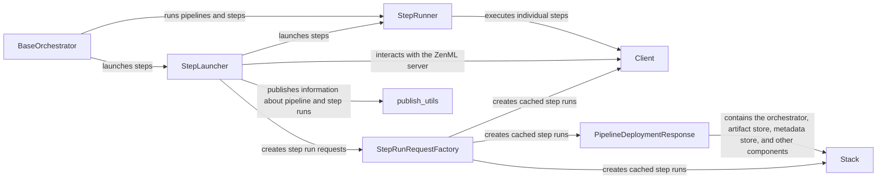

## Component Details

### BaseOrchestrator
The abstract base class for all orchestrators in ZenML. It defines the core interface for running pipelines and steps, including methods for preparing the run, running steps, and cleaning up. It serves as a template for concrete orchestrator implementations, providing a foundation for different orchestration backends.
- **Related Classes/Methods**: `repos.zenml.src.zenml.orchestrators.base_orchestrator.BaseOrchestrator`

### StepRunner
Responsible for executing individual steps within a pipeline. It handles loading the step, parsing inputs, running the step's function, validating outputs, and storing output artifacts. It encapsulates the logic for executing a step in the orchestration environment, ensuring that each step is executed correctly and efficiently.
- **Related Classes/Methods**: `repos.zenml.src.zenml.orchestrators.step_runner.StepRunner`

### StepLauncher
Responsible for launching steps in the orchestration environment. It creates or reuses pipeline runs, prepares the environment for the step, and executes the step using either a step operator or the StepRunner. It acts as a coordinator for launching and managing the execution of steps, ensuring that they are executed in the correct order and with the necessary resources.
- **Related Classes/Methods**: `repos.zenml.src.zenml.orchestrators.step_launcher.StepLauncher`

### Client
Provides an interface for interacting with the ZenML server. It is used to retrieve and update metadata about pipelines, steps, artifacts, and other ZenML objects. It enables communication with the ZenML backend for managing and tracking pipeline runs, allowing the orchestrator to persist and retrieve information about the execution.
- **Related Classes/Methods**: `zenml.client.Client`

### StepRunRequestFactory
Responsible for creating StepRunRequest objects, which contain all the information needed to execute a step. It populates the request with information about the step's inputs, outputs, and caching configuration. It streamlines the creation of step run requests, ensuring that all necessary information is available for the step to be executed.
- **Related Classes/Methods**: `repos.zenml.src.zenml.orchestrators.step_run_utils.StepRunRequestFactory`

### Stack
A collection of components that together form a ZenML deployment. It includes the orchestrator, artifact store, metadata store, and other components. It defines the infrastructure and configuration for running ZenML pipelines, providing the context in which the orchestrator operates.
- **Related Classes/Methods**: `zenml.stack.stack.Stack`

### PipelineDeploymentResponse
Represents a deployed ZenML pipeline, containing information about the pipeline's configuration, steps, and stack. It is used to execute the pipeline in the orchestration environment, providing the orchestrator with the necessary information to run the pipeline.
- **Related Classes/Methods**: `zenml.models.v2.core.pipeline_deployment.PipelineDeploymentResponse`

### publish_utils
Contains functions for publishing information about pipeline and step runs to the ZenML server, including metadata, status updates, and artifact links. It facilitates the tracking and monitoring of pipeline runs, allowing users to monitor the progress and results of their pipelines.
- **Related Classes/Methods**: `zenml.orchestrators.publish_utils`
