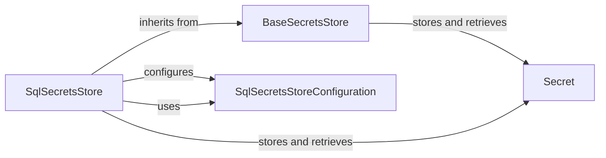

## Component Details

### BaseSecretsStore
The `BaseSecretsStore` class serves as an abstract base class for secret stores. It defines the interface for storing, retrieving, updating, and deleting secret values. It outlines the fundamental operations that any concrete secret store implementation must support, ensuring a consistent API for interacting with different secret storage backends.
- **Related Classes/Methods**: `repos.zenml.src.zenml.zen_stores.secrets_stores.base_secrets_store.BaseSecretsStore`

### SqlSecretsStore
The `SqlSecretsStore` class is a concrete implementation of the `BaseSecretsStore` that stores secret values in a SQL database. It leverages SQLAlchemy to interact with the database and provides methods for storing, retrieving, updating, and deleting secrets. It also handles encryption and decryption of secret values to ensure data security.
- **Related Classes/Methods**: `repos.zenml.src.zenml.zen_stores.secrets_stores.sql_secrets_store.SqlSecretsStore`

### SqlSecretsStoreConfiguration
The `SqlSecretsStoreConfiguration` class defines the configuration settings for the `SqlSecretsStore`. It includes parameters such as the encryption key used to encrypt and decrypt secret values stored in the database. This configuration class allows users to customize the behavior of the `SqlSecretsStore` and specify security-related settings.
- **Related Classes/Methods**: `repos.zenml.src.zenml.zen_stores.secrets_stores.sql_secrets_store.SqlSecretsStore`

### Secret
The `Secret` class represents a single secret, containing a name and a dictionary of key-value pairs representing the secret's data. It provides a structured way to manage individual secrets and their associated values. Secrets are stored and retrieved using the `BaseSecretsStore` and its implementations.
- **Related Classes/Methods**: `repos.zenml.src.zenml.secret.base_secret.Secret`
