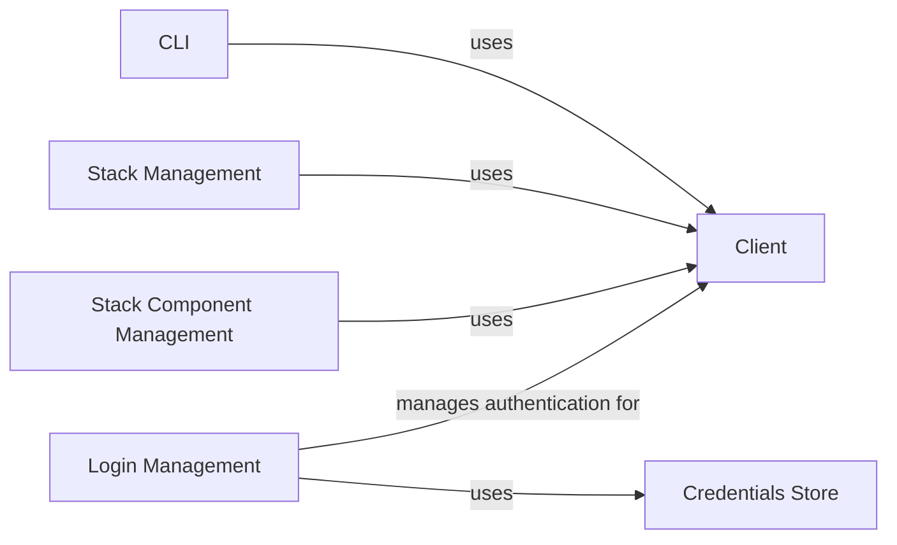

## Component Details

### CLI
The CLI serves as the primary interface for users to interact with ZenML. It parses user commands, leveraging the `Client` to execute actions against the ZenML server. The CLI is responsible for presenting the results of these actions to the user in a clear and understandable format. It handles command parsing, validation, and error handling, ensuring a smooth user experience.
- **Related Classes/Methods**: `zenml.cli.cli`, `zenml.cli.base`, `zenml.cli.utils`

### Client
The Client component acts as an intermediary between the CLI and the ZenML server. It encapsulates the logic for making API requests to the server, handling authentication, and managing data serialization/deserialization. The Client provides a high-level API for interacting with ZenML resources, such as pipelines, stacks, and components, abstracting away the complexities of the underlying HTTP communication.
- **Related Classes/Methods**: `zenml.client.Client`

### Credentials Store
The Credentials Store is responsible for securely storing and managing user credentials, including API keys and OAuth tokens. It provides an abstraction layer for accessing these credentials, ensuring that sensitive information is protected and handled appropriately. The Credentials Store is used by the Login Management component to authenticate users and authorize access to ZenML resources.
- **Related Classes/Methods**: `zenml.login.credentials_store.CredentialsStore`

### Login Management
The Login Management component handles user authentication and authorization, allowing users to connect to both local and remote ZenML servers. It interacts with the Credentials Store to retrieve and store user credentials, and it uses the Client to authenticate with the ZenML server. This component is crucial for securing access to ZenML resources and ensuring that only authorized users can perform actions.
- **Related Classes/Methods**: `zenml.cli.login`

### Stack Management
The Stack Management component provides CLI commands for managing ZenML stacks. It allows users to create, update, activate, and delete stacks, which are essential for defining the execution environment for ZenML pipelines. This component interacts with the Client to perform stack-related operations on the ZenML server.
- **Related Classes/Methods**: `zenml.cli.stack`

### Stack Component Management
The Stack Component Management component provides CLI commands for managing individual components within a ZenML stack. It allows users to list, describe, register, update, and delete stack components, providing fine-grained control over the configuration of ZenML stacks. This component interacts with the Client to perform stack component-related operations on the ZenML server.
- **Related Classes/Methods**: `zenml.cli.stack_components`
