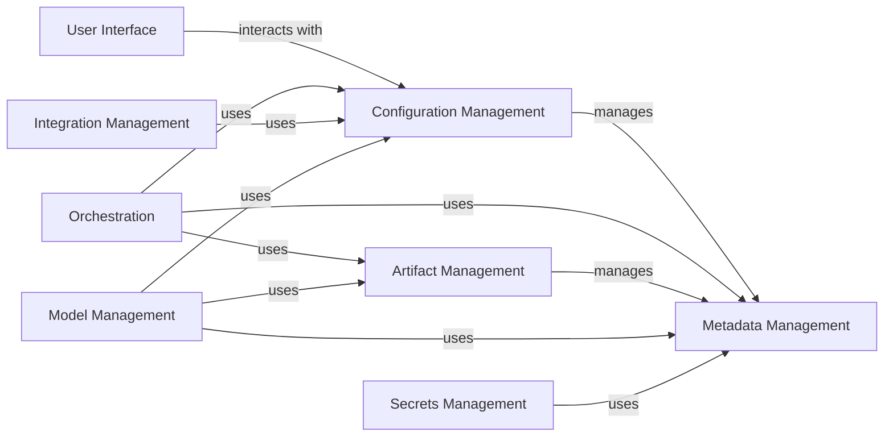

## Component Details

### User Interface
The User Interface component provides the primary entry point for users to interact with ZenML. It encompasses the CLI and the API server, handling user authentication, command processing, and result presentation. It translates user commands into API requests and presents the results, providing a seamless user experience.
- **Related Classes/Methods**: `repos.zenml.src.zenml.cli.cli`, `repos.zenml.src.zenml.cli.base`, `repos.zenml.src.zenml.client.Client`, `repos.zenml.src.zenml.login.credentials_store.CredentialsStore`, `repos.zenml.src.zenml.zen_server.routers.auth_endpoints`, `repos.zenml.src.zenml.zen_server.zen_server_api`, `repos.zenml.src.zenml.zen_server.auth`, `repos.zenml.src.zenml.zen_server.routers`

### Configuration Management
This component is responsible for managing all configuration aspects of ZenML, including global settings, stack definitions, and component configurations. It handles reading, writing, validating, and persisting configuration data, ensuring consistency and integrity across the system. It acts as a central repository for all configuration-related information, providing a single source of truth for all configuration settings.
- **Related Classes/Methods**: `repos.zenml.src.zenml.config.global_config.GlobalConfiguration`, `repos.zenml.src.zenml.config.store_config.StoreConfiguration`, `repos.zenml.src.zenml.config.step_configurations`, `repos.zenml.src.zenml.stack.stack`, `repos.zenml.src.zenml.stack.stack_component.StackComponentConfig`

### Metadata Management
The Metadata Management component provides an abstraction layer for interacting with the underlying metadata store. It offers a consistent interface for creating, reading, updating, and deleting metadata related to pipelines, runs, artifacts, and other entities. It ensures data integrity and provides a unified view of metadata across different storage implementations, enabling efficient tracking and analysis of ZenML workflows.
- **Related Classes/Methods**: `repos.zenml.src.zenml.zen_stores.base_zen_store.BaseZenStore`, `repos.zenml.src.zenml.zen_stores.sql_zen_store.SqlZenStore`, `repos.zenml.src.zenml.zen_stores.rest_zen_store.RestZenStore`, `repos.zenml.src.zenml.models.v2.base.filter`

### Orchestration
The Orchestration component manages the execution of ZenML pipelines. It handles scheduling, running, and monitoring pipeline runs, as well as managing resources and dependencies. It coordinates the execution of steps, ensuring that they are executed in the correct order and with the necessary resources, enabling the automated and reliable execution of machine learning workflows.
- **Related Classes/Methods**: `repos.zenml.src.zenml.orchestrators.base_orchestrator.BaseOrchestrator`, `repos.zenml.src.zenml.orchestrators.dag_runner.ThreadedDagRunner`, `repos.zenml.src.zenml.orchestrators.step_launcher.StepLauncher`, `repos.zenml.src.zenml.orchestrators.step_runner.StepRunner`

### Artifact Management
This component manages the storage, versioning, and retrieval of artifacts produced by ZenML pipelines. It handles materialization, access control, and lineage tracking for artifacts, ensuring that they are stored securely and can be easily accessed and reproduced. It provides a central repository for all artifacts generated during pipeline execution, enabling efficient collaboration and reproducibility.
- **Related Classes/Methods**: `repos.zenml.src.zenml.artifacts.base_artifact.BaseArtifact`, `repos.zenml.src.zenml.artifacts.utils`, `repos.zenml.src.zenml.materializers.base_materializer.BaseMaterializer`, `repos.zenml.src.zenml.materializers.materializer_registry.MaterializerRegistry`

### Model Management
The Model Management component provides a centralized repository for managing machine learning models. It handles model versioning, tracking, promotion, and deployment. It provides a consistent interface for managing models across different stages of the model lifecycle, enabling efficient model governance and deployment.
- **Related Classes/Methods**: `repos.zenml.src.zenml.model_registries.base_model_registry.BaseModelRegistry`, `repos.zenml.src.zenml.model.model`, `repos.zenml.src.zenml.model.utils`, `repos.zenml.src.zenml.model_deployers.base_model_deployer`, `repos.zenml.src.zenml.services.service`, `repos.zenml.src.zenml.services.container`

### Integration Management
The Integration Management component handles the integration of ZenML with other tools and frameworks. It manages the loading, activation, and management of integrations, providing a consistent interface for accessing integration-specific functionality. It enables ZenML to seamlessly interact with a wide range of external systems, extending its capabilities and providing flexibility.
- **Related Classes/Methods**: `repos.zenml.src.zenml.integrations.registry.IntegrationRegistry`, `repos.zenml.src.zenml.integrations.integration.Integration`

### Secrets Management
This component provides a secure way to manage secrets and credentials used by ZenML pipelines. It handles storing, retrieving, and encrypting secrets, as well as providing access control and auditing. It ensures that sensitive information is protected and managed securely, preventing unauthorized access and maintaining data integrity.
- **Related Classes/Methods**: `repos.zenml.src.zenml.secret.base_secret`, `repos.zenml.src.zenml.zen_stores.secrets_stores.base_secrets_store`, `repos.zenml.src.zenml.zen_stores.secrets_stores.sql_secrets_store`