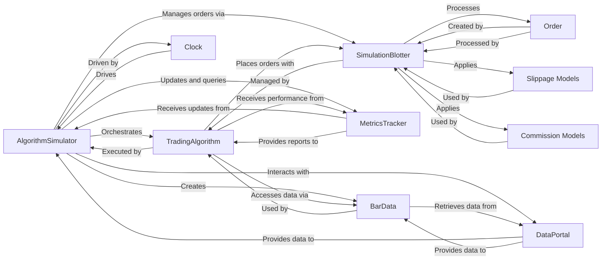

## Component Details

Component overview for AlgorithmSimulator, focusing on its core interactions with the most fundamental components of the Zipline backtesting engine.

### AlgorithmSimulator
The central orchestrator of the backtest. It drives the simulation by iterating through market data, advancing the simulation clock, and triggering the `TradingAlgorithm`'s lifecycle methods (`before_trading_start`, `handle_data`). It coordinates with the `DataPortal`, `SimulationBlotter`, and `MetricsTracker` to execute trades and record performance.

**Related Classes/Methods**:

- `AlgorithmSimulator` (0:0)

### TradingAlgorithm
Encapsulates the user-defined trading logic. Users implement methods like `initialize`, `handle_data`, and `before_trading_start`, which are invoked by the `AlgorithmSimulator` at specific points during the simulation. It holds references to the `SimulationBlotter` for order execution and `MetricsTracker` for performance insights.

**Related Classes/Methods**:

- `TradingAlgorithm` (0:0)

### DataPortal
Provides a unified interface for accessing historical and current market data, including OHLCV data, splits, and other financial information. It serves as the primary data source for the `AlgorithmSimulator` and `BarData`.

**Related Classes/Methods**:

- <a href="https://github.com/quantopian/zipline/blob/master/zipline/data/data_portal.py#L99-L1424" target="_blank" rel="noopener noreferrer">`DataPortal` (99:1424)</a>

### Clock
Generates simulation events (e.g., `BAR`, `SESSION_START`, `BEFORE_TRADING_START_BAR`) and manages the advancement of simulation time. It dictates when the `AlgorithmSimulator` should perform its actions, ensuring proper temporal progression of the backtest.

**Related Classes/Methods**:

- `Clock` (0:0)

### SimulationBlotter
Manages the lifecycle of orders within the simulated trading environment. It handles order placement, cancellation, and applies `Slippage Models` and `Commission Models` during transaction processing. The `AlgorithmSimulator` interacts with it to execute trades.

**Related Classes/Methods**:

- <a href="https://github.com/quantopian/zipline/blob/master/zipline/finance/blotter/simulation_blotter.py#L42-L392" target="_blank" rel="noopener noreferrer">`SimulationBlotter` (42:392)</a>

### MetricsTracker
Tracks and calculates various performance metrics of the trading algorithm, such as portfolio value, positions, transactions, and commissions. It aggregates data for daily and minute performance reports, providing insights into the algorithm's profitability and risk.

**Related Classes/Methods**:

- `MetricsTracker` (0:0)

### BarData
Provides a convenient and abstracted interface for the `TradingAlgorithm` to access current and historical market data for assets. It simplifies data retrieval by abstracting away the direct interaction with the `DataPortal`.

**Related Classes/Methods**:

- `BarData` (0:0)

### Order
Represents a single trading order within the simulation. It encapsulates details such as the asset, amount, order type (e.g., limit, stop), fill status, and commission incurred. Orders are created and processed by the `SimulationBlotter`.

**Related Classes/Methods**:

- <a href="https://github.com/quantopian/zipline/blob/master/zipline/finance/order.py#L40-L257" target="_blank" rel="noopener noreferrer">`Order` (40:257)</a>

### Slippage Models
A family of models that calculate the price impact of trades due to factors like market liquidity and order size. These models are applied by the `SimulationBlotter` to make the simulated trade execution more realistic.

**Related Classes/Methods**:

- `Slippage Models` (0:0)

### Commission Models
A family of models that calculate the fees incurred on trades. These models are applied by the `SimulationBlotter` to determine the cost of transactions, which is essential for accurate profit/loss calculation in the simulation.

**Related Classes/Methods**:

- `Commission Models` (0:0)

### [FAQ](https://github.com/CodeBoarding/GeneratedOnBoardings/tree/main?tab=readme-ov-file#faq)