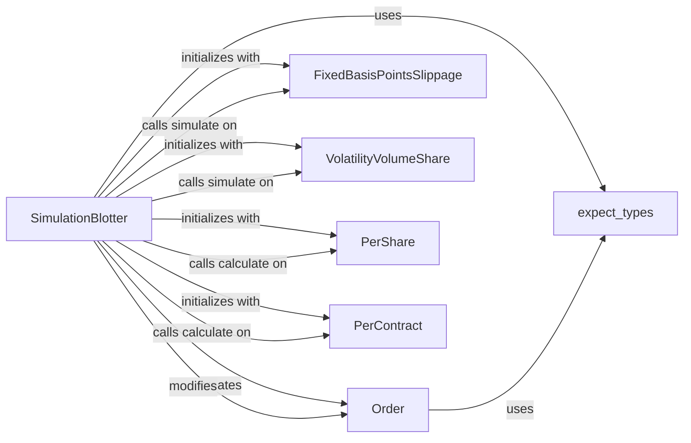

## Component Details

The `Blotter` subsystem in Zipline is the operational core for managing the lifecycle of trading orders within a simulation. It translates abstract trading intentions into concrete, simulated market actions, applying realistic financial models for slippage and commission, and subsequently updating the portfolio state.

### SimulationBlotter
The central orchestrator of the Blotter subsystem. It manages the creation, cancellation, and processing of orders. It integrates slippage and commission models to simulate realistic trade executions and is responsible for generating transactions and commissions that reflect these simulated fills.

**Related Classes/Methods**:

- <a href="https://github.com/quantopian/zipline/blob/master/zipline/finance/order.py#L40-L257" target="_blank" rel="noopener noreferrer">`Order` (40:257)</a>
- `FixedBasisPointsSlippage` (0:0)
- `VolatilityVolumeShare` (0:0)
- `PerShare` (0:0)
- `PerContract` (0:0)
- `expect_types` (0:0)
- <a href="https://github.com/quantopian/zipline/blob/master/zipline/finance/blotter/simulation_blotter.py#L305-L365" target="_blank" rel="noopener noreferrer">`SimulationBlotter:get_transactions` (305:365)</a>
- <a href="https://github.com/quantopian/zipline/blob/master/zipline/finance/blotter/simulation_blotter.py#L94-L153" target="_blank" rel="noopener noreferrer">`SimulationBlotter:order` (94:153)</a>

### Order
Represents a single trading instruction within the simulation. It encapsulates all critical details of a trade, including the asset, amount, execution style (stop/limit prices), fill status, and incurred commission. It also handles updates related to price triggers and stock splits.

**Related Classes/Methods**:

- `expect_types` (0:0)
- <a href="https://github.com/quantopian/zipline/blob/master/zipline/finance/order.py#L49-L76" target="_blank" rel="noopener noreferrer">`Order:__init__` (49:76)</a>

### FixedBasisPointsSlippage
A concrete implementation of a slippage model, primarily used for equities. It simulates market impact by applying a fixed percentage (basis points) to the trade price, constrained by a volume limit, to reflect the cost of executing large orders.

**Related Classes/Methods**: _None_

### VolatilityVolumeShare
A concrete slippage model specifically designed for futures contracts. It calculates market impact based on the asset's volatility and the proportion of the average daily volume that the order represents.

**Related Classes/Methods**: _None_

### PerShare
A concrete commission model that calculates the cost of a trade based on a fixed amount per share, with an optional minimum cost per trade. This is the default commission model for equities.

**Related Classes/Methods**: _None_

### PerContract
A concrete commission model tailored for futures contracts. It calculates commission based on a cost per contract and incorporates exchange fees, with an optional minimum trade cost.

**Related Classes/Methods**: _None_

### expect_types
A utility decorator used for input validation. It ensures that function arguments conform to their expected data types, thereby enhancing the robustness and reliability of the code by catching type-related errors early.

**Related Classes/Methods**: _None_

### [FAQ](https://github.com/CodeBoarding/GeneratedOnBoardings/tree/main?tab=readme-ov-file#faq)