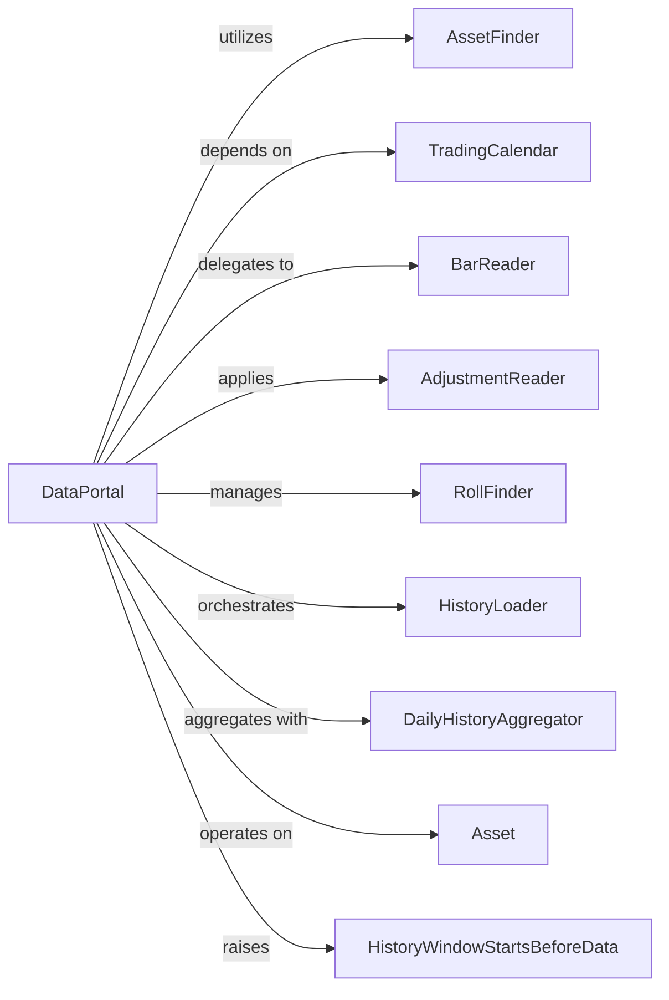

## Component Details

Analysis of the DataPortal component and its related components within the Zipline project.

### DataPortal
The primary interface for accessing all historical and current market data (prices, adjustments, dividends, splits) for various assets. It abstracts the underlying data storage mechanisms, providing a consistent and efficient way for other components to retrieve necessary financial information. It acts as the "memory" or "knowledge base" of the system.

**Related Classes/Methods**:

- <a href="https://github.com/quantopian/zipline/blob/master/zipline/data/data_portal.py#L99-L1424" target="_blank" rel="noopener noreferrer">`zipline.data.data_portal.DataPortal` (99:1424)</a>

### AssetFinder
Responsible for resolving asset identifiers (SIDs) into `Asset` objects and providing metadata about financial instruments.

**Related Classes/Methods**:

- <a href="https://github.com/quantopian/zipline/blob/master/zipline/assets/assets.py#L275-L1515" target="_blank" rel="noopener noreferrer">`zipline.assets.assets.AssetFinder` (275:1515)</a>

### TradingCalendar
Defines the trading schedule, including market open/close times, sessions, and holidays. It provides utilities for navigating time-series data according to market conventions.

**Related Classes/Methods**:

- `zipline.utils.calendar.exchange_calendar.TradingCalendar` (1:1)

### BarReader
Defines the interface for reading raw historical price data (bars) at different frequencies (minute, daily). `DataPortal` uses concrete implementations of this interface to fetch the actual OHLCV (Open, High, Low, Close, Volume) data.

**Related Classes/Methods**:

- <a href="https://github.com/quantopian/zipline/blob/master/zipline/data/bar_reader.py#L42-L147" target="_blank" rel="noopener noreferrer">`zipline.data.bar_reader.BarReader` (42:147)</a>
- <a href="https://github.com/quantopian/zipline/blob/master/zipline/data/dispatch_bar_reader.py#L133-L136" target="_blank" rel="noopener noreferrer">`zipline.data.dispatch_bar_reader.AssetDispatchMinuteBarReader` (133:136)</a>
- <a href="https://github.com/quantopian/zipline/blob/master/zipline/data/dispatch_bar_reader.py#L139-L148" target="_blank" rel="noopener noreferrer">`zipline.data.dispatch_bar_reader.AssetDispatchSessionBarReader` (139:148)</a>

### AdjustmentReader
Provides access to corporate action data such as splits, dividends, and mergers, which are used to adjust historical prices to ensure accuracy.

**Related Classes/Methods**:

- <a href="https://github.com/quantopian/zipline/blob/master/zipline/data/adjustments.py#L1-L1" target="_blank" rel="noopener noreferrer">`zipline.data.adjustments.AdjustmentReader` (1:1)</a>
- <a href="https://github.com/quantopian/zipline/blob/master/zipline/data/adjustments.py#L337-L702" target="_blank" rel="noopener noreferrer">`zipline.data.adjustments.SQLiteAdjustmentWriter` (337:702)</a>

### RollFinder
Specifically used for continuous futures contracts, this component helps in determining the "roll" dates, which are crucial for stitching together data from different futures contracts to form a continuous series.

**Related Classes/Methods**:

- <a href="https://github.com/quantopian/zipline/blob/master/zipline/assets/roll_finder.py#L23-L136" target="_blank" rel="noopener noreferrer">`zipline.assets.roll_finder.RollFinder` (23:136)</a>
- <a href="https://github.com/quantopian/zipline/blob/master/zipline/assets/roll_finder.py#L139-L153" target="_blank" rel="noopener noreferrer">`zipline.assets.roll_finder.CalendarRollFinder` (139:153)</a>
- <a href="https://github.com/quantopian/zipline/blob/master/zipline/assets/roll_finder.py#L156-L274" target="_blank" rel="noopener noreferrer">`zipline.assets.roll_finder.VolumeRollFinder` (156:274)</a>

### HistoryLoader
Responsible for loading historical data windows, including applying adjustments, for a given set of assets and a specified time range. It works in conjunction with `BarReader` and `AdjustmentReader`.

**Related Classes/Methods**:

- <a href="https://github.com/quantopian/zipline/blob/master/zipline/data/history_loader.py#L295-L554" target="_blank" rel="noopener noreferrer">`zipline.data.history_loader.HistoryLoader` (295:554)</a>
- <a href="https://github.com/quantopian/zipline/blob/master/zipline/data/history_loader.py#L557-L573" target="_blank" rel="noopener noreferrer">`zipline.data.history_loader.DailyHistoryLoader` (557:573)</a>
- <a href="https://github.com/quantopian/zipline/blob/master/zipline/data/history_loader.py#L576-L595" target="_blank" rel="noopener noreferrer">`zipline.data.history_loader.MinuteHistoryLoader` (576:595)</a>

### DailyHistoryAggregator
Aggregates minute-level data into daily bars, particularly useful when only minute data is available but daily data is requested.

**Related Classes/Methods**:

- <a href="https://github.com/quantopian/zipline/blob/master/zipline/data/data_portal.py#L1-L1" target="_blank" rel="noopener noreferrer">`zipline.data.data_portal.DailyHistoryAggregator` (1:1)</a>

### Asset
Represents financial instruments (equities, futures, etc.) and holds metadata about them, such as start/end dates, symbol, and exchange.

**Related Classes/Methods**:

- <a href="https://github.com/quantopian/zipline/blob/master/zipline/assets/assets.py#L1-L1" target="_blank" rel="noopener noreferrer">`zipline.assets.assets.Asset` (1:1)</a>

### HistoryWindowStartsBeforeData
A custom exception raised when a requested historical data window extends before the available data for a given asset or the overall data start date.

**Related Classes/Methods**:

- <a href="https://github.com/quantopian/zipline/blob/master/zipline/errors.py#L770-L774" target="_blank" rel="noopener noreferrer">`zipline.errors.HistoryWindowStartsBeforeData` (770:774)</a>

### [FAQ](https://github.com/CodeBoarding/GeneratedOnBoardings/tree/main?tab=readme-ov-file#faq)