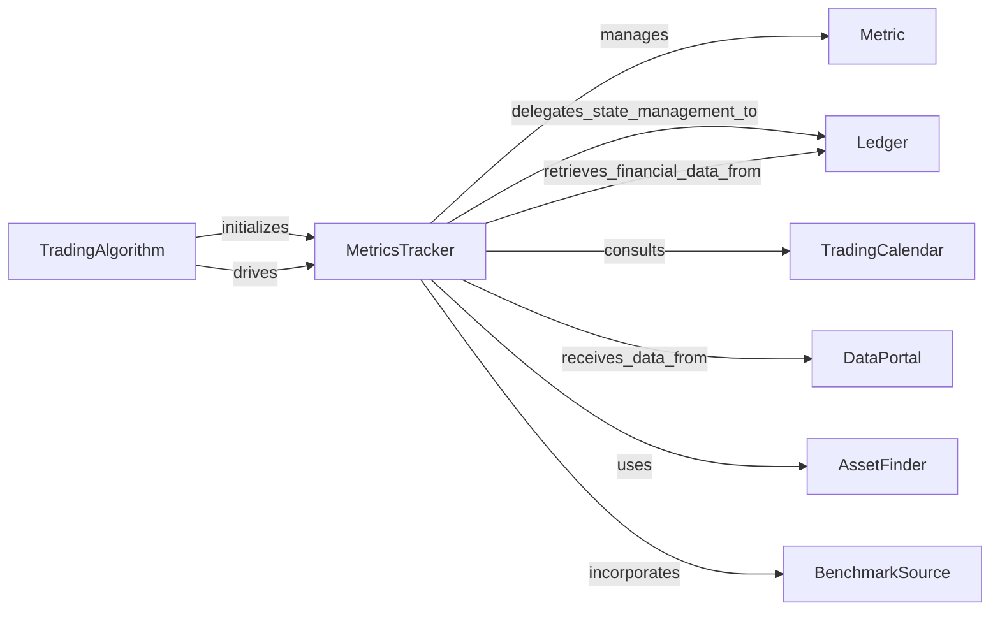

## Component Details

This subsystem focuses on the collection, aggregation, and calculation of financial performance metrics within the Zipline simulation. It provides the essential reporting and analysis capabilities for evaluating trading strategy performance.

### MetricsTracker
The central component responsible for orchestrating the collection, aggregation, and calculation of various financial performance metrics throughout a trading simulation. It maintains the overall financial state of the portfolio and account by interacting with the `Ledger`. It dynamically binds and invokes "hook" methods from registered `Metric` objects at various points in the simulation lifecycle (e.g., start/end of simulation, start/end of session, end of bar) to update metrics based on market events. It also leverages `TradingCalendar` for time-based calculations and `DataPortal` for market data synchronization.

**Related Classes/Methods**:

- `MetricsTracker` (1:1)

### Metric
An abstract base class representing an individual performance or risk metric (e.g., returns, volatility, drawdown). Concrete implementations of `Metric` provide specific calculation logic and expose "hook" methods (e.g., `start_of_simulation`, `end_of_bar`) that `MetricsTracker` calls. This allows for a modular and extensible way to add new metrics without modifying the core `MetricsTracker` logic.

**Related Classes/Methods**:

- <a href="https://github.com/quantopian/zipline/blob/master/zipline/finance/metrics/metric.py#L1-L1" target="_blank" rel="noopener noreferrer">`Metric` (1:1)</a>

### Ledger
A fundamental financial component that maintains the algorithm's detailed financial state. This includes the portfolio, account balances, and individual asset positions. `MetricsTracker` delegates many state-updating operations to the `Ledger`, such as processing transactions, commissions, splits, capital changes, and syncing last sale prices. The `MetricsTracker` retrieves portfolio and account information directly from the `Ledger` to generate performance packets.

**Related Classes/Methods**:

- <a href="https://github.com/quantopian/zipline/blob/master/zipline/finance/ledger.py#L341-L839" target="_blank" rel="noopener noreferrer">`Ledger` (341:839)</a>

### TradingCalendar
Defines and provides information about the trading schedule, including session open and close times, and the range of trading sessions for the simulation. `MetricsTracker` uses `TradingCalendar` to determine market open/close times, iterate through sessions, and align metric updates with the correct market events.

**Related Classes/Methods**:

- `TradingCalendar` (1:1)

### DataPortal
Serves as the primary interface for accessing market data within the simulation. It provides historical and real-time price data, as well as adjustment information (e.g., dividends, splits). `MetricsTracker` interacts with `DataPortal` (often indirectly via `Ledger` or directly for `sync_last_sale_prices` and `process_dividends`) to ensure that financial calculations are based on the most current and accurate market data.

**Related Classes/Methods**:

- <a href="https://github.com/quantopian/zipline/blob/master/zipline/data/data_portal.py#L99-L1424" target="_blank" rel="noopener noreferrer">`DataPortal` (99:1424)</a>

### TradingAlgorithm
The main simulation engine that orchestrates the entire trading simulation. It initializes and manages the lifecycle of `MetricsTracker` and other core components. `TradingAlgorithm` drives the simulation forward, calling `MetricsTracker` methods at appropriate times (e.g., `handle_minute_close`, `handle_market_open`, `handle_market_close`) to trigger metric updates and performance packet generation.

**Related Classes/Methods**:

- `TradingAlgorithm` (1:1)

### AssetFinder
A utility component responsible for resolving asset identifiers (e.g., ticker symbols) to internal asset objects. `MetricsTracker` passes an `AssetFinder` instance to the `Ledger` (specifically when processing dividends via `handle_market_open`) to ensure that financial adjustments are correctly applied to the right assets.

**Related Classes/Methods**:

- `AssetFinder` (1:1)

### BenchmarkSource
Provides benchmark data against which the algorithm's performance is compared. `MetricsTracker` receives a `BenchmarkSource` instance during its `handle_start_of_simulation` method and uses it when generating the final simulation end packet. This allows for the calculation of relative performance metrics.

**Related Classes/Methods**:

- <a href="https://github.com/quantopian/zipline/blob/master/zipline/sources/benchmark_source.py#L24-L311" target="_blank" rel="noopener noreferrer">`BenchmarkSource` (24:311)</a>

### [FAQ](https://github.com/CodeBoarding/GeneratedOnBoardings/tree/main?tab=readme-ov-file#faq)