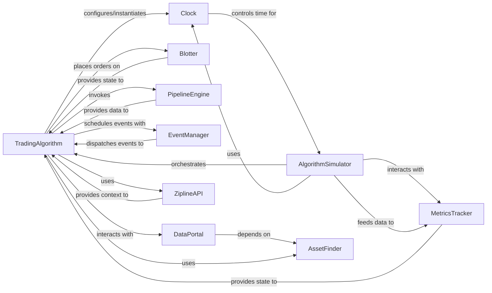

## Component Details

Updated analysis based on feedback, focusing on corrected source code references and revised relationships to align with architectural feedback.

### TradingAlgorithm
The core user-defined component that contains the trading strategy logic. It defines the `initialize`, `handle_data`, `before_trading_start`, and `analyze` lifecycle methods that users implement. It interacts with various other components to execute trades, access data, and manage events.

**Related Classes/Methods**:

- <a href="https://github.com/quantopian/zipline/blob/master/zipline/algorithm.py#L149-L2415" target="_blank" rel="noopener noreferrer">`zipline.algorithm.TradingAlgorithm` (149:2415)</a>

### AlgorithmSimulator
The central orchestrator of the backtesting process. It drives the simulation forward in time, manages simulation parameters, and coordinates interactions between the TradingAlgorithm, data sources, order execution, and performance tracking. It consumes time-based events provided by the Clock.

**Related Classes/Methods**:

- <a href="https://github.com/quantopian/zipline/blob/master/zipline/gens/tradesimulation.py#L33-L305" target="_blank" rel="noopener noreferrer">`zipline.gens.tradesimulation.AlgorithmSimulator` (33:305)</a>

### DataPortal
Provides a unified interface for accessing all market data, including historical OHLCV data, asset metadata, and adjustments. It serves as the primary data provider for the TradingAlgorithm and other simulation components.

**Related Classes/Methods**:

- <a href="https://github.com/quantopian/zipline/blob/master/zipline/data/data_portal.py#L99-L1424" target="_blank" rel="noopener noreferrer">`zipline.data.data_portal.DataPortal` (99:1424)</a>

### Blotter
Simulates the order management and execution process. It handles the creation, modification, cancellation, and filling of orders, and manages the algorithm's positions and transactions.

**Related Classes/Methods**:

- <a href="https://github.com/quantopian/zipline/blob/master/zipline/finance/blotter/simulation_blotter.py#L42-L392" target="_blank" rel="noopener noreferrer">`zipline.finance.blotter.simulation_blotter.SimulationBlotter` (42:392)</a>

### MetricsTracker
Responsible for tracking and calculating the performance metrics of the trading algorithm throughout the simulation. It aggregates financial events (transactions, orders, commissions) and generates comprehensive performance reports.

**Related Classes/Methods**:

- <a href="https://github.com/quantopian/zipline/blob/master/zipline/finance/metrics/tracker.py#L25-L352" target="_blank" rel="noopener noreferrer">`zipline.finance.metrics.tracker.MetricsTracker` (25:352)</a>

### AssetFinder
Manages and provides access to information about financial assets (equities, futures). It handles asset lookup by symbol or unique identifier (SID) and resolves asset information based on specific dates, accounting for corporate actions and delistings.

**Related Classes/Methods**:

- <a href="https://github.com/quantopian/zipline/blob/master/zipline/assets/assets.py#L275-L1515" target="_blank" rel="noopener noreferrer">`zipline.assets.assets.AssetFinder` (275:1515)</a>

### PipelineEngine
Executes data pipelines defined using Zipline's Pipeline API. It processes complex data transformations and filters across a universe of assets, providing structured dataframes of computed results to the TradingAlgorithm for advanced analysis and signal generation.

**Related Classes/Methods**:

- <a href="https://github.com/quantopian/zipline/blob/master/zipline/pipeline/engine.py#L86-L165" target="_blank" rel="noopener noreferrer">`zipline.pipeline.engine.PipelineEngine` (86:165)</a>

### EventManager
Manages and dispatches custom events scheduled by the TradingAlgorithm. It allows users to define rules for when specific functions should be executed, providing flexibility for implementing time-based or condition-based logic.

**Related Classes/Methods**:

- <a href="https://github.com/quantopian/zipline/blob/master/zipline/utils/events.py#L183-L218" target="_blank" rel="noopener noreferrer">`zipline.utils.events.EventManager` (183:218)</a>

### Clock
Manages the time progression within the simulation. It emits time-based events (e.g., BAR, SESSION_START, SESSION_END) that drive the AlgorithmSimulator. While the `TradingAlgorithm` configures and instantiates the specific `Clock` implementation, the `AlgorithmSimulator` is the primary consumer of its time-based events.

**Related Classes/Methods**:

- `zipline.gens.sim_engine.MinuteSimulationClock` (20:200)

### ZiplineAPI
A utility component that acts as a context manager to expose Zipline's built-in API functions (e.g., order, record, log) directly to the user's TradingAlgorithm script, simplifying interaction with the simulation environment.

**Related Classes/Methods**:

- <a href="https://github.com/quantopian/zipline/blob/master/zipline/utils/api_support.py#L20-L40" target="_blank" rel="noopener noreferrer">`zipline.utils.api_support.ZiplineAPI` (20:40)</a>

### [FAQ](https://github.com/CodeBoarding/GeneratedOnBoardings/tree/main?tab=readme-ov-file#faq)